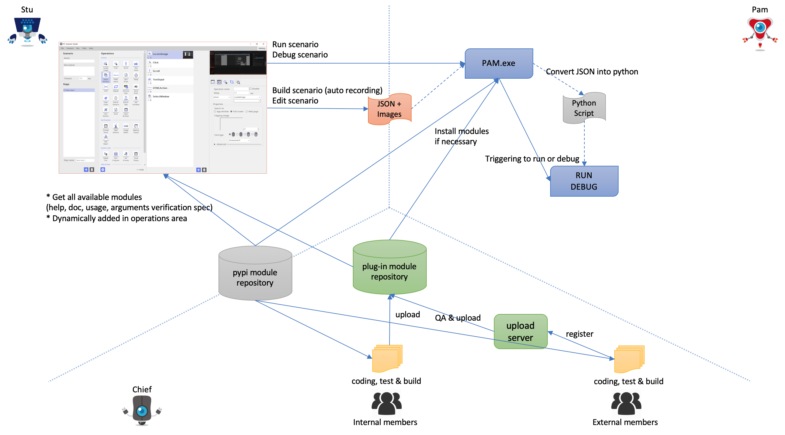

# README
이 문서는 ARGOS RPA+ 플러그인 모듈에 관한 것입니다.

# Plugin 구성

## 플러그인 구성도
)

## 플러그인 동작 원리 (with Stu & Pam)
)

## 플러그인 포함 전체 구성도
)

# Plugin Module 설치

## 환경 설정

### 시스템 python 확인
* python3 필요 (버전 3.6 이상, 3.7 권고)
* 맥 또는 리눅스인 경우 다음과 같은 명령으로 버전 3.6 이상 확인
``` sh
python3 -V
```
* 윈도우 버전인 경우 3.7 (3.6 이상) 설치 및 환경변수의 Path 에 추가하여 CMD.EXE 창에서 python 가 실행되고 버전이 3.6 이상인지 확인
``` sh
python.exe -V
```

### 파이썬 가상환경 (필요 시)

파이썬의 가상환경에 대한 개념을 잘 알면 인생이 편해집니다.

시스템에 python 버전3이 설치되어 있다고 가정합니다.
A 프로젝트를 하는데 a-1, a-2 이라는 외부 모듈을 설치하고,
B 프로젝트를 하는데 b-3, b-4 라는 외부 모듈을 설치했다고 가정합니다.

그러면 시스템의 python은 a-1, a-2 뿐만 아니라 b-3, b-4 라는 모듈을
모두 가지고 있게 됩니다. 즉, 무언가를 돌리는데 필요한 모든 외부 모듈이 모두 섞여
관리 및 재설치 등의 모든 문제가 복잡하게 얽혀 버릴 것입니다.

이런 것을 위하여 파이썬에서는 `가상환경` 이라는 개념이 등장했습니다.
[pyenv](http://mcchae.egloos.com/11271948) 등과 같은 것을 이용해도 되지만 윈도우에서는 지원안하는 단점이 있기 때문에
python의 `venv` 라는 모듈을 사용하면 됩니다. (대신 python 버전 3.4 이후에 등장하여 그 이후의 파이썬을 이용해야 합니다.)


#### 가상환경 생성 

다음과 같이 가상환경을 생성합니다. (파이썬 3.7 권고 3.6 이상)

``` sh
cd $HOME
python3 -m venv py3ve
```

Mac 또는 linux 에서 위와 같이 명령을 내리면 홈 폴더 아래에 py3ve 라는 가상환경이 생성됨.

``` sh
C:
cd %USERPROFILE%
python.exe -m venv py3ve
```

윈도우에서는 `C:\Users\toor\py3ve` 라는 곳에 가상환경이 생성됨.
(toor 는 사용자 이름으로 각자의 사용자 ID로 생각함)


#### 가상환경 활성화
CMD에서 가상환경을 사용하려면 해당 가상환경으로 활성화 시켜야 함.

다음과 같이 가상환경 활성화

``` sh
cd $HOME
source py3ve/bin/activate
(py3ve)
```

Mac이나 Linux 에서는 `source py3ve/bin/activate` 라고 활성화 시키고,

``` sh
C:
cd %USERPROFILE%
py3ve\Scripts\activate.bat
(py3ve)
```

윈도우에서는 `py3ve\Scripts\activate.bat` 로 활성화시킵니다.
모두 프람프트 앞에 `(py3ve)` 라고 붙는 것을 확인할 수 있습니다.

#### 필요 패키지 설치

위와 같이 활성화 된 상태에서 실행시키는 파이썬은 시스템의 python 실행파일이 아니라
가상환경 안에 설치된 python이 동작합니다.

`pip` 도 동일하게 실행하면 개별 가상환경의 pip 로 동작을 하는데,
`pip list` 등으로 확인을 해 보면, 개별 가상환경 마다 다른 설치된 모듈을 확인할 수 있습니다.

> 만약 윈도우 시스템에서 pip 명령이 없다면 다음과 같이 pip 설치
> * [get-pip.py 다운로드](https://bootstrap.pypa.io/get-pip.py)
> * python get-pip.py 
> * 위와 같이 실행하여 pip 설치

#### 가상환경 나가기

필요한 작업을 다 마치고 가상환경을 마치려면

``` sh
deactivate
```

라고 명령하면 해당 가상환경을 빠져나오고 `(py3ve)` 라고 붙은 프람프트도 없어진 것을 확인할 수 있습니다.

## APM (Argos Package Manager) 설치

### 홈 폴더에 .argos-rpa.conf 작성

다음과 같은 `YAML` 형식의 .argos-rpa.conf 파일 작성

``` yaml
repository: http://192.168.99.66:8080
username: argos
password: argos_01
```

> 만약 윈도우인 경우 `toor` 이라는 사용자면 `C:\Users\toor\.argos-rpa.conf` 라는 파일이름으로 저장

> 주소나 사용자ID 및 암호는 지정한 값을 주도록 함 (위의 정보는 내부 테스트 용도임)


### 필요 패키지 설치
* PyYAML 패키지 설치

다음과 같은 명령으로 패키지 설치
```sh
pip install PyYAML
```

> 만약 윈도우 시스템에서 pip 명령이 없다면 다음과 같이 pip 설치
> * [get-pip.py 다운로드](https://bootstrap.pypa.io/get-pip.py)
> * python get-pip.py 
> * 위와 같이 실행하여 pip 설치

### ppm 설치

* 다음의 명령으로 alabs.ppm 설치

``` sh
pip install alabs.ppm --index http://192.168.99.66:8080 --trusted-host 192.168.99.66
```

* 그 다음 pip list 명령으로 해당 모듈이 설치되었는지 확인

``` sh
$ pip list
Package    Version
---------- --------------
alabs.ppm  18.1227.105544
PyYAML     3.13
...
```

> 버전은 틀릴 수 있습니다 (위의 버전보다 더 높으면 됩니다)


## APM 으로 플러그인 패키지 설치

### 플러그인 목록 확인

다음과 같은 명령으로 설치가능한 플러그인 목록 확인

``` sh
$ alabs.ppm search argoslabs
start search ...
argoslabs.data.rdb (1.0.190103.85525)           - 1.0.190103.85525
argoslabs.demo.helloworld (1.0.190103.90001)    - 1.0.190103.90001
argoslabs.monitor.directory (1.0.190103.90233)  - 1.0.190103.90233
argoslabs.demo.argtest (1.0.190103.85735)       - 1.0.190103.85735
```

### 플러그인 모듈 설치

다음과 같은 명령으로 플러그인 모듈 설치

``` sh
$ alabs.ppm install argoslabs.demo.helloworld
```

그러면 다음과 같이 `pip list` 명령으로 설치되었는지 확인할 수 있습니다.

``` sh
$ pip list
Package                   Version
------------------------- ----------------
alabs.ppm                 18.1227.105544
alabs.common              18.1227.105643
argoslabs.demo.helloworld 1.0.190103.90001
```

> 위에 `alabs.common` 모듈은 `argoslabs.demo.helloworld` 모듈을 설치하면서 필요한 모듈로 자동으로 설치된 모듈입니다.

