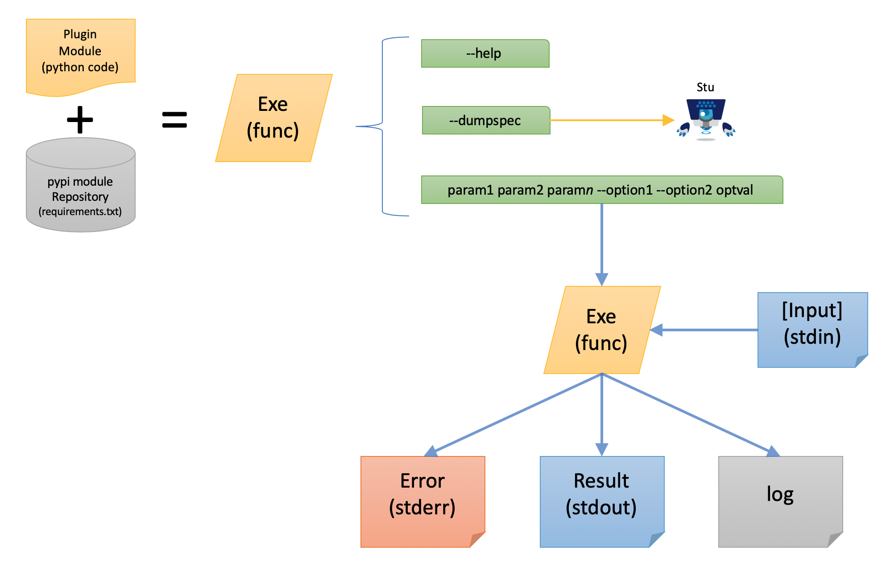
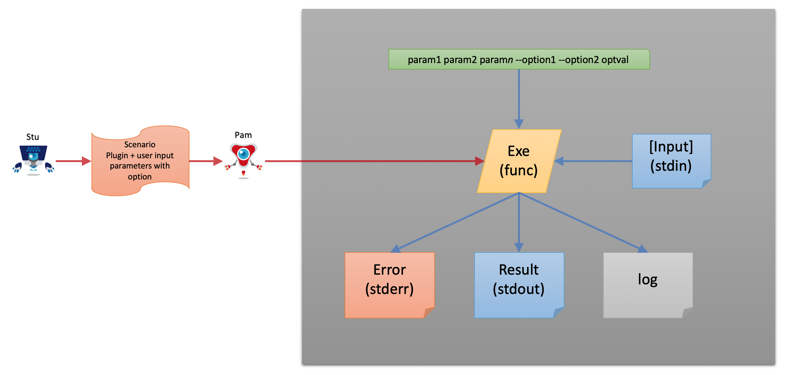
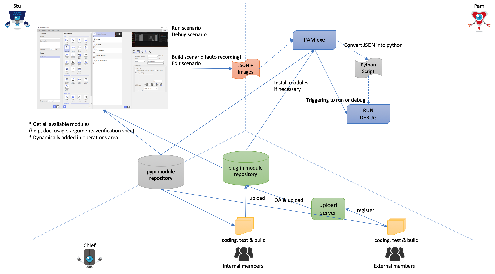

# README
This document is for plugins of ARGOS RPA.

# Plugin compose

## Plugin diagram


## How to work the plugin (with STU & PAM)


## Whole working diagram


# How to install build environment for Plugin

## Installation of Environment

### Python interpreter
* Need python3.x (Recommended more than version 3.7)
* You can check the python version with -V option
``` sh
python3 -V
```

#### Python VirtualEnv

When you build python module you need to [python virtual environment](https://docs.python.org/3/tutorial/venv.html).

You can create the virtual environment at the terminal in MacOS or Linux.

``` sh
cd $HOME
python3 -m venv py3ve
```

Or you can create at the CMD.EXE in Windows 10.

``` sh
C:
cd %USERPROFILE%
python.exe -m venv py3ve
```

#### Activate VirtualEnv
You have to activate virtualenv in order to use virtualenv.

You can activate in MacOS or Linux.

``` sh
cd $HOME
source py3ve/bin/activate
(py3ve)
```

Or you can activate in Windows.

``` sh
C:
cd %USERPROFILE%
py3ve\Scripts\activate.bat
(py3ve)
```

> Note: `(py3ve)` will be added at terminal shell prompt. 

#### Installation of necessary packages

> Note: This installation must under proper virtualenv so activate first.

`pip` or `pip.exe` is [the package installer for python](https://packaging.python.org/key_projects/#pip).

> If `pip` or `pip.exe` is not found you can install pip from [get-pip.py](https://pip.pypa.io/en/stable/installing/#installing-with-get-pip-py)

#### Deactivate VirtualEnv

When all work done it needed to exit virtualenv you can do `deactivate` command.

``` sh
deactivate
```

## Installation of POT SDK utility

### Installation of PPM utility

* You can install `alabs.ppm` 

``` sh
pip install alabs.ppm --index https://pypi-official.argos-labs.com/simple
```

* You can list and check this `alabs.ppm` utility is installed porperly.

``` sh
$ pip list
Package    Version
---------- --------------
alabs.ppm  18.1227.105544
...
```

> Version number may be different.


## Installation of plugin using `alabs.ppm`

> Note: This installation must under proper virtualenv so activate first.

### Installation of plugin

You can install plugin.

``` sh
$ alabs.ppm install argoslabs.data.binaryop
```

And then you can list and check this plugin is installed properly.

``` sh
$ pip list
Package                   Version
------------------------- ----------------
argoslabs.data.binayop 1.0.190103.90001
```

