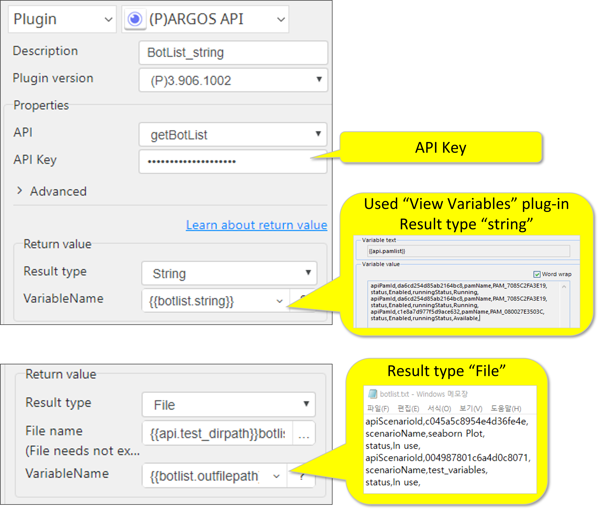

# ARGOS API

***This allows the ARGOS API to be used in scenarios.***

> This function is one of Plugins Operation.You can find the movie in [ARGOS RPA+ video tutorial](https://www.argos-labs.com/video-tutorial/).

## Name of the plugin
Item | Value
---|:---:
Icon |  
Display Name | **ARGOS API**

## Name of the author (Contact info of the author)

Kyobong An
* [email](mailto:akb0930@argos-labs.com)

[comment]: <> (* [github]&#40;https://github.com/Jerry-Chae&#41;)

## Notification

### Dependent modules
Module | Source Page | License | Version (If specified otherwise using recent version will be used)
---|---|---|---
[requests](https://pypi.org/project/requests/) | [requests](https://github.com/psf/requests) | [Apache](https://github.com/psf/requests/blob/main/LICENSE) | 2.27.1

## Warning 
None

## Helpful links to 3rd party contents
None

## Version Control 
* [4.407.1831](setup.yaml)
* Release Date: `Apr 7, 2022`

## Input (Required)
Display Name | Input Method | Default Value | Description
---|---|---|---
API | getPamList getBotList sendOndemand | | getPamList : get a list of pams. getBotList : get a list of scenarios sendOndemand : run a pam remotely
API Key | | | One of API Tokens from API Token List

> * If message to translate is too big then use `Text file`

## Input (Optional)

Display Name |Group| Show Default | Input Method | Default Value | Description
---|---|---|---|---|---
User ID  | sendOndemand | False| | | User ID
Scenario ID | sendOndemand | False | | | One of Scenario ids from a scenario list
Pam ID | sendOndemand | False | | | One of pam ids from a pam list **Pam cannot be duplicated. Currently, Pam ID on PC cannot be used.**
End Point | sendOndemand | False | | | API User’s Webhook URL Value
Variable_Text | sendOndemand | False | | | Parameter name to use for pam oprations
Value | sendOndemand | False | | | Parameter value to use for pam oprations
Value |  | False | | | Parameter value to use for pam oprations
API URL |  | False | | | API URL according to environment

> * If Show Default is True then this item is showed at the Properties otherwise hided at Advanced group

## Return Value

### Normal Case
* getPamList : List of pams.
* getBotList : List of scenarios
* sendOndemand : Request status

## Return Code
Code | Meaning
---|---
0 | Success
1 | Exceptional case

## Parameter setting examples

