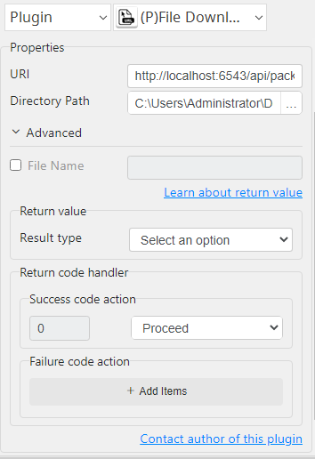

# File Downloader

***File Downloader with this plug-in can download file from url.***

***Limited to unauthenticated URI Only***

## File Downloader
| Item         |             Value             |
|--------------|:-----------------------------:|
| Icon         |   |
| Display Name |      **File Downloader**      |

### Arun Kumar (arunk@argos-labs.com)

Arun Kumar
* [Email](mailto:arunk@argos-labs.com) 
 
## Version Control 
* [4.327.1826](setup.yaml)
* Release Date: `July 14, 2023`

## Input (Required)
| Parameters     | Output      |
|----------------|-------------|
| URL            | file_path   |
| Directory Path |             |
| URL            | file_path   |
| Directory Path |             |
| File Name      |             |

## Return Value

### Normal Case
Description of the output result

## Return Code
| Code | Meaning                      |
|------|------------------------------|
| 0    | Success                      |
| 1    | Exceptional case             |

## Output Format
You may choose one of 3 output formats below,

<ul>
  <li>String (default)</li>
  <li>CSV</li>
  <li>File</li>
</ul>  

## Parameter setting examples (diagrams)

## Operations

### Downloader with input:

