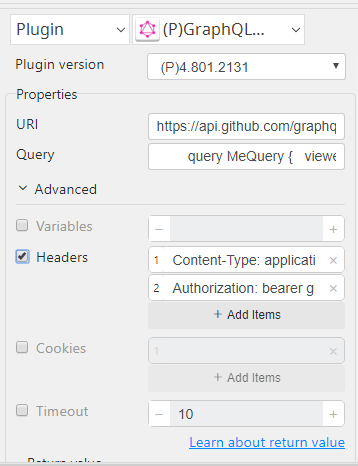

# GraphQL API

***GraphQL API can use to request to the server and get the exact data you need, and therefore limit the number of requests you need.***

## GraphQL API
| Item         |          Value           |
|--------------|:------------------------:|
| Icon         |  |
| Display Name |     **GraphQL API**      |

### Arun Kumar (arunk@argos-labs.com)

Arun Kumar
* [email](mailto:arunk@argos-labs.com) 
 
## Version Control 
* [4.822.1124](setup.yaml)
* Release Date: `August 22, 2022`

## Input (Required)
| Display Name  | Parameters                                                       | Output    |
|---------------|------------------------------------------------------------------|-----------|
| URI           | Server URL                                                       | str(data) |
| Query         | Query String                                                     |           |
| Headers       | Content-Type header   Authorization header   Other headers |           |
|            |                                                                  |           |
| URI           | Server URL                                                       | str(data) |
| Query         | Query String                                                     |           |
| Variables     | Variables String                                                 |           |
| Headers       | Content-Type header   Authorization header   Other headers |           |

 

## Return Value

### Normal Case

Description of the output result

## Return Code

<table>
    <tr>
        <th>
            Code
        </th>
        <th>
            Status
        </th>
        <th>
            Description
        </th>
    </tr>

<tr>
    <td>0</td>
    <td>response code 200</td>
    <td style="width:600px">
    success
    </td>
</tr>
<tr>
    <td>1</td>
    <td>response code 1xx</td>
    <td style="width:600px">
    <b>
    100 Continue
    </b>
     
<pre style="font-size: 15px;">
The initial part of a request has been received and has not yet been rejected 
by the server. The server intends to send a final response after the request has been 
fully received and acted upon.
</pre>
    <b>
    101 Switching Protocols
    </b>
     
<pre style="font-size: 15px;">
Switching to a newer version of HTTP might be advantageous over older versions
</pre>
    <b>
    102 Processing
    </b>
     
<pre style="font-size: 15px;">
The server has received and is processing the request. It indicates that no response is available yet.
</pre>
    <b>
    103 Early Hints
    </b>
     
<pre style="font-size: 15px;">
This code is used to return the headers of some responses before the final HTTP message.
</pre>
    </td>
</tr>

<tr>
    <td>3</td>
    <td>response code 3xx</td>
    <td style="width:600px">
    <b>
        300 Multiple Choices
    </b>
     
<pre style="font-size: 15px;">
This code is used to indicate that the multiple options for the resource from which
the client may choose.
</pre>
    <b>
        301 Moved Permanently
    </b>
     
<pre style="font-size: 15px;">
This code shows that the URL of the requested resource has been changed permanently.
In response, the new URL gives.
</pre>
    <b>
        302 Found
    </b>
     
<pre style="font-size: 15px;">
The requested page has moved temporarily to a new URL.
</pre>
    <b>
        303 See Other
    </b>
     
<pre style="font-size: 15px;">
The requested page can be found under another URL using the GET method.
</pre>
    <b>
        304 Not Modified
    </b>
     
<pre style="font-size: 15px;">
It shows the client that the response has not been modified, so the client can 
continue to use the same response's cached version.
</pre>
    <b>
        307 Temporary Redirect
    </b>
     
<pre style="font-size: 15px;">
The requested page has moved temporarily to a new URL.
</pre>
    <b>
        308 Permanent Redirect
    </b>
     
<pre style="font-size: 15px;">
The requested page has moved permanently to a new URL.
</pre>
    </td>
</tr>

<tr>
    <td>4</td>
    <td>response code 4xx</td>
    <td style="width:600px">
    <b>
    400 Bad Request
    </b>
     
<pre style="font-size: 15px;">
This code is used to indicate that the server did not understand the request 
due to invalid syntax.
</pre>
    <b>
        401 Unauthorized
    </b>
     
<pre style="font-size: 15px;">
In this code, the requested page needs a username and password or token.
</pre>
    <b>
        402 Payment Required
    </b>
     
<pre style="font-size: 15px;">
This code reserved for future use.
</pre>
    <b>
        403 Forbidden
    </b>
     
<pre style="font-size: 15px;">
The access is forbidden to the requested page.
</pre>
    <b>
        404 Not Found
    </b>
     
<pre style="font-size: 15px;">
The server cannot find the requested page.
</pre>
    <b>
        405 Method Not Allowed
    </b>
     
<pre style="font-size: 15px;">
It shows that the request method is not supported for the requested resource.
</pre>
    <b>
        406 Not Acceptable
    </b>
     
<pre style="font-size: 15px;">
The server can only generate a resource that the client does not accept.
</pre>
    <b>
        407 Proxy Authentication Required
    </b>
     
<pre style="font-size: 15px;">
It is used to show that the client must first authenticate itself with the proxy.
</pre>
    <b>
        408 Request Timeout
    </b>
     
<pre style="font-size: 15px;">
The request took longer than the server was prepared to wait.
</pre>
    <b>
        409 Conflict
    </b>
     
<pre style="font-size: 15px;">
The request could not be completed due to a conflict(POST to create a new contact
if the contact already exists) with the current state of the target resource.
</pre>
    <b>
        410 Gone
    </b>
     
<pre style="font-size: 15px;">
The target resource is no longer available at the origin server and that 
this condition is likely to be permanent.
</pre>
    <b>
        411 Length Required 
    </b>
     
<pre style="font-size: 15px;">
The server refuses to accept the request without a defined Content-Length
</pre>
    <b>
        412 Precondition Failed
    </b>
     
<pre style="font-size: 15px;">
One or more conditions given in the request header fields evaluated to false 
when tested on the server.
</pre>
    <b>
        413 Payload Too Large
    </b>
     
<pre style="font-size: 15px;">
The server is refusing to process a request because the body of your request and 
response message is larger than the server is willing or able to process.
</pre>
    <b>
        414 URI Too Long
    </b>
     
<pre style="font-size: 15px;">
The server is refusing to service the request because the request-target is longer 
than the server is willing to interpret.
</pre>
    <b>
        415 Unsupported Media Type
    </b>
     
<pre style="font-size: 15px;">
The origin server is refusing to service the request because the body of your request and 
response message is in a format not supported by this method on the target resource.
</pre>
    <b>
        416 Range Not Satisfiable
    </b>
     
<pre style="font-size: 15px;">
This status code is generated in response to a byte-range request, the sender SHOULD 
generate a Content-Range(in a full body message a partial message belongs) header field 
specifying the current length of the selected representation
</pre>
    <b>
        417 Expectation Failed
    </b>
     
<pre style="font-size: 15px;">
The server cannot meet the requirements of the Expect request-header field.
</pre>
    <b>
        418 I'm a teapot
    </b>
     
<pre style="font-size: 15px;">
The requests they don’t want to handle, such as automated queries.
</pre>
    <b>
        422 Unprocessable Entity
    </b>
     
<pre style="font-size: 15px;">
The server understands the content type of the request entity,
and the syntax of the request entity is correct but was unable to process 
the contained instructions.
</pre>
    <b>
        425 Too Early
    </b>
     
<pre style="font-size: 15px;">
The server is unwilling to risk processing a request that might be replayed, 
which creates the potential for a replay attack.
</pre>
    <b>
        426 Upgrade Required
    </b>
     
<pre style="font-size: 15px;">
The server refuses to perform the request using the current protocol but 
might be willing to do so after the client upgrades to a different protocol.
</pre>
    <b>
        428 Precondition Required
    </b>
     
<pre style="font-size: 15px;">
The origin server requires the request to be only happens if something else is done or happens first.
</pre>
    <b>
        429 Too Many Requests
    </b>
     
<pre style="font-size: 15px;">
The user has sent too many requests in a given amount of time.
</pre>
    <b>
        431 Request Header Fields Too Large
    </b>
     
<pre style="font-size: 15px;">
The server is unwilling to process the request because its header fields are too large.
The request MAY be resubmitted after reducing the size of the request header fields.
</pre>
    <b>
        451 Unavailable For Legal Reasons
    </b>
     
<pre style="font-size: 15px;">
The server is denying access to the resource as a consequence of a legal demand.
</pre>
</td>
</tr>
<tr>
    <td>5</td>
    <td>response code 5xx</td>
    <td style="width:700px">
    <b>
        500 Internal Server Error
    </b>
     
<pre style="font-size: 15px;">
The server has encountered a situation, and it does not know how to handle it.
</pre>
    <b>
        501 Not Implemented
    </b>
     
<pre style="font-size: 15px;">
This code shows that the request was not completed, and the server did not support 
the inputs to the software system.
</pre>
    <b>
        502 Bad Gateway
    </b>
     
<pre style="font-size: 15px;">
This code shows that the request was not completed, and the server received 
an invalid response from the upstream server(a server that provides service to another server).
</pre>
    <b>
        503 Service Unavailable
    </b>
     
<pre style="font-size: 15px;">
This code shows that the request was not completed, and the server is temporarily 
overloading or down.
</pre>
    <b>
        504 Gateway Timeout
    </b>
     
<pre style="font-size: 15px;">
It shows that the gateway has timed out.
</pre>
    <b>
        505 HTTP Version Not Supported
    </b>
     
<pre style="font-size: 15px;">
The server does not support the "http protocol" version.
</pre>
    <b>
        506 Variant Also Negotiates
    </b>
     
<pre style="font-size: 15px;">
The server has an internal configuration error: 
the chosen variant resource is configured to engage in transparent content 
negotiation itself, and is therefore not a proper end point(url) in the negotiation process.
</pre>
    <b>
        507 Insufficient Storage
    </b>
     
<pre style="font-size: 15px;">
Method could not be performed on the resource because the server is unable to store 
the representation needed to successfully complete the request.
</pre>
    <b>
        508 Loop Detected
    </b>
     
<pre style="font-size: 15px;">
The server terminated an operation because it encountered an infinite loop while processing 
a request with “Depth: infinity”. This status indicates that the entire operation failed.
</pre>
    <b>
        510 Not Extended
    </b>
     
<pre style="font-size: 15px;">
The policy for accessing the resource has not been met in the request. 
The server should send back all the information necessary for the client to issue an extended request.
</pre>
    <b>
        511 Network Authentication Required
    </b>
     
<pre style="font-size: 15px;">

The client needs to authenticate to gain network access.
</pre>
    </td>
</tr>
<tr>
    <td>11</td>
    <td></td>
    <td>Failure (Invalid Input)</td>
</tr>
<tr>
    <td>9</td>
    <td></td>
    <td>Exceptional case</td>
</tr>
</table> 

## Output Format

You may choose one of 3 output formats below,

<ul>
  <li>String (default)</li>
  <li>CSV</li>
  <li>File</li>
</ul>  

## Parameter setting examples (diagrams)

## Operations

### Query API:

