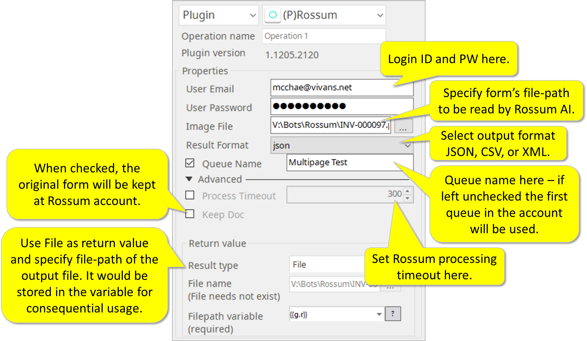
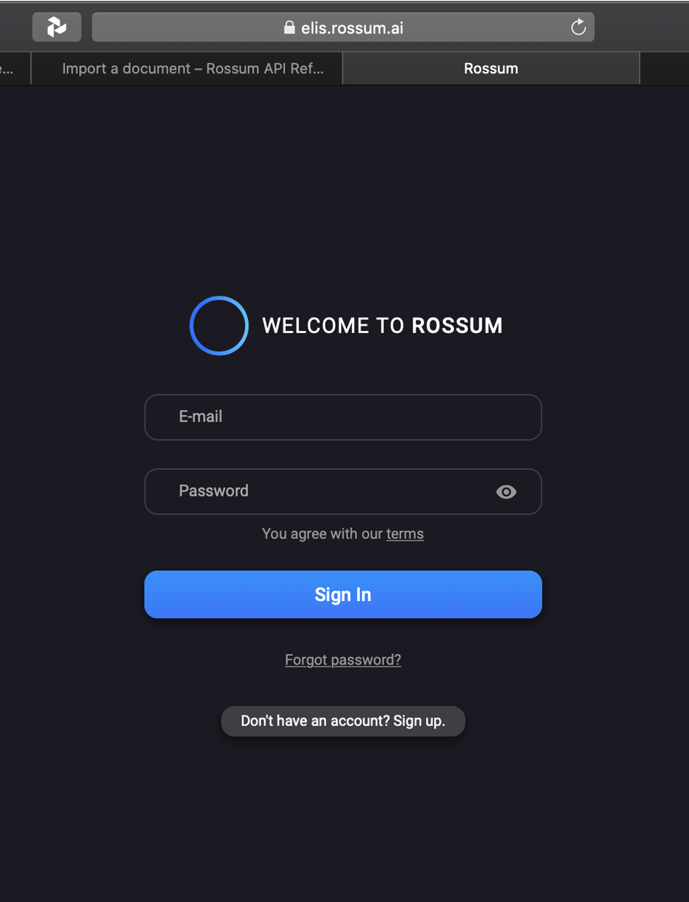
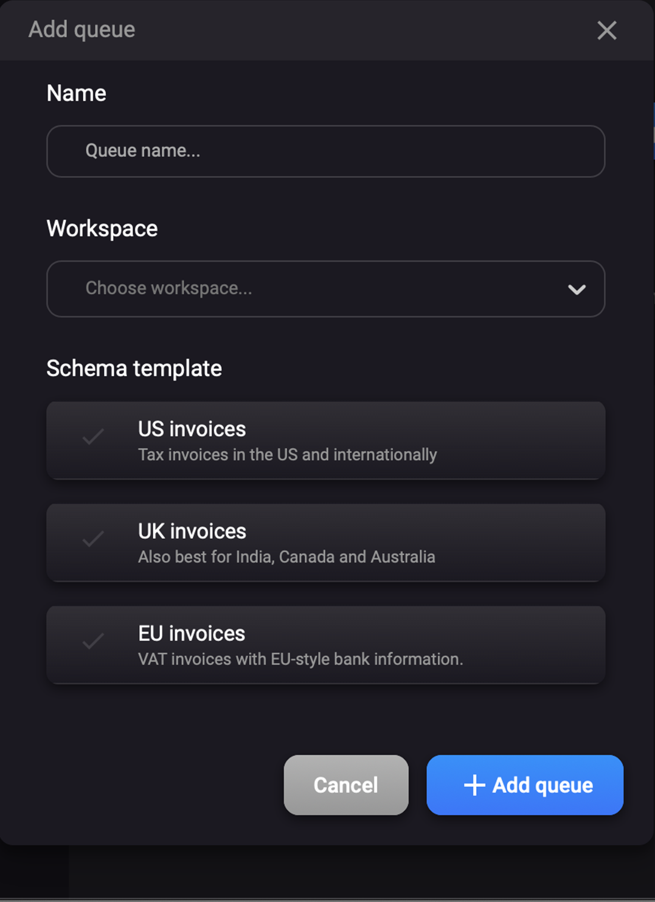
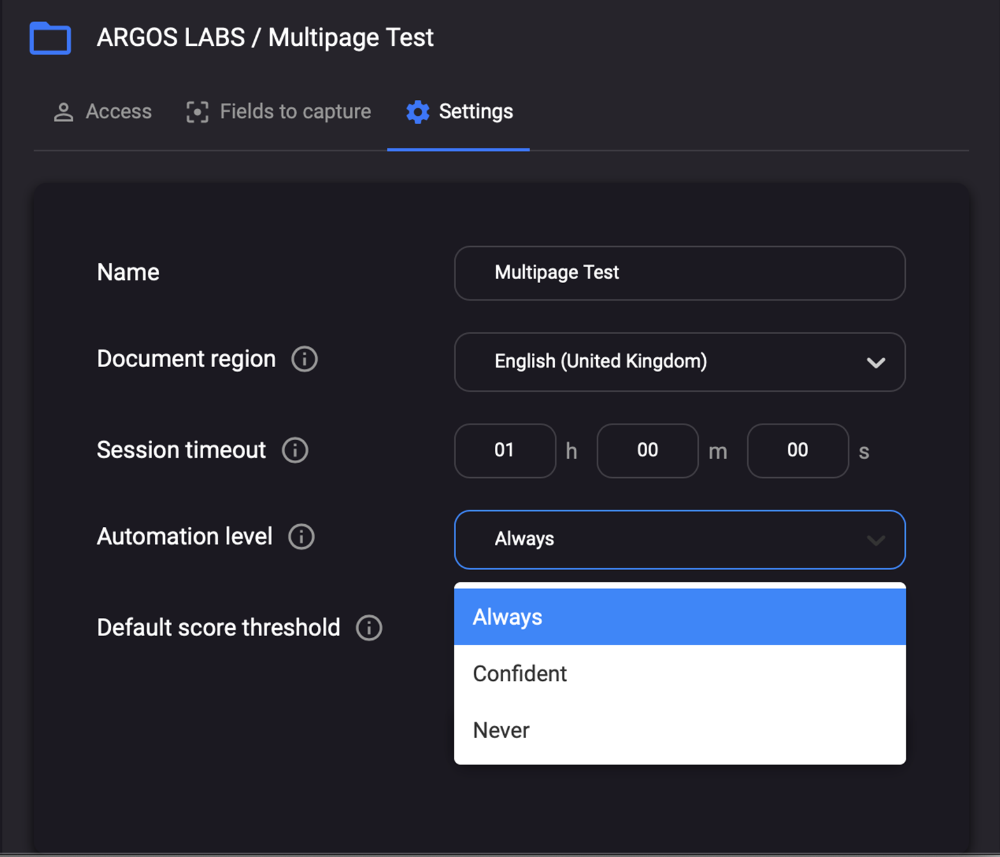

# Rossum

***ARGOS LABS plugin module sample***

## Name of the plugin
Item | Value
---|:---:
Icon |  
Display Name | **Rossum**

## Name of the author (Contact info of the author)

Jerry Chae
* [email](mailto:mcchae@argos-labs.com)

[comment]: <> (* [github]&#40;https://github.com/Jerry-Chae&#41;)

## Notification

### Primary Feature
* Rossum plugin sends document and forms (image file such as PDF) to Rossum AI OCR engine in the cloud and returns data in forms of JSON, CSV, and XML. 

### Pre-requisite
* Users require signing up with Rossum for User Account.
* Users require commercial or non-commercial agreement (such as Free Trial) with Rossum.
* Users must complete training of the Queue and switch its automation level to “Always”
* The Assist-o-mation execution environment must be connected to the Internet.

### Dependent modules
Module | Source Page              | License | Version (If specified otherwise using recent version will be used)
---|--------------------------|---|---
[rossum](https://pypi.org/project/rossum/) | [rossum](https://github.com/rossumai/rossum) | [MIT License](https://github.com/rossumai/rossum/blob/master/LICENSE) | `latest`
[requests](https://pypi.org/project/requests) | [requests](https://github.com/psf/requests) | [Apache License 2.0](https://github.com/psf/requests/blob/main/LICENSE) | `latest`  

## Warning 
 **[ROSSUM] plugin uses the official API released from Rossum AI [Rossum](https://rossum.ai/)  Product names and logos are properties of Rossum AI.**

## Helpful links to 3rd party contents
[Rossum](https://rossum.ai/)

## Version Control 
* [4.1202.419](setup.yaml)
* Release Date: Dec 02, 2022

## Input (Required)
Display Name | Input Method  | Default Value | Description
---|---------------|---------------|---
User Email | Login mail | - | Enter the Login ID here.
Password | Password | - | Enter the password here.
Image File | File path | - | Specify form's file path to be read  by Rossum AI.
Result Format | Select option | - | Select output format JSON, CSV, or XML.

## Input (Optional)
Display Name | Input Method  | Default Value | Description
---|---------------|---------------|---
Queue Name | String | False | Queue Name here - If left unchecked the first queue in the account will be used.
Process Timeout | Number | 300 | Set Rossum processing timeout here.
Keep Doc | - | False | When checked the original form will be kept at rossum account.

## Return Value
* Use `File` as return value and specify file-path of the output file. It would be stored in the variable for consequential usage.

## Parameter Setting Example 

## Instructions to Sign-up, Train AI, and change Queue automation status to Always.
Step 1: Visit Rossum AI website https://rossum.ai/  
Step 2: Sign up to create account.  

Step 3: Follow instructions at Rossum and create queue and train AI for your form (…quite nice UX actually)  

Step 4: After training is done, switch Queue automation level to “Always”.  

## Return Code
Code | Meaning
---|---
0 | Success
1 | Exception Failed

