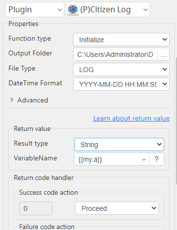
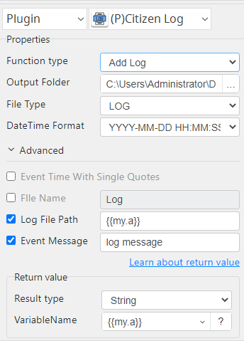

# Citizen Log

***The plugin manages the "Logging" for operations.***

## Citizen Log
| Item         |          Value           |
|--------------|:------------------------:|
| Icon         |  |
| Display Name |     **Citizen Log**      |

### Arun Kumar (arunk@argos-labs.com)

* [Email](mailto:arunk@argos-labs.com) 
 
## Version Control 
* [4.1031.1312](setup.yaml)
* Release Date: `October 31, 2022`

## Input (Required)
| Function type | Parameters                     | Output              |
|---------------|--------------------------------|---------------------|
| Initialize    | Output Folder                  | (Output File Path)  |
|               | File Type                      |                     |
|               | DateTime Format                |                     |
|               | FIle Name                      |                     |
| Add Log       | Output Folder                  | (Output File Path ) |
|               | File Type                      |                     |
|               | DateTime Format                |                     |
|               | Log File Path                  |                     |
|               | Event Log Message              |                     |
| Add Log       | Output Folder                  | (Output File Path ) |
|               | File Type                      |                     |
|               | DateTime Format                |                     |
|               | Event Time With Single Quotes  |                     |
|               | Log File Path                  |                     |
|               | Event Log Message              |                     |

Note:-
1. Add Log- Log File Path will be the output of Initialize.
2. File name having '/' or ':' auto remove.

## Return Value

### Normal Case
Description of the output result

## Return Code
| Code | Meaning             |
|------|---------------------|
| 0    | Success             |
| 99   | Exceptional case    |

## Output Format
You may choose one of 3 output formats below,

<ul>
  <li>String (default)</li>
  <li>CSV</li>
  <li>File</li>
</ul>  

## Parameter setting examples (diagrams)

## Operations

### Initialize:

### Add Log:

