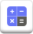
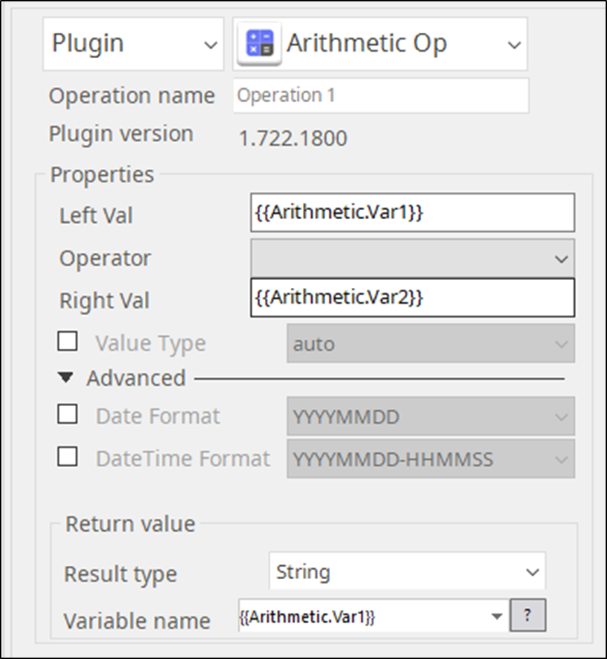
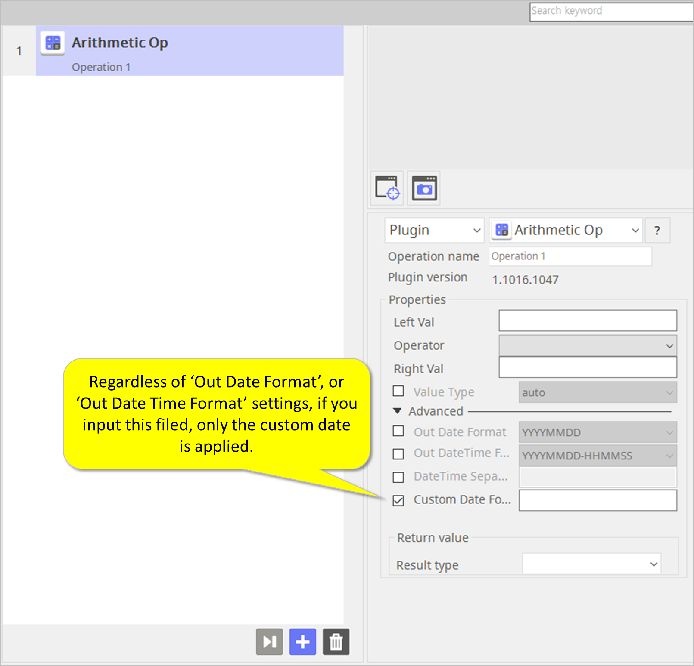
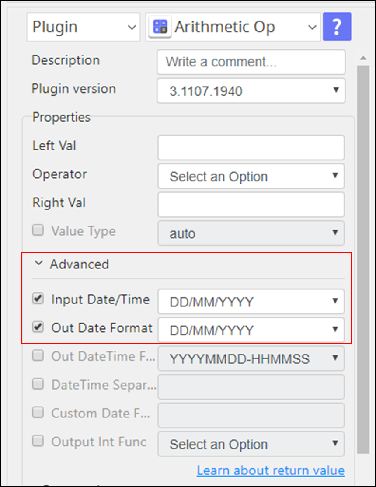

# Arithmetic Operation 

***ARGOS LABS plugin module for binary op***

> This function is one of Plugins Operation.You can find the movie in [ARGOS RPA+ video tutorial](https://www.argos-labs.com/video-tutorial/).

## Name of the plugin
Item         | Value
-------------|:---:
Icon         |  
Display Name | **ARITHMETIC OP**

## Name of the author (Contact info of the author)

Jerry Chae
* [email](mailto:mcchae@argos-labs.com)

[comment]: <> (* [github]&#40;https://github.com/Jerry-Chae&#41;)

## Notification
### Dependent modules
Module | Source Page | License | Version (If specified otherwise using recent version will be used)
---|---|---|---
[python-dateutil](https://pypi.org/project/python-dateutil/) | [python-dateutil](https://github.com/dateutil/dateutil) | [Apache 2.0](https://github.com/dateutil/dateutil/blob/master/LICENSE) | newer than `2.8.0` (Latest is `2.8.2`, Jan 2023)

## Warning 
If you want to know how to do calculations between dates and times, go straight to the bottom of this page!

## Helpful links to 3rd party contents
None

## Version Control 
* [4.202.3456](setup.yaml)
* Release Date: Feb 02, 2022

## Input (Required)
Display Name | Input Method          | Default Value | Description
-------------|-----------------------|---------------|---
Left Val     | User variable(String) | -             | Operand before operator.
Operator     | + , - , * , /, %      | -             | Operator to perform mathematical functions on the operands.
Right Val    | User variable(String) | -             | Operand after operator.

> * Value Type is defaulted to auto.

## Input (Optional) 
Display Name                | Input Method | Default Value    | Description
----------------------------|--------------|------------------|---
Input Date/Time             | Date/Time    | Auto             | This defines a date and time picker.
Out Date Format             | Date         | D B YYYY         | The output Date format is defined here.
Out Date/Time Format        | Date/Time    | YYYYMMDD -HHMMSS | The output Date/Time format is defined here.
Date Time Seperator         | Date/Time    | -                | The date separator separates the day, month, and year when date values are formatted.
Custom Date Format          | Date         | -                | The custom date format field to format dates in a view.
Output Int Function - Round | -            | -                | Float point number from the decimal value to the closest multiple of 10.
Output Int Function - Ceil  | -            | -                |  The ceil() function returns the integer as a double value.
Output Int Function - Floor | -            | -                | It returns an integer value, but with a floating-point type.
Output Int Function - Trunc | -            | -                | It removes the fractional part of a number and, thus, truncates a number to an integer.

## Return Value
* `Number` `operatator` `Number`: normal arithmatic operation like `1` `+` `2` returns `3`.
* `String` `+` `String`: This returns string concatanation.
* `Date/Time` `+/-` `time-delta` : Add or subtract date/time period.

## Parameter setting examples

> 1.  [Left Value] [+] [Right Value] = [Result Value]

### Parameters

### Operators
Operator | Meaning                                                   | Example 
---|-----------------------------------------------------------------|---
'+' | Add two operands or unary plus                                   | x + y 
'-' | Subtract right operand from the left or unary minus              | x - y
'*' | Multiply two opeands                                             | x * y
'/' | Divide left operand by the right one (always results into float) | x / y
'%' | Modulus - remainder of the division of left operand by the right | x % y (remainder of x/y)

## 1. When using User Variables, you can store the Result Value in one of the Left or Right values. (you can use it as a counter!)
**Example:** When you want to user {{user.variable1}} as a counter for increment of 1

> 1. Left Value     {{user.variable1}}
> 2. Operator      +
> 3. Right Value   1
> 4. Result Value {{user.variable1}}

## 2. When calculating dates/times, here are the tips!
###   2-1. Left Value can take all the following formats.

> 1. YYYYMMDD
> 2. YYYY-MM-DD
> 3. YYYY/MM/DD
> 4. MMDDYYYY
> 5. MM-DD-YYYY
> 6. MM/DD/YYYY
> 7. B D YYYY
> 8. B D, YYYY
> 9. D B YYYY
> 10. YYYYMMDD-HHMMSS.mmm
> 11. YYYY-MM-DD HH:MM:SS.mmm
> 12. YYYY/MM/DD HH:MM:SS.mmm
> 13. MMDDYYYY-HHMMSS.mmm
> 14. MM-DD-YYYY HH:MM:SS.mmm
> 15. MM/DD/YYYY HH:MM:SS.mmm
> 16. YYYYMMDD-HHMMSS
> 17. YYYY-MM-DD HH:MM:SS
> 18. YYYY/MM/DD HH:MM:SS
> 19. MMDDYYYY-HHMMSS
> 20. MM-DD-YYYY HH:MM:SS
> 21. MM/DD/YYYY HH:MM:SS

###  2-2. You can use only [+] or [-] operator.

###  2-3. Right Value can take only the following “time-delta” notations. There is NO SPACE after [n].

> 1. n day
> 2. n hour
> 3. n min
> 4. n sec
> 5. n msec
> 6. n usec
> 7. n week
> 8. n month
> 9. n year

**Note: [n] is an Integer.**
###  There is NO SPACE after [n].

### 2-4. You can use date or datetime for the Right Value only when operator is [-].
In this case, if Left Value is date, then the Right Value must be date. If the Left Value is datetime, then the Right Value must be datetime.

### 2-5. You can customize date or datetime with Custom date format.

> 1. YYYY|YY(Year) MM|M(Month) DD|D(Day) hh|h(Hour) mm|m(Minute) ss|s(Second)
You can combine then in various orders like shown in examples below.

**Example 1** 
**June 03, 2019** 

YYYY.MM.DD => 2019.06.03
 YY.MM.DD => 19.06.03
 M/D => 6/3

**Example 2** 
**Jun 03, 2019 13: 02: 03** 

M/D hhmmss=> 6/3 130203 
M/D h:m=> 6/3 13:2

 If you input data to ‘Custom Date Format’ field, regardless of ‘Out Date Format’, or ‘Out Date Time Format’ settings, only the custom date is applied.

### Latest Update 2021.11.15
### New! The Arithmetic Op plugin can now handle data and datetime format from Europe.
New! The Arithmetic Op plugin can now handle data and datetime format from Europe.
You will find a new menu to explicitly specify the formats in the advanced menu.

## Return Code
Code | Meaning
-----|---
0    | Success
99    | Exceptional case
