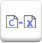
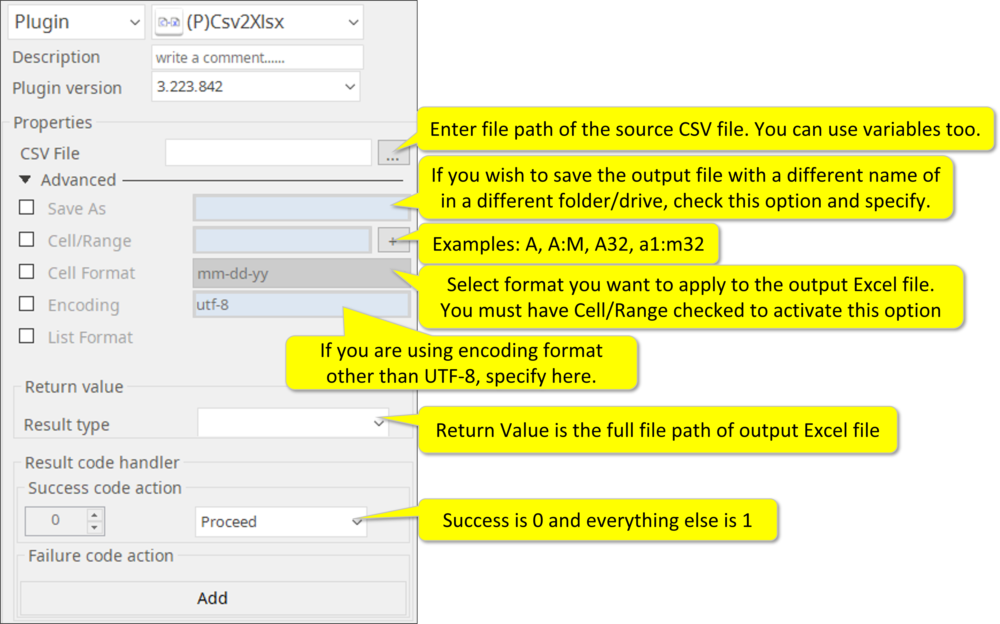

# Csv2Xlsx

***This allows to convert CSV format file into Excel file***

> This function is one of Plugins Operation.You can find the movie in [ARGOS RPA+ video tutorial](https://www.argos-labs.com/video-tutorial/).

## Name of the plugin
Item         | Value
-------------|:---:
Icon         |  
Display Name | **Csv2Xlsx**

## Name of the author (Contact info of the author)

Kyobong An 
* [email](mailto:akb0930@argos-labs.com)

## Notification

### Dependent modules
Module | Source Page | License | Version (If specified otherwise using recent version will be used)
---|---|---|---
[openpyxl](https://pypi.org/project/openpyxl/) | [openpyxl](https://github.com/theorchard/openpyxl) | [MIT](https://github.com/theorchard/openpyxl/blob/master/LICENCE.rst) | newer than `2.6.1` (Latest is `3.0.10`, Dec 2020)

## Warning 
None

## Helpful links to 3rd party contents
None

## Version Control 
* [3.1007.3456](setup.yaml)
* Release Date: Oct 7, 2021

## Input (Required)
Display Name | Input Method  | Default Value | Description
-------------|---------------|---------------|---
CSV File     | File          |               | Select Files to convert it as Excel.

> * This plugin simply converts a CSV file to Excel (.xlsx) file.  It is only one-way conversion.

## Input (Optional)

Display Name | Input Method | Default Value | Description
-------------|--------------|---------------|---
Save As      | String       | False         | If you leave this unchecked, output file will be created in the same folder as the source CSV file with the same name except for the extension.
Cell/Range   | Cell Range   | False         | This option can be checked if you wish to convert numeric value of the CSV data into some specific format after conversion to an Excel file.
Cell Format  | -            | False         | This option used together with the Cell/Range option. You can choose the format from the pull-down menu. Please make sure the source CSV data is a string of 0 to 9. - More explanations at this link. https://exceljet.net/custom-number-formats
Encoding     | -            | utf-8         | Select encoding format if different from UTF-8
List Format  | -            | False         | When this option is checked the Return Value will contain the list of Format from the pull-down menu above.            

## Return Value

> * A full file path of the output Excel (.xlsx) file

## Parameter setting examples

## Return Code
Code | Meaning
-----|---
0    | Success
1    | Exceptional case

