# EXCEL ADVANCED

**ARGOS LABS plugin module for Excel**

## Name of the plugin
Item | Value
---|:---:
Icon |  
Display Name | **Excel Advance**

## Name of the author (Contact info of the author)

Jerry Chae
* [email](mailto:mcchae@argos-labs.com)

[comment]: <> (* [github]&#40;https://github.com/Jerry-Chae&#41;)

## Notification

### Dependent modules
Module | Source Page | License | Version (If specified otherwise using recent version will be used)
---|---|---|---
[openpyxl](https://pypi.org/project/openpyxl/) | [openpyxl](https://github.com/theorchard/openpyxl) | [MIT](https://github.com/theorchard/openpyxl/blob/master/LICENCE.rst) | Use version 3.0.7 (Latest is 3.0.10, Dec 2020)
[xlwings](https://pypi.org/project/xlwings/)  | [xlwings](https://github.com/xlwings/xlwings) | [BSD-Licensed](https://github.com/xlwings/xlwings/blob/main/LICENSE.txt) |  Use version 0.23.0
[pywin32](https://pypi.org/project/pywin32/) | [pywin32](https://github.com/mhammond/pywin32) | [PSF-2.0](https://github.com/mhammond/pywin32/blob/main/Pythonwin/License.txt) | `win32` for password option : Windows ONLY!!!


## Warning 
* Please note that Return Value of Excel Advanced does NOT contain the output file's file-path!
* EXCEL ADVANCED plugin is great for some tricky functions like finding a cell ID that includes a specific character string.
* For general reading and writing, it is highly recommended to use EXCEL SIMPLE READ/WRITE plugins
* Overwrite Value/Overwrite Cell enters value to "read-from" file(sheet), NOT "write-to" file(sheet).

## Helpful links to 3rd party contents
None

## Version Control 
* [4.810.3456](setup.yaml)
* Release Date: `Aug 10, 2022`

## Input (Required)
Display Name | Input Method                                           | Default Value | Description
---|--------------------------------------------------------|---------------|---
Excel/CSV File   | File Path                                              | -             | Determine the file path of the Excel/CSV file.
Read-fr sheet </br>Read-fr range | Read-fr-sheet: Sheet Nos.</br>Read-fr-range: Cell Range | -             | Read-fr-sheet: If not specified it will read the Left side of the first page.</br>Read-fr-range: Reads the specified range.
Write-to Excel File| File Path                                              | -             | Determie the file path of the Excel/CSV file(If different from the above path, To create a new file).
Write-to sheet | Sheet Numbers                                          | Sheet1        | Start to write from the sheet specified.
Write start cell | Cell Number | A1            |Starts to write from the cell specified. 

> * Write property only works after checking in the box otherwise it is optional  

## Input (Optional) 
Display Name | Input Method | Default Value | Description
---|--------------|---------------|---
Overwrite Value| String       | -             | The value specified will be over-written (No formula).
Overwrite Cell | Cell Number  | -             | String Cell only no range.
Find String </br>Partial Match  | String       | - | These two parameters are used in pair.</br>Find Search: Specify String</br>Partial Match:Declare if allow parial match.
Show Data Run | -            | - | Return valuetells you the top-right cell ID anfthe bottom right cell ID of your Excel Data.
Pivot | -   | - | By checking this option, the orientation of data will rotate 90 degrees.
Clear Cell | - | - | By checking clear cell, all the data will be deleted and lost forever.
Encoding | String | - | The string value will be encoded and stored in the cell.
List sheetnames only | - | - | By checking this option, it will return the sheetnames.
Data Only | - | - | By checking this option, this will delete all functions/formulas.
Allow Overwrite | - | - | This option enables over write property in the existing sheet/book.
Remove Password | -  | - | This option will removes the existing password of the file.
Password: </br>Excel/CSV File | String | - | If the file path entered contains a password you should provide the password to open the file.
Password: </br>Write-to Excel File | String | - | Existing/New file to provide the password with.


> * If Show Default is True then this item is showed at the Properties otherwise hided at Advanced group


## Return Values

### For normal case

Result will be a absolute file path to save with `Write-to Excel file`.

> * If `Overwrite` flag is set and target file exists then overwrite that file. 
> * If `Overwrite` flag is not set and target file exists then new number will be appended at filename with parentheses which is not already exists. For example `target_filename (1).xls`

### List sheet names

If `List sheetnames only` flag is set then result will be the sheet names with comma separated format.

### Show Data Range

If `Show Data Range` flag is set then the result is the range of the sheet like `A1:C47`.

### Find String

If `Find String` option has the string then the result will be the lines of matching cells.
For example,

```sh
A3
A5
B2
```

## Output Format

You may choose one of 3 output formats below,
* [String](#restring)
* [CSV](#csv)
* [File](#f1)

according to each results.

## Return Code
Code | Meaning
---|---
0 | Execution Successful
1 | Execution Failed


# Examples

## Checkpoints
### First here are the checkpoints when using Excel Advanced plugin!

1. Main usage/purpose of this plugin is to “READ”. It would READ from an existing excel and store data internal to the Bot as CSV.
2. This plugin is best when reading a “table” section only from an Excel file and prepare data for further processing.
3. Caution --- Return Value is recommended to be either CSV or FILE. String will return the data itself, not the file path.
4. WRITE menu is secondary but useful.
5. When WRITE, the target Excel file needs not to exist but unless you need to write to an existing Excel file, we recommend using Return Value (.csv) and then convert it to .xlsx with other plugins such as File Conv.

### THIS PLUGIN IS DESIGNED TO “READ” BEFORE “WRITE”.
Be careful! Return-Value stores data, not file path even when you “WRITE”.

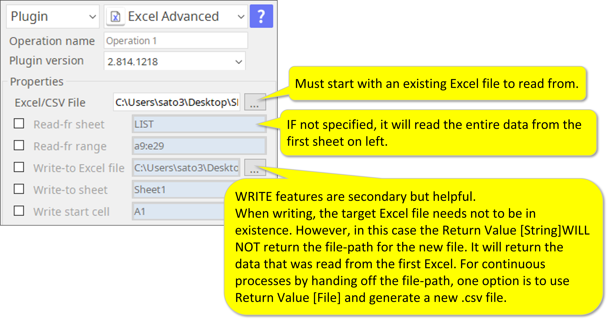

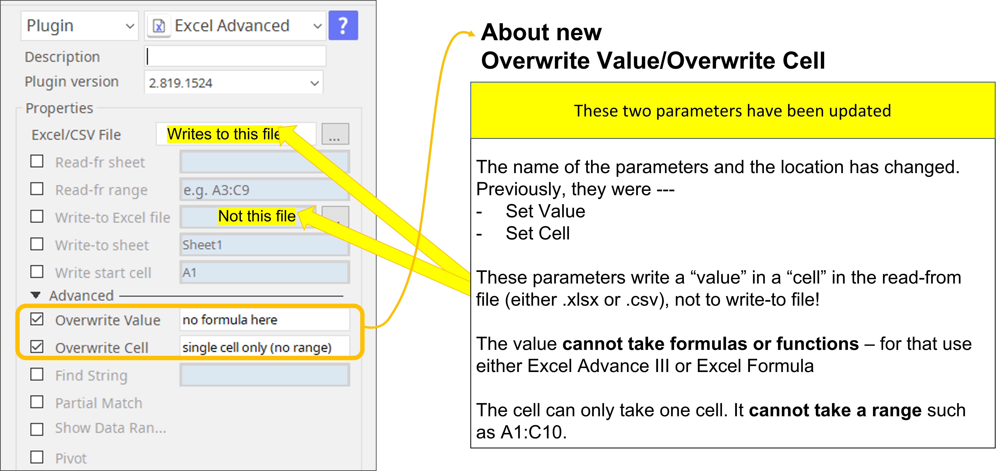

## No functions can be inserted.
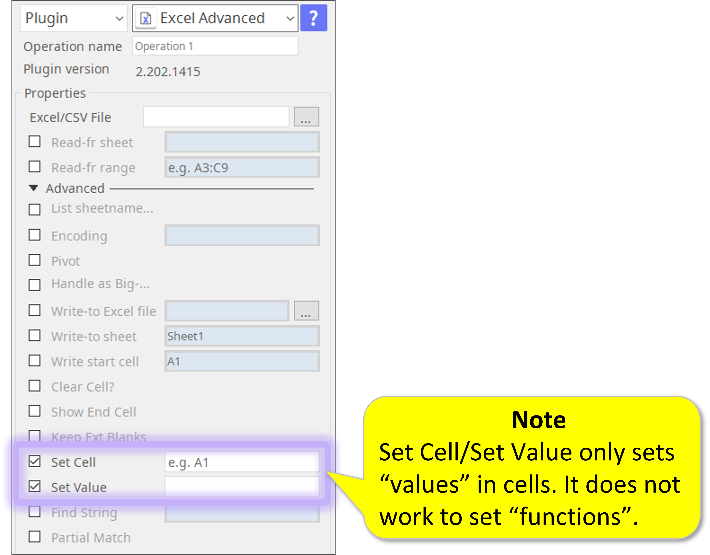

## Tips when reading from an Excel file
* You need a source file either xlsx or csv.
* You can specify sheet and range.
* You will read the data and store it in forms of String, CSV (Internal to bot), or File (usually CSV or TXT, external file location).
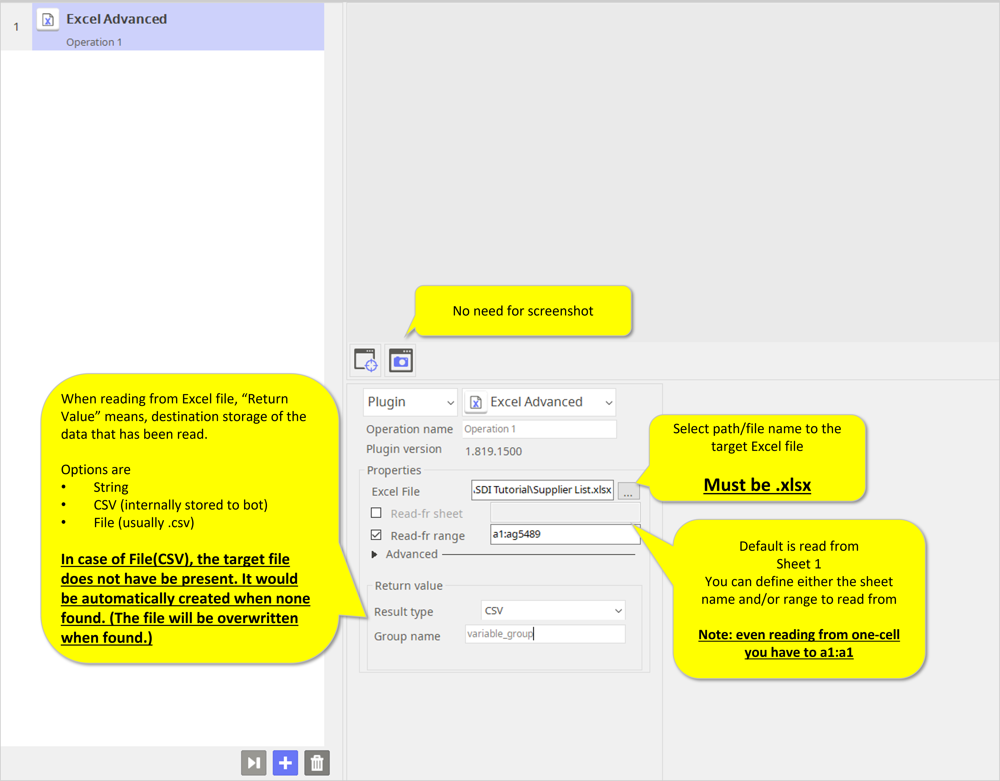

## Tips when writing to an Excel file
* You need a source file either xlsx or csv.
* You can specify sheet and range to read from.
* You specify a target file either xlsx or csv.
* If target file is not found, the Excel Advanced plugin will automatically create the file.
* If target file exists, the Excel Advance plugin will overwrite the specified cells.
* The data will be simultaneously and store it in forms of String, CSV (Internal to bot), or File (usually CSV or TXT, external file location)

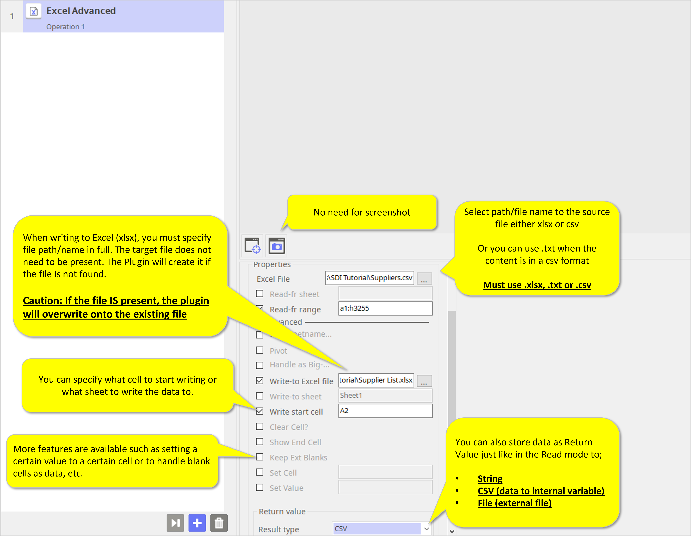
More tips about the Plugin [Return Value] types.

## How to use the Pivot option

* Here is your source EXCEL.

  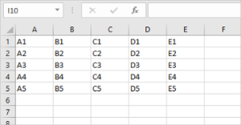

* Pivot option will result in this Excel.
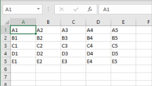

* The settings look like this.
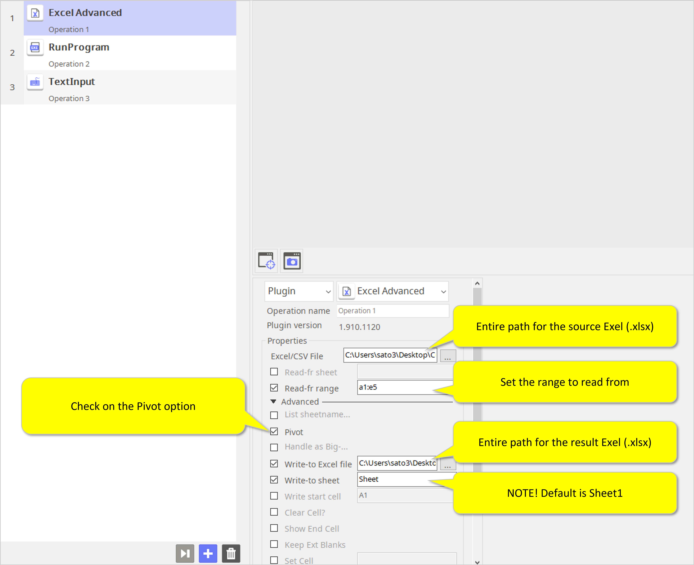

* If you want an internally stored CSV, the setting will look like this. 
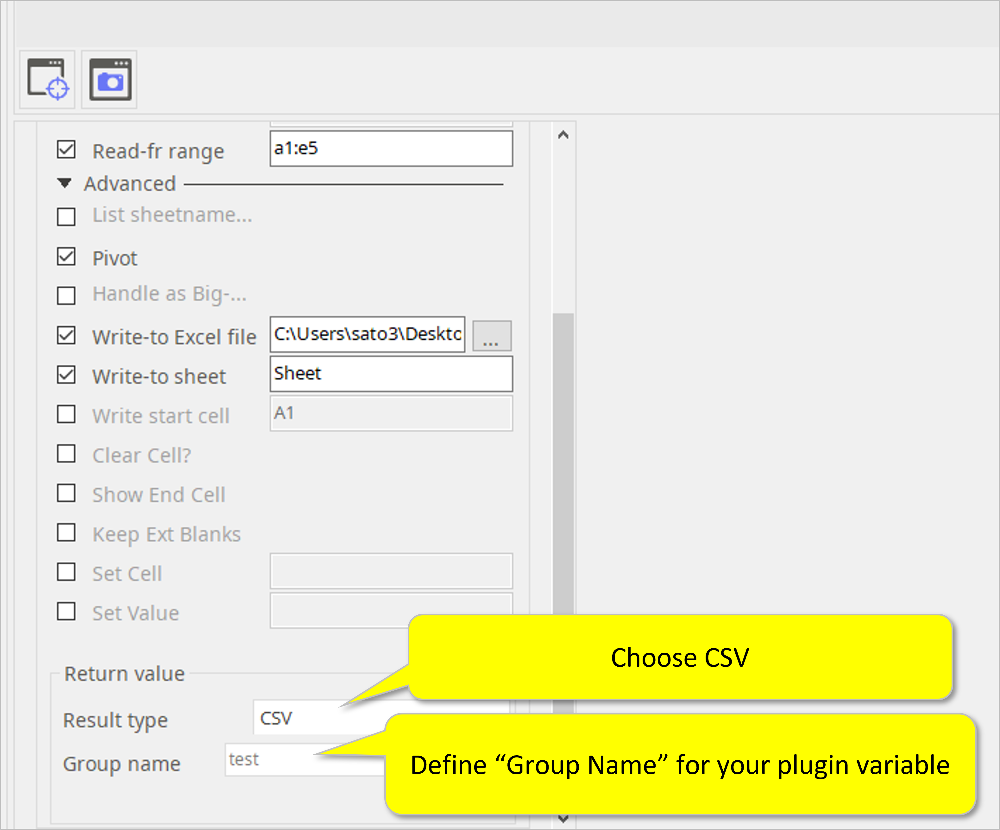

   Then your plugin variable {{test.A2(4)}} will produce E2.

  Your row 1 will become headers. Row 2 to 5 are the data.

  Plugin variable does not support 1 row CSV.


## “Data Only” and “Allow Overwrite” options
### 1. Data only
By checking this checkbox, all functions (formulas) will be deleted and the new sheet/book will only contain data (values).

   **All functions and formulas will be deleted and lost forever.**


### 2. Allow Overwrite
By checking this checkbox, the plugin will overwrite existing sheet/book and save it. The original sheet/book will be lost forever.

   **This function can result in loss of functions/formulas.**


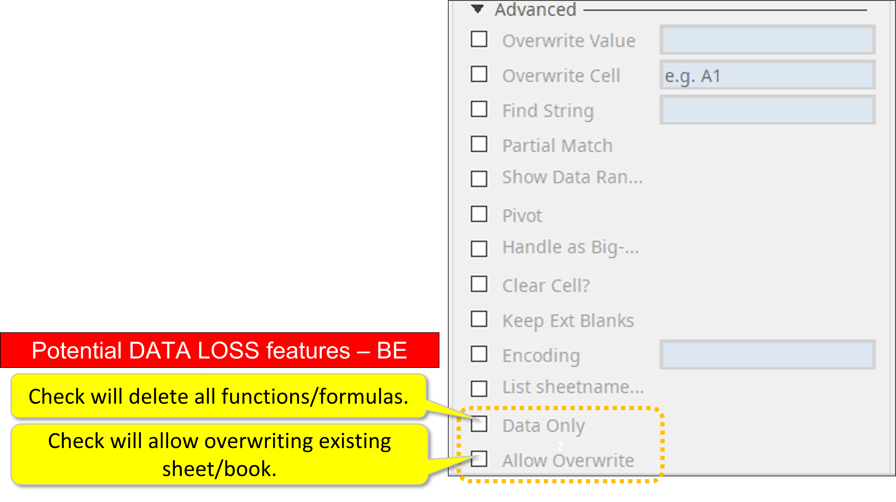

## Other useful functions
### 1. Find String
* **Input**

      Required
           - .xlsx or .csv file to read from.

        Optional
           - Sheet name
           - Cell ID/Range
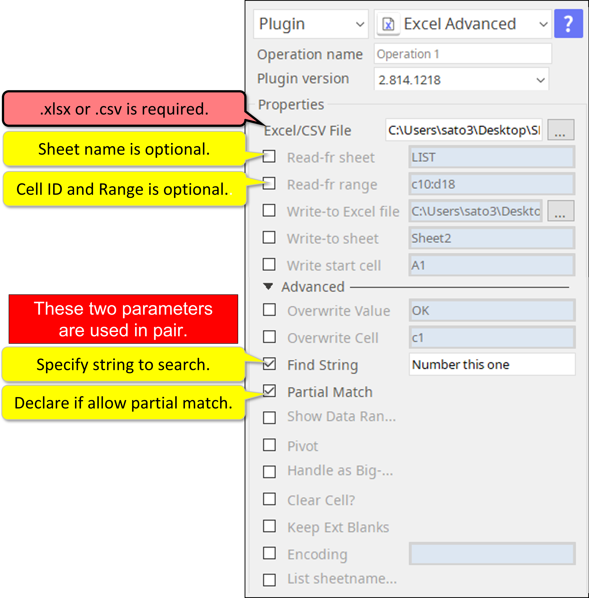
  * **Output/Return Value**
  
    Cell ID/Cell IDs in CSV format.

### 2. Pivot

* **Input**


    Required:
        .xlsx or .csv file to write to
        .xlsx or .csv file to read from

    Optional
     -  Sheet name of the source file.
     -  Cell ID/Range of the source file.
     -  Sheet name of the target file.
     -  Cell ID/Range of the target file.
**Even when you are writing the result to the same file, you must declare the target file.**
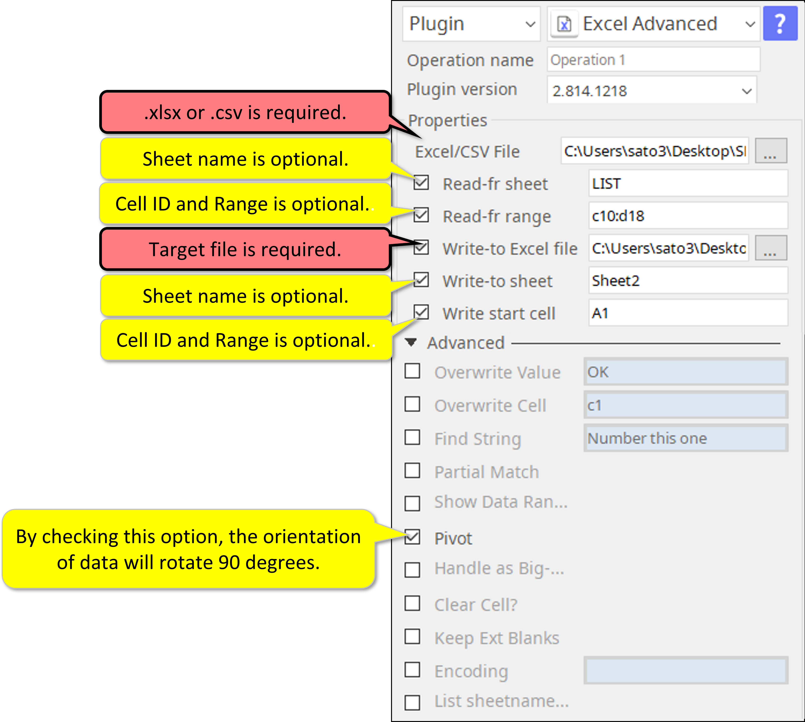

 * **Output/Return Value**
  
    File path of the target file.

### 3. Show Data Range
* **Input**

      Required
           - .xlsx or .csv file to read from.

        Optional
           - Sheet name
           - Cell ID/Range
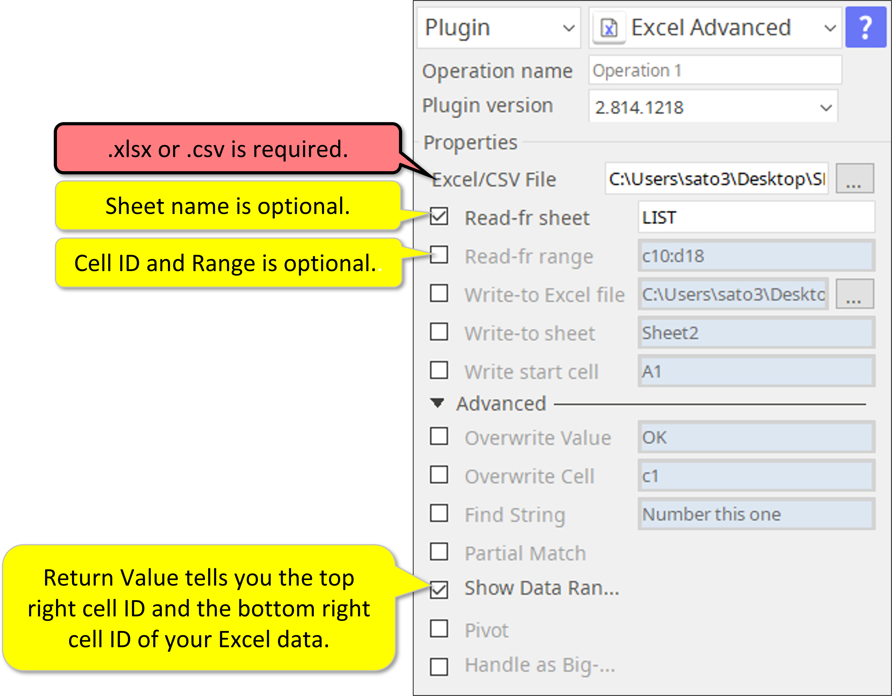
 * **Output/Return Value**
  
    Top left cell ID and bottom right cell ID that contains some data on the sheet.

### 4. Clear Cell
* **Input**

      Required
           - .xlsx or .csv file to read from.

        Optional
           - Sheet name
           - Cell ID/Range
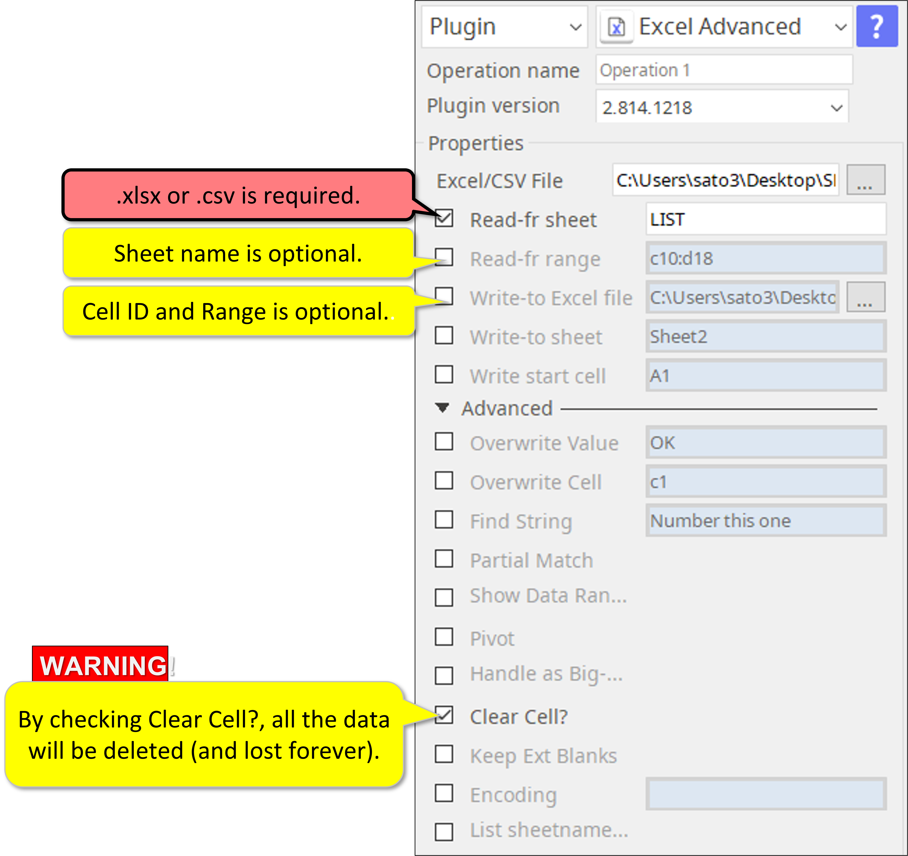
 * **Output/Return Value**
  
    Top left cell ID and bottom right cell ID that contains some data on the sheet.

