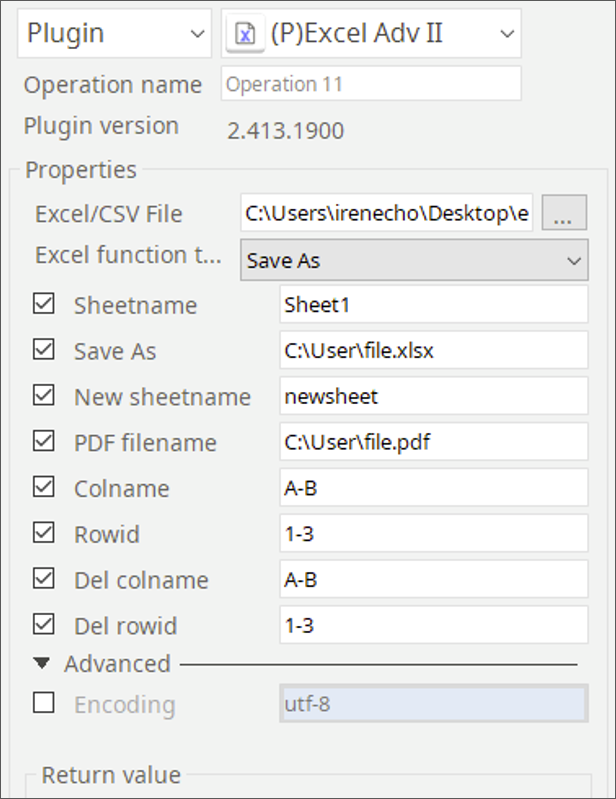
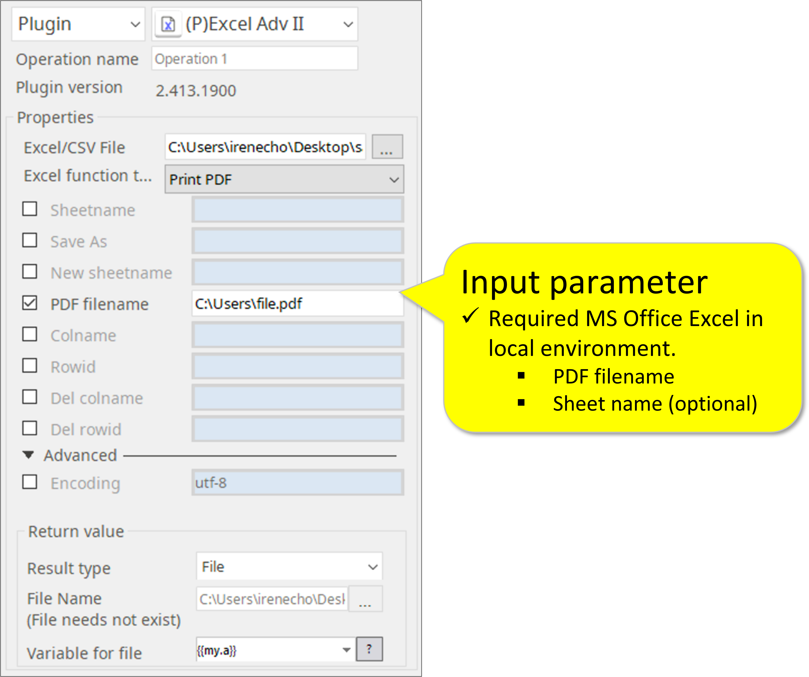

# Excel Advance II

***ARGOS LABS plugin module for Excel Advance II***

> This function is one of Plugins Operation.You can find the movie in [ARGOS RPA+ video tutorial](https://www.argos-labs.com/video-tutorial/).

## Name of the plugin
Item         | Value
-------------|:---:
Icon         |  
Display Name | **Excel Adv II**

## Name of the author (Contact info of the author)

Jerry Chae
* [email](mailto:mcchae@argos-labs.com)

[comment]: <> (* [github]&#40;https://github.com/Jerry-Chae&#41;)

## Notification

### Dependent modules
Module | Source Page | License | Version (If specified otherwise using recent version will be used)
---|---|---|---
[openpyxl](https://pypi.org/project/openpyxl/) | [openpyxl](https://github.com/theorchard/openpyxl) | [MIT](https://github.com/theorchard/openpyxl/blob/master/LICENCE.rst) | newer than `2.6.1` (Latest is `3.0.10`, Dec 2020)
[pywin32](https://pypi.org/project/pywin32/) | [pywin32](https://github.com/mhammond/pywin32) | [PSF2.0](https://github.com/mhammond/pywin32/blob/main/win32/License.txt) | win32
## Warning 
None

## Prerequisite
Local excel file for the ‘Print to PDF function’ 

## Helpful links to 3rd party contents
None

## Version Control 
* [3.1110.3456](setup.yaml)
* Release Date: Nov 10, 2021

## Input (Required) - I
Display Name | Input Method                                           | Default Value | Description
---|--------------------------------------------------------|---------------|---
Excel/CSV File   | File Path  | -             | Determine the file path of the Excel/CSV file.

## Parameter setting examples

## Input (Required) - II
### 1. Main Features

Feature | Parameter | Return Value
------|------|-----
Save as | New File Name  | File path (Str)
Add Sheet  | New Sheet Name | File path (Str)
Delete Sheet | Sheet Name | File path (Str)
Rename Sheet  | Old Sheet name,New sheet name | File path (Str)
Print to PDF | PDF file path and name | File path (Str)
Insert, delete row and column | A or A-C / 1 or 1-3 (can do multiple) | File path (Str)
Find first blank column | 1 (row number) | Column ID (Str)
Find first blank row | A (column ID) | Row ID (Str)

## Input (Optional)
### 2.Plugin parameters and example
Plugin Parameters | Example
-----|------
Sheetname | Sheet1
Save As | C:\User\file.xlsx (absolute path)
New Sheetname | Newsheet
PDF filename | C:\User\file.pdf (absolute path)
Colname | A-B or A
RowID | 1-3 or 1
Del Colname | A-B or A
Del RowID | 1-3 or 1
Encoding | utf-8

### 3. Plugin features and each required or optional parameter
Plugin Features | Required Parameters | Optional Parameters
--------|--------|-------
Save As | Save As | -
Rename Sheet | Sheetname, New Sheetname | Save As
Print to PDF | PDF Filename | -
Insert Delete Row Col | Rowid/ Colname / Del colname / Del rowid |Save As, Sheetname
Find first blank row | Colname |Save As,Sheetname
Find first blank column | Colname | Save As,Sheetname
Delete Sheet | Sheetname | Save As
Add Sheet | New Sheetname |Save As

### 4. Print PDF Example

## Return Value
Select String - See chart above [Input Required II](#input--required----ii)

## Return Code
Code | Meaning
---|---
0 | Execution Success
9 | Execution Failed
