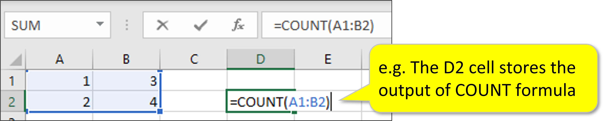
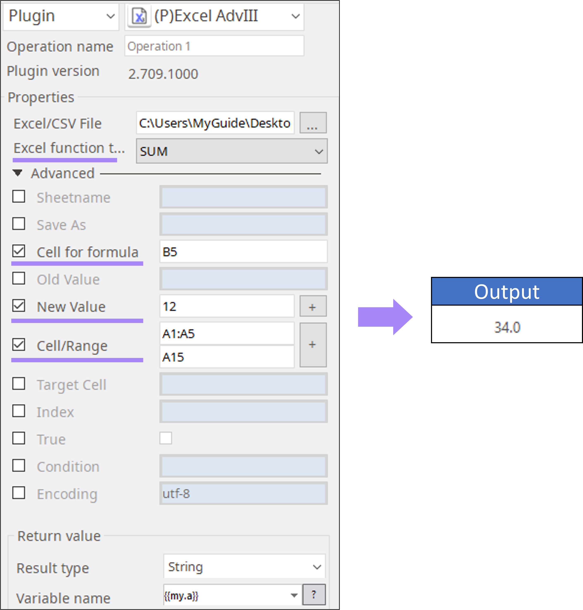

# Excel Advance III

***ARGOS LABS plugin module for Excel Formula***

> This function is one of Plugins Operation.You can find the movie in [ARGOS RPA+ video tutorial](https://www.argos-labs.com/video-tutorial/).

## Name of the plugin
Item         | Value
-------------|:---:
Icon         |  
Display Name | **Excel Adv III**

## Name of the author (Contact info of the author)

Jerry Chae
* [email](mailto:mcchae@argos-labs.com)

[comment]: <> (* [github]&#40;https://github.com/Jerry-Chae&#41;)

## Notification

### Dependent modules
Module | Source Page | License | Version (If specified otherwise using recent version will be used)
---|---|---|---
[openpyxl](https://pypi.org/project/openpyxl/) | [openpyxl](https://github.com/theorchard/openpyxl) | [MIT](https://github.com/theorchard/openpyxl/blob/master/LICENCE.rst) | newer than `2.6.1` (Latest is `3.0.10`, Dec 2020)
[xlwings](https://pypi.org/project/xlwings/)  | [xlwings](https://github.com/xlwings/xlwings) | [BSD-Licensed](https://github.com/xlwings/xlwings/blob/main/LICENSE.txt) |  `latest` 
[pywin32](https://pypi.org/project/pywin32/) | [pywin32](https://github.com/mhammond/pywin32) | [PSF2.0](https://github.com/mhammond/pywin32/blob/main/win32/License.txt) | win32 for password option : Windows ONLY!!!

## Warning 

>  **IMPORTANT NOTE** 
> Excel Advanced III (AdvIII) is designed to take CSV as an input. However, it is an Excel plugin after all. There are some limitations with CSV data type. If your CSV includes special data types such as date/time, percentage, and currency, they may be handled only as string thus some formulas may not work. 
## Primary Features

 * You can create paste new values or replace the old values to new ones.
 * Simple excel formulas such as count, counta, countif, sum, vloookup can be performed

## Prerequisite

* Local MS Excel 

## Helpful links to 3rd party contents
**For the details of each operation, refer the MS office website:** 
[Formulas & Functions](https://support.microsoft.com/en-us/office/formulas-and-functions-294d9486-b332-48ed-b489-abe7d0f9eda9?ui=en-US&rs=en-US&ad=US#ID0EAABAAA=More_functions)

## Version Control 
* [3.1008.1544](setup.yaml)
* Release Date: Oct 08, 2021

## Input (Required) - I
Display Name | Input Method                                           | Default Value | Description
---|--------------------------------------------------------|---------------|---------
Excel/CSV File   | File Path  | -             | Determine the file path of the Excel/CSV file.

## Input (Required) - II
### 1. Plugin operations and required parameters

Operation | Parameter  | Output         
----------------|----------------------------------------|----------------
Put value/formula | Newvalue: A new value to put (e.g. 10)    Cell/Range: A cell/range to paste.                                                                                                                                                                                                       | Filepath       
Replace value/formula | Oldvalue: An old value to put (e.g. 10)   Newvalue: A new value to put (e.g. 10)  Cell/Range (optional): A cell or range to replace the values.   *If you don’t specify, the whole sheet will be replaced                                                             | File path      
Convert str2num    *convert string to numeric values | Cell/Range (e.g. A1:A1 even when choosing one cell)   Sheetname (if more than one sheet in .xlsx)                                                                                                                                                                                  | File path      
VLOOKUP  | Cell for formula: A cell to save the VLOOKUP formula    Cell/Range: range containing the lookup value    Target Cell: lookup value    Index: the column number in the range containing the return value    True: Approximate match (TRUE) or Exact match (FALSE) | VLOOKUP value  
COUNT | Cell for formula: A cell to save the COUNT formula    New Value: New values to count (e.g. 1,2)    Cell/Range                                                                                                                                                                | COUNT value
COUNTA | Cell for formula: A cell to save the COUNTA formula    Cell/Range                                                                                                                                                                                                                  | COUNTA value 
COUNTIF | Cell for formula: A cell to save the COUNIF formula    Cell/Range    Condition: The condition for COUNTIF function    *Use 2 double quotation marks for the condition e.g. ““>10””                                                                                     | COUNTIF Value 
SUM | Cell for formula: A cell to save the SUM formula    New Value: A numeric value to be added    Cell/Range                                                                                                                                                                     | SUM value
Fill formula    *Put the formula in the range | New Value: New formula    Cell/Range: Range to paste                                                                                                                                                                              | File Path

 
 
  The function of ’Cell for formula’ parameter? It is a cell which stores output value. 

## Input (Optional)
### 2. Common Parameter

> * Sheetname: A sheetname for the excel file which default is 0
> * Save As: A new filename 
> * Encoding: UTF-8 is default
> * Format Cell/Range: Cell or range of cells to change the specific excel format
> * Format: Specify the type of formats e.g. YYYY-MM-DD

## Parameter setting examples
### 3. Example of the plugin in STU
* SUM

## Return Value
Select String - See chart above [Input Required II](#input--required----ii)

## Return Code
Code | Meaning
---|---
0 | Execution Success
1 | Execution Failed
