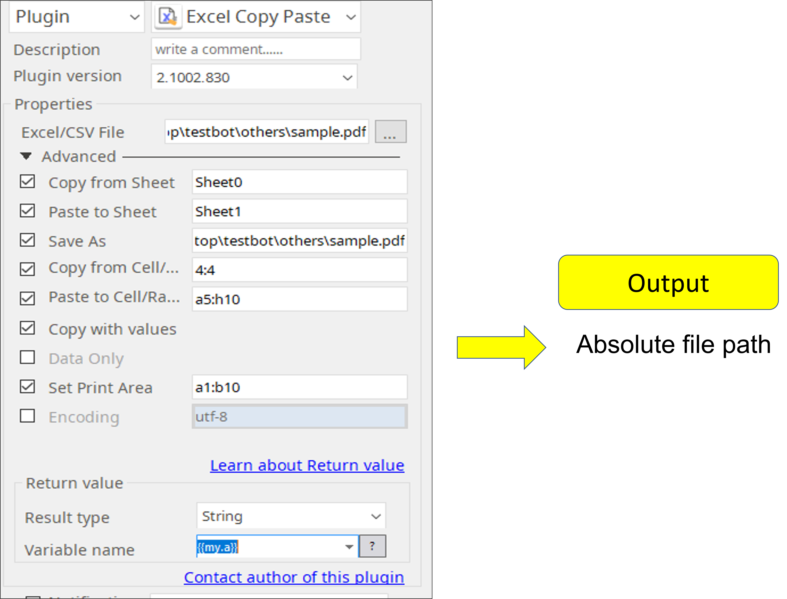

# Excel Copy Paste

***ARGOS LABS plugin module for Excel Copy Format***

> This function is one of Plugins Operation.You can find the movie in [ARGOS RPA+ video tutorial](https://www.argos-labs.com/video-tutorial/).

## Name of the plugin
Item         | Value
-------------|:---:
Icon         |  
Display Name | **Excel Copy Paste**

## Name of the author (Contact info of the author)

Jerry Chae
* [email](mailto:mcchae@argos-labs.com)

[comment]: <> (* [github]&#40;https://github.com/Jerry-Chae&#41;)

## Notification

### Dependent modules
Module | Source Page | License | Version (If specified otherwise using recent version will be used)
---|---|---|---
[openpyxl](https://pypi.org/project/openpyxl/) | [openpyxl](https://github.com/theorchard/openpyxl) | [MIT](https://github.com/theorchard/openpyxl/blob/master/LICENCE.rst) | newer than `2.6.1` (Latest is `3.0.10`, Dec 2020)

## Warning 

>  **IMPORTANT NOTE** 
> **When you want to perform a plain copy and paste of data/value, you must check the Copy with Value option and/or Data Only option!**  This plugin has been mainly designed to perform copy and paste"Style" and "Format" in Excel.

## Primary Features

* Copy styles and values of cells in an excel sheet
* Select print area
* Output will be an absolute file path 

## Prerequisite

* Local MS Excel 

## Helpful links to 3rd party contents
None

## Version Control 
* [2.1002.3456](setup.yaml)
* Release Date: Oct 02, 2020

## Input (Required) 
Display Name | Input Method                                           | Default Value | Description
---|--------------------------------------------------------|---------------|---------
Excel/CSV File   | File Path  | -             | Determine the file path of the Excel/CSV file.

 See the below charts for more information about parameter setting.

## Input (Optional)

Parameters | Format | Req/Opt  | Description
----------|-------|----------|---------
Excel/CSV File | An absolute file path of a file | Required | An absolute file path of a file.
Sheetname | Case sensitive |Optional | The name of the source sheet to copy.
Paste Sheetname | Case sensitive | Optional |The name of the destination source sheet to paste.
Save As | An absolute file path of a new file | Optional | An absolute file path of a new file.
Cell/Range | A1, a1,A1:C11, a1:c11, 1:11, A:A, a:a | Required | Cell or range of cells to copy
Paste Cell/Range | A1, a1,A1:C11, a1:c11, 1:11, A:A, a:a | Required | Cell or range of cells to paste
Copy with values | yes or no | Optional | Default is no values will be copied(Just style/format will be copied).
Data Only | yes or no | Optional |Yes will copy value default will copy the formula
Set Print Area | Select print area | Optional | Bonus feature to selct print area.
Encoding | Example: UTF-8 | Optional | Excel Encoding.

### Plugin Parameters

> * Excel/CSV File: An absolute file path of a file
> * Sheetname: The name of a sheet to copy
> * Paste Sheetname:  The name of a sheet to paste
> * Save As: A new filename to save
> * Cell/Range: Cell or range of cells to copy
> * Paste Cell/Range: Cell or range of cells to paste
> * Copy with values: Copy and paste cell values
> * Data Only: Print only data instead of including formulas
> * Set Print Area: Select print area
> * Encoding: Excel encoding

## Parameter setting examples
### 3. Example of the plugin in STU

## Return Value
Select String - See chart above [Input Optiona](#input--optional-)

## Return Code
Code | Meaning
---|---
0 | Execution Success
1 | Execution Failed
