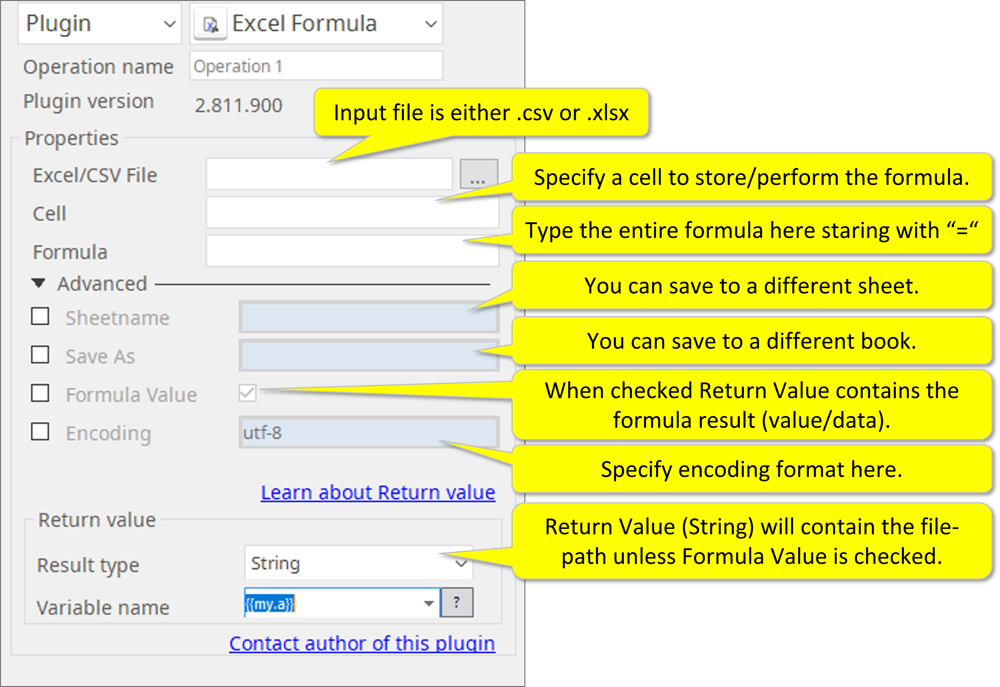

# Excel Formula

***ARGOS LABS plugin module for Excel Formula***

> This function is one of Plugins Operation.You can find the movie in [ARGOS RPA+ video tutorial](https://www.argos-labs.com/video-tutorial/).

## Name of the plugin
Item         | Value
-------------|:---:
Icon         |  
Display Name | **Excel Formula**

## Name of the author (Contact info of the author)

Jerry Chae
* [email](mailto:mcchae@argos-labs.com)

[comment]: <> (* [github]&#40;https://github.com/Jerry-Chae&#41;)

## Notification

### Dependent modules
Module | Source Page | License | Version (If specified otherwise using recent version will be used)
---|---|---|---
[openpyxl](https://pypi.org/project/openpyxl/) | [openpyxl](https://github.com/theorchard/openpyxl) | [MIT](https://github.com/theorchard/openpyxl/blob/master/LICENCE.rst) | newer than 2.6.1 (Latest is 3.0.10, Dec 2020)
[xlwings](https://pypi.org/project/xlwings/)  | [xlwings](https://github.com/xlwings/xlwings) | [BSD-Licensed](https://github.com/xlwings/xlwings/blob/main/LICENSE.txt) | `latest` 
[pywin32](https://pypi.org/project/pywin32/) | [pywin32](https://github.com/mhammond/pywin32) | [PSF-2.0](https://github.com/mhammond/pywin32/blob/main/Pythonwin/License.txt) | `win32` for password option : Windows ONLY!!!
## Warning 
None
## Primary Features
* This plugin simply inserts an Excel formula to either a .csv file or an .xlsx file.

## Prerequisite
None

## Helpful links to 3rd party contents
None

## Version Control 
* [3.824.3456](setup.yaml)
* Release Date: Aug 24, 2021

## Input (Required) 
Display Name | Input Method | Default Value | Description
---|--------------|---------------|---------
Excel/CSV File   | File Path    | -             | Determine the file path of the Excel/CSV file.
Cell  | CellID       | - | Cell ID at which the formula will be stored.
Formula | Formula | -  | Excel formula itself.

## Input (Optional)

Parameters | Format | Description
----------|-------|------
Sheetname | Case sensitive  | The name of the source sheet to copy.
Save As | An absolute file path of a new file  | File path/file name if you want to store the results to a separate file (no change will be made to the original file).
Formula Value | - | Formula result value (data) to be returned instead of the full file-path.
Encoding | Example: UTF-8 | Excel Encoding.

## Parameter setting examples

## Return Value
* String should be chosen.
* Return Value will be either the file-path or the formula execution result (value/data).

## Return Code
Code | Meaning
---|---
0 | Execution Success
1 | Execution Failed
