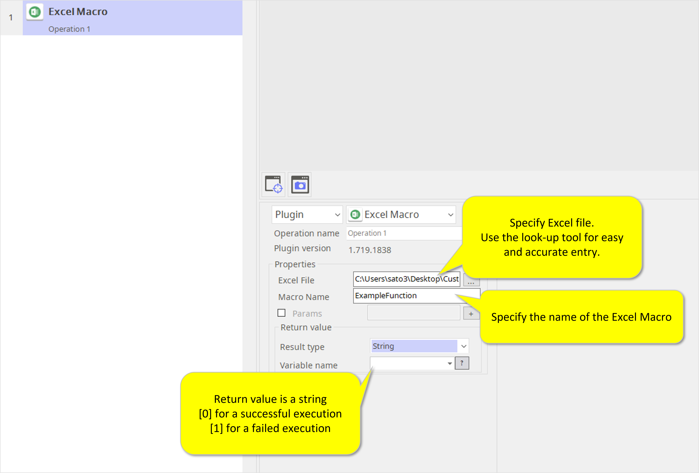
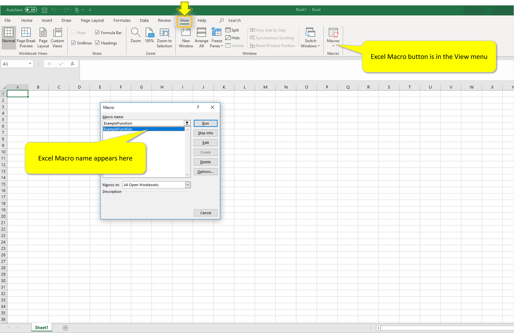

# Excel Macro

***ARGOS LABS plugin module for Excel Macro***

> This function is one of Plugins Operation.You can find the movie in [ARGOS RPA+ video tutorial](https://www.argos-labs.com/video-tutorial/).

## Name of the plugin
Item         | Value
-------------|:---:
Icon         |  
Display Name | **Excel Macro**

## Name of the author (Contact info of the author)

Jerry Chae
* [email](mailto:mcchae@argos-labs.com)

[comment]: <> (* [github]&#40;https://github.com/Jerry-Chae&#41;)

## Notification

### Dependent modules
Module | Source Page | License | Version (If specified otherwise using recent version will be used)
---|---|---|---
[openpyxl](https://pypi.org/project/openpyxl/) | [openpyxl](https://github.com/theorchard/openpyxl) | [MIT](https://github.com/theorchard/openpyxl/blob/master/LICENCE.rst) | Use version 3.0.7 (Latest is 3.0.10, Dec 2020)
[xlwings](https://pypi.org/project/xlwings/)  | [xlwings](https://github.com/xlwings/xlwings) | [BSD-Licensed](https://github.com/xlwings/xlwings/blob/main/LICENSE.txt) |  Use version 0.23.0
[pywin32](https://pypi.org/project/pywin32/) | [pywin32](https://github.com/mhammond/pywin32) | [PSF-2.0](https://github.com/mhammond/pywin32/blob/main/Pythonwin/License.txt) | This excel macro needs local excel installed

## Warning 
 IMPORTANT NOTE  
Please read carefully as you MAY LOSE your macros!  
**The [Excel Macro] plugin works with .xls and .xlsm file format only.** It does not work with .xlsx file format even when the file's setting to be changed to "Enable all macros". When .xlsx files are run with this plugin, YOU MAY LOSE ALL MACRO settings.
## Primary Features
* Executes Excel Macro from bot.
* Can include parameters for the Macro.
## Prerequisite
* Local Excel File

## Helpful links to 3rd party contents
None

## Version Control 
* [2.428.3456](setup.yaml)
* Release Date: Apr 28, 2020

## Input (Required) 
Display Name | Input Method | Default Value | Description
---|--------------|---------------|---------
Excel/CSV File   | File Path    | -             | Determine the file path of the Excel/CSV file.
Excel Macro | String | - | Specify the name of the excel macro.

## Input (Optional)

None

## Parameter setting examples

## Return Value
* String should be chosen.

## Return Code
Code | Meaning
---|---
0 | Execution Success
1 | Execution Failed
