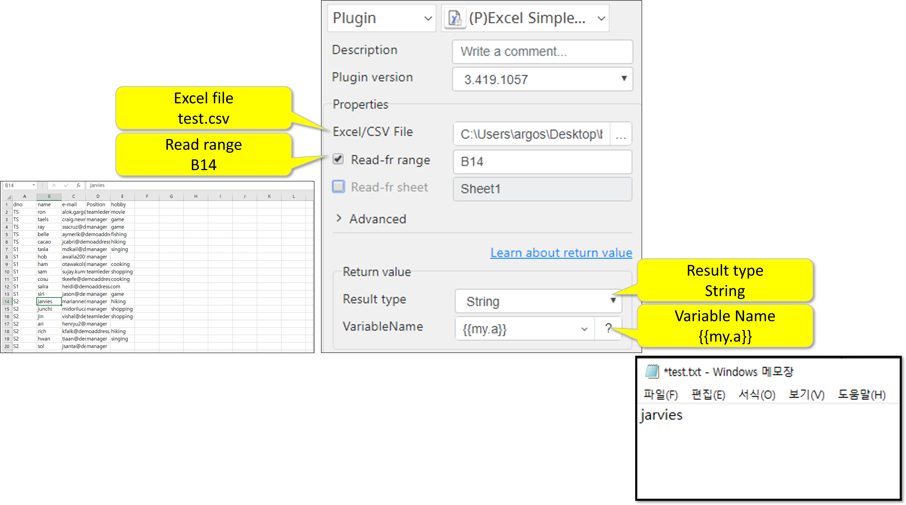
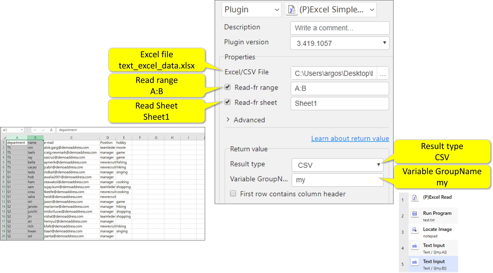
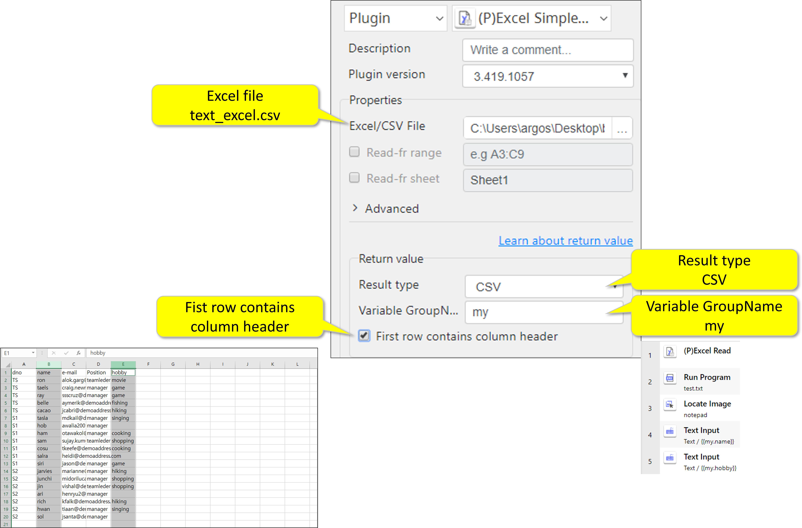
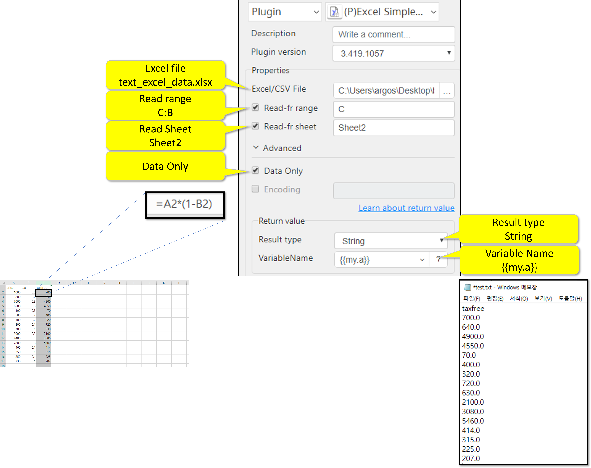

# Excel Simple Read

***ARGOS LABS plugin module for Excel***

> This function is one of Plugins Operation.You can find the movie in [ARGOS RPA+ video tutorial](https://www.argos-labs.com/video-tutorial/).

## Name of the plugin
Item         | Value
-------------|:---:
Icon         |  
Display Name | **Excel Simple Read**

## Name of the author (Contact info of the author)

Kyobong An
* [email](mailto:akb0930@argos-labs.com)

[comment]: <> (* [github]&#40;https://github.com/Jerry-Chae&#41;)

## Notification

### Dependent modules
Module | Source Page | License | Version (If specified otherwise using recent version will be used)
---|---|---|---
[openpyxl](https://pypi.org/project/openpyxl/) | [openpyxl](https://github.com/theorchard/openpyxl) | [MIT](https://github.com/theorchard/openpyxl/blob/master/LICENCE.rst) | Use the version `3.0.7`
[xlwings](https://pypi.org/project/xlwings/)  | [xlwings](https://github.com/xlwings/xlwings) | [BSD-Licensed](https://github.com/xlwings/xlwings/blob/main/LICENSE.txt) |  Use the version `0.23.0`

## Warning 
None

## Primary Features
* This plugin reads value from CSV or EXCEL file.

## Prerequisite
* Local Excel/CSV File

## Helpful links to 3rd party contents
None

## Version Control 
* [4.712.3456](setup.yaml)
* Release Date: Jul 12, 2022

## Input (Required) 
Display Name | Input Method | Default Value | Description
---|--------------|---------------|---------
Excel/CSV File   | File Path    | -             | Determine the file path of the Excel/CSV file.

## Input (Optional)
Display Name | Input Method | Default Value | Description
---|--------------|---------------|---------
Read Sheet | Sheet Name | - | Sheet name (.xlsx only)
Read Range | A1:C30 A:C 1:30 A 1 | - | Cell Range
Data Only | - | - | Data only option (Good only with .xlsx when you want to read data (value) over formula)
Encoding | utf-8 | - | Excel Encoding.

> Formats For Read Range:
>
>        A1:C30    -      for specific rage
>        A:C       -      for multiple columns
>        1:30      -      for multiple rows
>        A         -      one column
>        1         -      one row

## Parameter setting examples
### .xlsx file usage output String:
 

### CSV file usage output String: 

### .xlsx file usage output CSV: 

### CSV file usage output CSV: 

### Data only usage output String:  

## Return Value
Check the above [diagram](#parameter-setting-examples) :
* String         Value or formula that was read from the source file
* CSV            Value or formula that was read from the source file
* File           Value or formula that was read from the source file

## Return Code
Code | Meaning
---|---
0 | Execution Successful
1 | File Open Failure
9 | Other Failure
