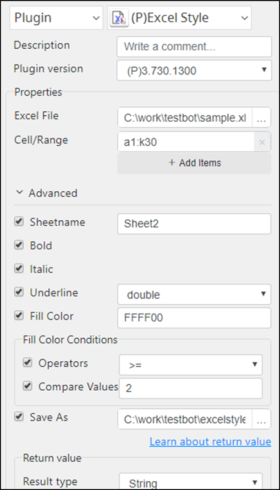
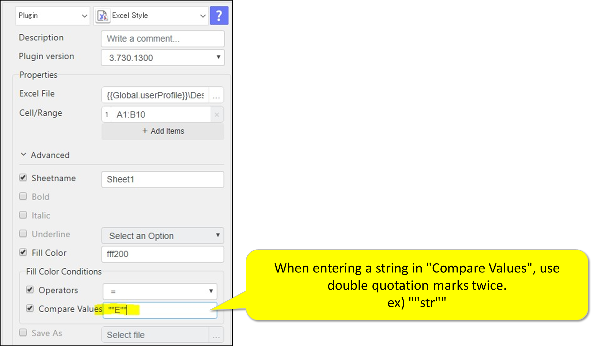

# Excel Style 

***ARGOS LABS plugin module for Excel Style***

> This function is one of Plugins Operation.You can find the movie in [ARGOS RPA+ video tutorial](https://www.argos-labs.com/video-tutorial/).

## Name of the plugin
Item         | Value
-------------|:---:
Icon         |  
Display Name | **Excel Style**

## Name of the author (Contact info of the author)

Jerry Chae
* [email](mailto:mcchae@argos-labs.com)

[comment]: <> (* [github]&#40;https://github.com/Jerry-Chae&#41;)

## Notification

### Dependent modules
Module | Source Page | License | Version (If specified otherwise using recent version will be used)
---|---|---|---
[openpyxl](https://pypi.org/project/openpyxl/) | [openpyxl](https://github.com/theorchard/openpyxl) | [MIT](https://github.com/theorchard/openpyxl/blob/master/LICENCE.rst) | newer than 2.6.1 (Latest is 3.0.10, Dec 2020)

## Warning 
None

## Primary Features
* This plugin changes font styles and fill colors.

## Prerequisite
* Local Excel/CSV File

## Helpful links to 3rd party contents
None

## Version Control 
* [3.1118.3456](setup.yaml)
* Release Date: Nov 18, 2021

## Input (Required) 
Display Name | Input Method | Default Value | Description
---|--------------|---------------|---------
Excel/CSV File   | File Path    | -             | Determine the file path of the Excel/CSV file.

## Input (Optional)
Display Name | Input Method         | Default Value | Description
---|----------------------|---------------|---------
Cell/Range | A1:C30 A:C 1:30 A 1  | -             | Cell Range
Sheetname | Sheet Name           | -             | Sheet name (.xlsx only)
Bold| -                    | -             | Determined cell range will have the appearance of darker text by applying a thicker stroke weight to the letters
Italic | -                    | -             | This option enables the font style that slants to the right.
Underline | Double/Single        | -             | The specified value is highlighted with the horizontal line below the value.
Fill Color | FFFFFF               | -             | RGB Color.
Fill Color - Operator | \>, >=, <, <=, =, != | -         | Set an operator to compare the values of cells
Fill Color - Compare Values | Variable             | -         | Set the value to compare
Fill Color - Use functions | -                    | -         |  Use functions in "Compare Values"
Save As | Absolute path        | - | Save as a different filename

> Formats For Cell/Range:
>
>        A1:C30    -      for specific rage
>        A:C       -      for multiple columns
>        1:30      -      for multiple rows
>        A         -      one column
>        1         -      one row

## Return Value
You can choose one of 3 output formats from below:
* String
* CSV
* File

## Parameter setting examples

 

## Return Code
Code | Meaning
---|---
0 | Execution Successful
1 | Execution Failed
