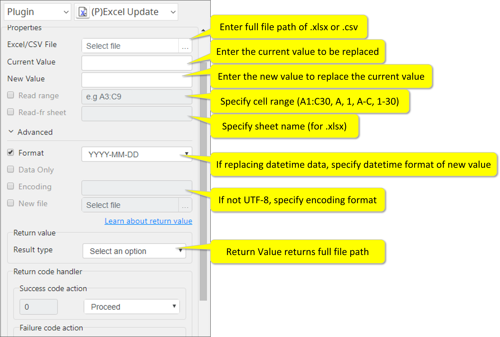

# Excel Update

***ARGOS LABS plugin module for Excel***

> This function is one of Plugins Operation.You can find the movie in [ARGOS RPA+ video tutorial](https://www.argos-labs.com/video-tutorial/).

## Name of the plugin
Item         | Value
-------------|:---:
Icon         |  
Display Name | **Excel Update**

## Name of the author (Contact info of the author)

Kyobong An
* [email](mailto:akb0930@argos-labs.com)

[comment]: <> (* [github]&#40;https://github.com/Jerry-Chae&#41;)

## Notification

### Dependent modules
Module | Source Page | License | Version (If specified otherwise using recent version will be used)
---|---|---|---
[openpyxl](https://pypi.org/project/openpyxl/) | [openpyxl](https://github.com/theorchard/openpyxl) | [MIT](https://github.com/theorchard/openpyxl/blob/master/LICENCE.rst) | Use the version `3.0.7`
[xlwings](https://pypi.org/project/xlwings/)  | [xlwings](https://github.com/xlwings/xlwings) | [BSD-Licensed](https://github.com/xlwings/xlwings/blob/main/LICENSE.txt) |  Use the version `0.23.0`
[chardet](https://pypi.org/project/chardet/) | [chardet](https://github.com/chardet/chardet) | [LGPL](https://github.com/chardet/chardet/blob/main/LICENSE) | `latest`

## Warning 
> The **DATA ONLY** option will remove all “formulas” from Excel as well.

## Primary Features
* This plugin replaces a value with another on an Excel sheet or on CSV. A handy tool for simple data manipulation.

## Prerequisite
* Local Excel/CSV File

## Helpful links to 3rd party contents
None

## Version Control 
* [3.614.3456](setup.yaml)
* Release Date: Jun 14, 2021

## Input (Required) 
Display Name | Input Method | Default Value | Description
---|--------------|---------------|---------
Excel/CSV File   | File Path    | -             | Determine the file path of the Excel/CSV file.
Current Value | Value | - | The current value of the Excel/CSV file.
New Value | Value | - | The New value to be updated in the Excel/CSV.

## Input (Optional)
Display Name | Input Method        | Default Value | Description
---|---------------------|---------------|---------
Read-fr Sheet | Sheet Name          | -             | Sheet name (.xlsx only)
Read Range | A1:C30 A:C 1:30 A 1 | -             | •  Use A1:C50 to select range.     •  Entire column/row can be selected by just entering A or 1.      •  Multiple full column/rows can be selected by A-C or 1-3 notation.
Date-Time Format | -                   | -             | When the replacement value is date/time, you must specify the format from the pull-down menu. **This format applies to the new value**. You must strictly follow the format such that mm must have 2 digits as in 02 as opposed to 2.
Data Only | -                   | -             |  By checking this option, all formulas will be removed and the “result data” will remain on the sheet. Because of the customer data protection policy, if new file name is not designated, the plugin will not change the original file.     Instead it would generate and new file with (n) at the end of the file name.
Encoding | -                   | utf-8         | Excel Encoding.
New file | Absolute file path | - |  Enter full file path of the new file after updating values.

> Formats For Read Range:
>
>        A1:C30    -      for specific rage
>        A:C       -      for multiple columns
>        1:30      -      for multiple rows
>        A         -      one column
>        1         -      one row

## Return Value
Full file path of the new file (String, CSV, or File)       Value or formula that was read from the source file

## Parameter setting examples

## Return Code
Code | Meaning
---|---
0 | Execution Successful
1 | File Open Errors
2 | Extension Errors
9 | Other Failure
