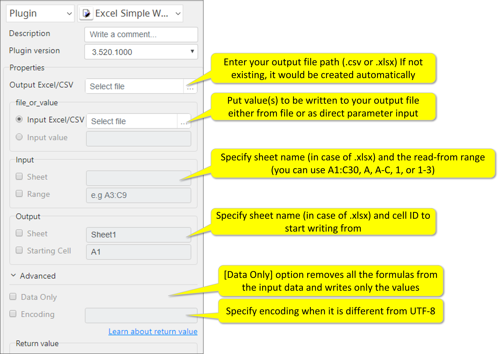

# Excel Write

***ARGOS LABS plugin module for Excel***

> This function is one of Plugins Operation. You can find the movie in [ARGOS RPA+ video tutorial](https://www.argos-labs.com/video-tutorial/).

## Name of the plugin
Item         | Value
-------------|:---:
Icon         |  
Display Name | **Excel Write**

## Name of the author (Contact info of the author)

Kyobong An
* [email](mailto:akb0930@argos-labs.com)

[comment]: <> (* [github]&#40;https://github.com/Jerry-Chae&#41;)

## Notification

### Dependent modules
Module | Source Page | License | Version (If specified otherwise using recent version will be used)
---|---|---|---
[openpyxl](https://pypi.org/project/openpyxl/) | [openpyxl](https://github.com/theorchard/openpyxl) | [MIT](https://github.com/theorchard/openpyxl/blob/master/LICENCE.rst) | `latest`
[xlwings](https://pypi.org/project/xlwings/)  | [xlwings](https://github.com/xlwings/xlwings) | [BSD-Licensed](https://github.com/xlwings/xlwings/blob/main/LICENSE.txt) |  `latest`
[pywin32](https://pypi.org/project/pywin32/) | [pywin32](https://github.com/mhammond/pywin32) | [PSF-2.0](https://github.com/mhammond/pywin32/blob/main/Pythonwin/License.txt) | `latest`, `win32` for password option : Windows ONLY!!!

## Warning 
None
## Primary Features
* This plugin writes values to CSV or Excel (.xlsx). If writing to a file/sheet that does not exist, the plugin will generate it automatically.

## Prerequisite
* Local Excel/CSV File

## Helpful links to 3rd party contents
None

## Version Control 
* [3.526.3456](setup.yaml)
* Release Date: May 26, 2021

## Input (Required) 
Display Name | Input Method | Default Value | Description
---|--------------|---------------|---------
Output Excel/CSV File   | File Path    | -             | Determine the file path for the output Excel/CSV file.
File_or_Value : Input Excel/CSV File   | File Path    | -             | Determine the file path for the input Excel/CSV file.  (Either `Input Excel/CSV File` or `Input Value`)
File_or_Value : Input Value | Value | - | Value(s) to be written. (Either `Input Excel/CSV File` or `Input Value`)
Input : Sheet | Sheet Name | - |  Sheet name (.xlsx only).
Input : Read Range | A1:C30 A:C 1:30 A 1 | -             | For more information check the below format.
Output : Sheet | Sheet Name | - |  Sheet name (.xlsx only).
Output : Cell ID | Cell ID | - | Cell ID to start writing from.

## Input (Optional)
Display Name | Input Method        | Default Value | Description
---|---------------------|---------------|---------
Data Only | -                   | -             | Data only option (Good only with .xlsx when you want to read data (value) over formula).
Encoding | -                   | utf-8         | Encoding format of the input data.

> Formats For Read Range:
>
>        A1:C30    -      for specific rage
>        A:C       -      for multiple columns
>        1:30      -      for multiple rows
>        A         -      one column
>        1         -      one row

## Return Value
Absolute file path for the resulting excel file.

## Parameter setting examples

## Return Code
Code | Meaning
---|---
0 | Execution Successful
1 | Open Error (Input file not found or input sheet not found)
9 | All other responses from the plugin
    
