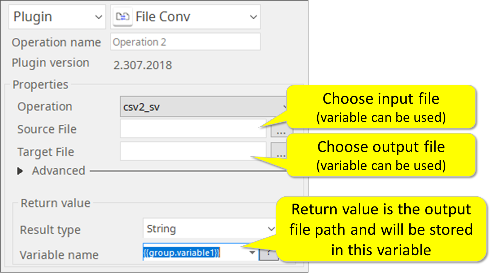
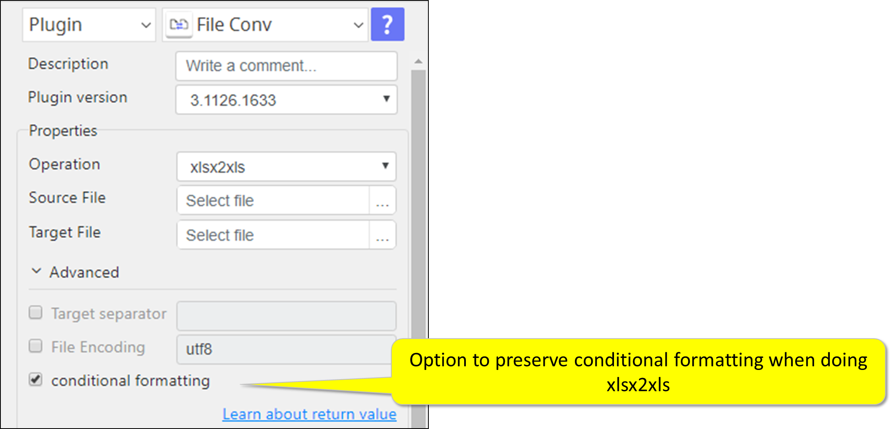

# File Conv

***ARGOS LABS plugin module data csv2tsv***

> This function is one of Plugins Operation.You can find the movie in [ARGOS RPA+ video tutorial](https://www.argos-labs.com/video-tutorial/).

## Name of the plugin
Item         | Value
-------------|:---:
Icon         |  
Display Name | **File Conv**

## Name of the author (Contact info of the author)

Jerry Chae
* [email](mailto:mcchae@argos-labs.com)

[comment]: <> (* [github]&#40;https://github.com/Jerry-Chae&#41;)

## Notification

### Dependent modules
Module | Source Page                                            | License | Version (If specified otherwise using recent version will be used)
---|--------------------------------------------------------|---|---
[xmltodict](https://pypi.org/project/xmltodict/) | [xmltodict](https://github.com/martinblech/xmltodict)  | [MIT License](https://github.com/martinblech/xmltodict/blob/master/LICENSE) | xmltodict>=`0.12.0` for xml2json
[pyexcel](https://pypi.org/project/pyexcel/) | [pyexcel](https://github.com/pyexcel/pyexcel)          | [BSD License](https://github.com/pyexcel/pyexcel/blob/dev/LICENSE) | `latest` for xls => xlsx
[pyexcel-xls](https://pypi.org/project/pyexcel-xls/) | [pyexcel-xls](https://github.com/pyexcel/pyexcel-xls)  | [BSD License](https://github.com/pyexcel/pyexcel-xls/blob/dev/LICENSE) | `latest` for xls => xlsx
[pyexcel-xlsx](https://pypi.org/project/pyexcel-xlsx/) | [pyexcel-xlsx](https://github.com/pyexcel/pyexcel-xlsx) | [BSD License](https://github.com/pyexcel/pyexcel-xlsx/blob/dev/LICENSE) | `latest` for xls => xlsx
[xlrd](https://pypi.org/project/xlrd/) | [xlrd](https://github.com/python-excel/xlrd) | [BSD License](https://github.com/python-excel/xlrd/blob/master/LICENSE) | xlrd>=  `1.2.0` for xls => csv
[pywin32](https://pypi.org/project/pywin32/) | [pywin32](https://github.com/mhammond/pywin32) | [PSF-2.0](https://github.com/mhammond/pywin32/blob/main/Pythonwin/License.txt) | `win32` for xlsx => xls

## Warning 
 **IMPORTANT NOTE** 
File Conv plugin was previously known as Data Conv plugin - now a new function has been added to convert .xls files into xlsx files.
## Primary Features
* This plugin converts file formats.

## Functions
* CSV file to TSV file
* CSV file to _SV file (space separated value file)
* json file to xml file
* xml file to json file
* xls file to xlsx file
* xls file to csv file
## Prerequisite
* Local File

## Helpful links to 3rd party contents
None

## Version Control 
* [3.1126.3456](setup.yaml)
* Release Date: Nov 26, 2021

## Input (Required) 
Display Name | Input Method | Default Value | Description
---|----------|---------------|---------
Operation | Select one from 8 options  | csv2tsv       | Conversion method. One of these `csv2tsv`, `csv2_sv`, `json2xml`, `xml2json`, `xls2xlsx`, `xls2csv`, `xlsx2xls`, `xlsx2csv`.
Source File | Absolute File Path | - | Choose input file (variable can be used).
Target File | Absolute File Path | - | Choose output file (variable can be used).

## Input (Optional)
Display Name | Input Method        | Default Value | Description
---|---------------------|---------------|---------
Target separator | - | `\t` as tab character | Target separator for `csv2_sv` operation
Conditional Formatting | -                   | -             | Option to preserve conditional formatting when doing xlsx2xls.
File Encoding | -                   | utf-8         | By checking this the target file will be encoded.

## Return Value
Absolute file path for the Output resulting file.

## Parameter setting examples

## How to preserve conditional formatting in xlsx2xls

## Return Code
Code | Meaning
---|---
0 | Execution Successful
1 | Other Failure
    
