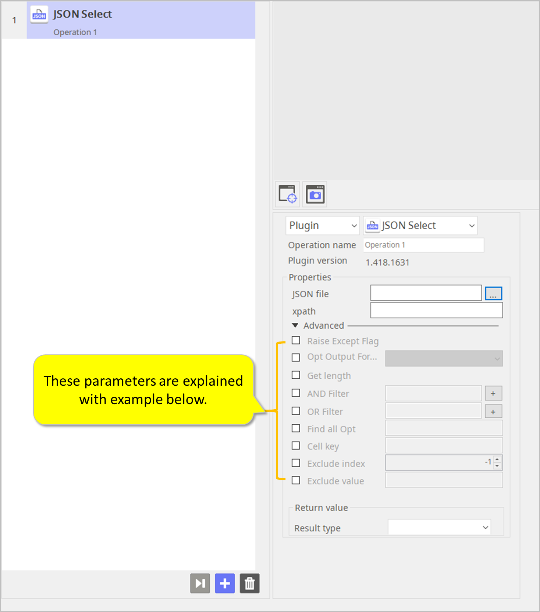
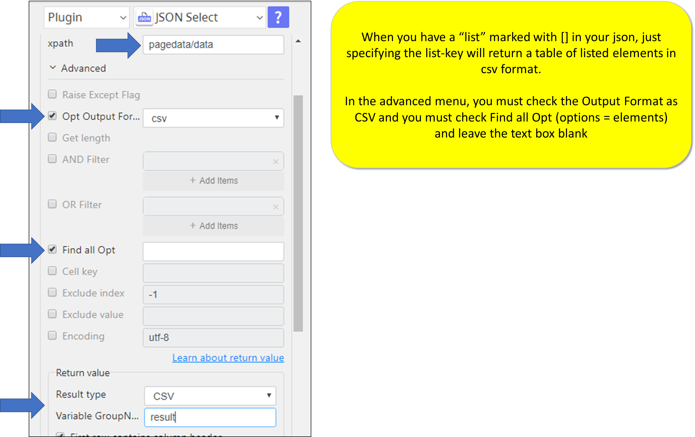
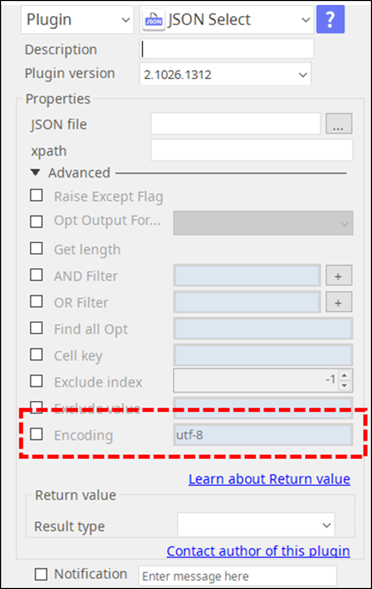

# JSON Select

***ARGOS LABS plugin module for select item from JSON***

> This function is one of Plugins Operation.You can find the movie in [ARGOS RPA+ video tutorial](https://www.argos-labs.com/video-tutorial/).

## Name of the plugin
Item         | Value
-------------|:---:
Icon         |  
Display Name | **JSON Select**

## Name of the author (Contact info of the author)

Jerry Chae
* [email](mailto:mcchae@argos-labs.com)

[comment]: <> (* [github]&#40;https://github.com/Jerry-Chae&#41;)

## Notification

### Dependent modules
None
## Warning 
None
## Primary Features
Please note the JSON Select plugin was designed to handle some special .json files that contain multiple-nested-layer structure with recursive columns. This type of .json files are often seen in output files from AI-OCR solutions such as Rossum and Xtracta.
## Prerequisite
* Local JSON File

## Helpful links to 3rd party contents
None

## Version Control 
* [3.122.3456](setup.yaml)
* Release Date: Dec 02, 2021

## Input (Required) 
Display Name | Input Method | Default Value | Description
---|-------------|---------------|---------
JSON File          | Absolute File Path | - | Determine the json file path.
xpath | XML Path | - | It is used to navigate through elements and attributes in an XML document.

## Input (Optional)
Display Name | Input Method | Default Value | Description
---|-------------|---------------|---------
Raise Except Flag | True/False | False | If this option is on and invalid xpath expression then raise error and return code will be set 2
Opt Output Format | - | csv | Output format, only `csv` format is allowed
Get length | True/False | False | If this flag is set then get the length of output elements instead data
AND Filter | multiple input | - | `AND` filter for matching key=value. eg) --and-filter `key=value`
OR Filter | multiple input | - | `OR` filter for matching key=value. eg) --or-filter `key=value`
Find all Opt | - | - | If this option is given with `key` string, then find all matching `key` items recursively
Cell key | (Only once set) | - | In CSV output cell is dictionary then get the value from with this cell-key
Exclude index | Integer type | - | In CSV output excluding cell index (1-based) with value
Exclude value | - | - | In CSV output excluding cell value
Encoding | - | utf-8 | Encoding for JSON file

### Usage Guide with Sample JSON code.

***Example JSON***

```json
{
    "page": 1,
    "per_page": 3,
    "total": 12,
    "total_pages": 4,
    "pagedata": {
        "data": [
            {
                "id": 1,
                "name": "cerulean",
                "year": 2000,
                "color": "#98B2D1",
                "pantone_value": "We"
            },
            {
                "id": 2,
                "name": "fuchsia rose",
                "year": 2001,
                "color": "#C74375",
                "pantone_value": "Freedom"
            },
            {
                "id": 3,
                "name": "true red",
                "year": 2002,
                "color": "#BF1932",
                "pantone_value": "Soul"
            }
        ]
    },
    "jpn": {
        "data": {
        "shippingDay": "2019-04-02",
        "mansionName": "新宿ビル"
    },
    "status": 200
}
```


### 1) Execute with xpath "total"
    > result is "12"
### 2)Execute with xpath "pagedata/data[2]/id"
     > result is "3"
### 3) Execute with xpath "pagedata/data"
     > result are
            "id","name","year","color","pantone_value"
             1,"cerulean",2000,"#98B2D1","We"
             2,"fuchsia rose",2001,"#C74375","Freedom"
             3,"true red",2002,"#BF1932","Soul"


### 4) Execute with xpath "pagedata/invalid" with "Raise Except Flag"
    > return Error

### 5) Execute with xpath "pagedata/invalid" without "Raise Except Flag"
     > return Error
     ==> no need this option.
>  *"Opt Output Format" is only "csv"

### 6) Execute with xpath "pagedata/data" with "Get length"
    > result are "3"

### 7) Execute with xpath "pagedata/data" with "AND Filter", "id=2" (this "AND Filter" can be mupliple)
     > result are
        "id","name","year","color","pantone_value"
         2,"fuchsia rose",2001,"#C74375","Freedom"

### 8) Execute with xpath "pagedata/data" with "OR Filter", "id=2", "OR Filter", "id=3"
    (this "AND Filter" can be mupliple)
             > result are
                "id","name","year","color","pantone_value"
                 2,"fuchsia rose",2001,"#C74375","Freedom"
                 3,"true red",2002,"#BF1932","Soul"

> * "Find all Opt" option is gathers all data matching key value.
> * "Cell key" option is defined then this column value is valid (exists and not empty).
> * "Exclude index" option is 1 and "Exclude value" is "Item" then in csv result first column value is "Item" rows are excluded.

## Return Value

### `Get length` flag is not set:
CSV result from the input JSON

### `Get length` flag is set:
The number of matching results which means number of rows for output CSV result

## Parameter setting examples
Check the [above](#input--optional-) for Parameter Setting Example

### Additional feature (as of Oct 26, 2020)



## Return Code
Code | Meaning
---|---
0 | Execution Successful
1 | If result is empty
2 | Execution Failed
    
