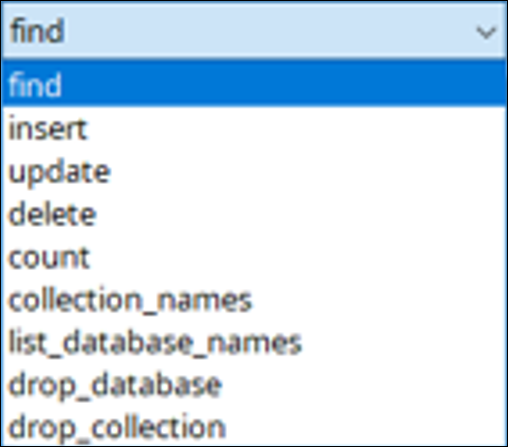
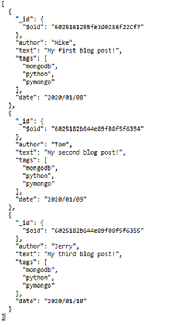
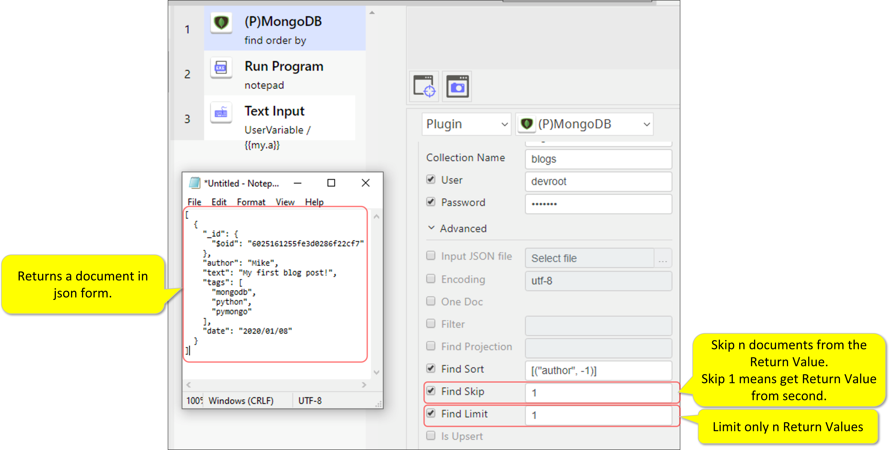
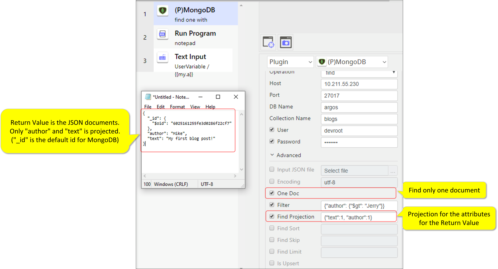
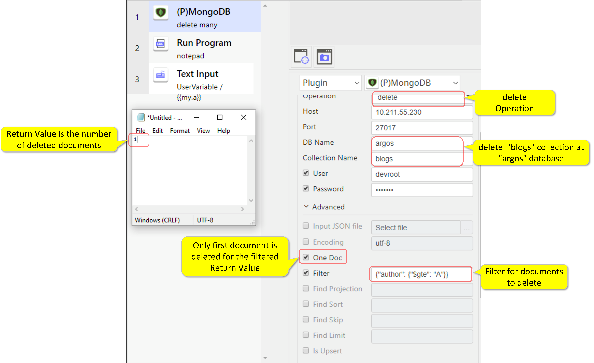
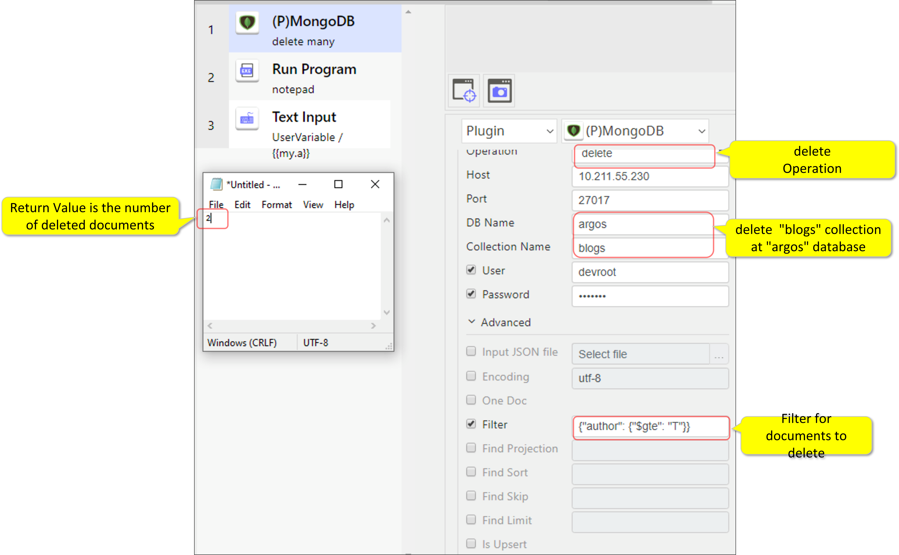
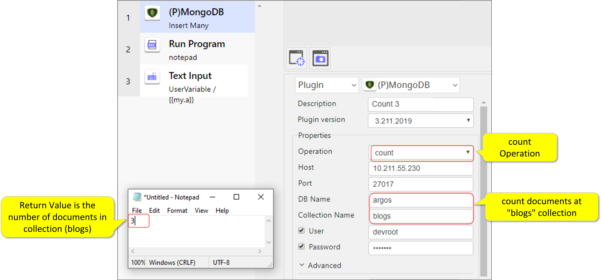
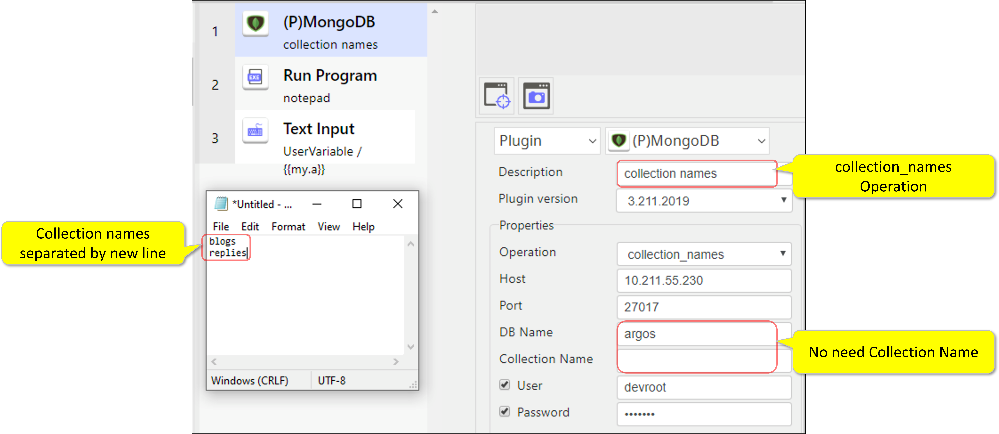
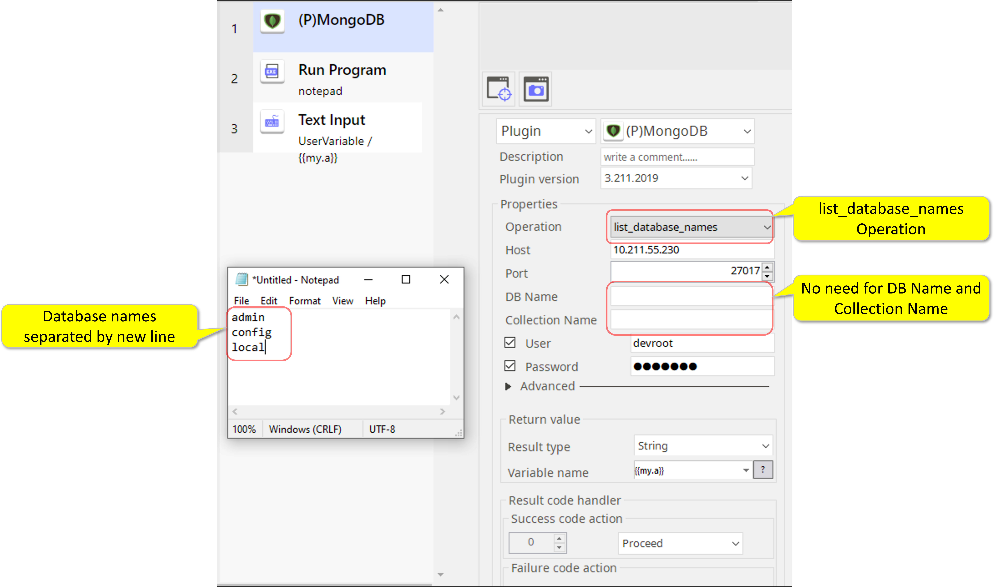
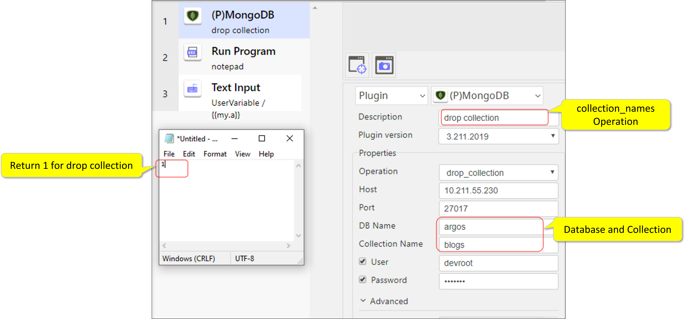

# MongoDB

***ARGOS LABS plugin module to use Selenium***

> This function is one of Plugins Operation.You can find the movie in [ARGOS RPA+ video tutorial](https://www.argos-labs.com/video-tutorial/).

## Name of the plugin
Item         | Value
-------------|:---:
Icon         |  
Display Name | **MongoDB**

## Name of the author (Contact info of the author)

Jerry Chae
* [email](mailto:mcchae@argos-labs.com)

[comment]: <> (* [github]&#40;https://github.com/Jerry-Chae&#41;)

## Notification

### Dependent modules
Module | Source Page                                            | License | Version (If specified otherwise using recent version will be used)
---|--------------------------------------------------------|---|---
[pymongo](https://pypi.org/project/pymongo/) | [pymongo](https://github.com/mongodb/mongo-python-driver) | [Apache License 2.0](https://github.com/mongodb/mongo-python-driver/blob/master/LICENSE) | `latest` 
## Warning 
None
## Primary Features
MongoDB plugin is based on Python MongoDB/PyMongo.
## Prerequisite
User must have a basic knowledge about the mongoDB solution.

## Helpful links to 3rd party contents
For more detailed explanations, please refer to the link [here](https://www.w3schools.com/python/python_mongodb_getstarted.asp).

## Version Control 
* [3.730.3456](setup.yaml)
* Release Date: Jul 30, 2021

## Input (Required) 
Display Name | Input Method                                                               | Default Value | Description
---|----------------------------------------------------------------------------|---------------|---------
Operation | (choose one from `find`, `insert`, `update`, `delete`, `count`, `collection_names`, `list_database_names`, `drop_database`, `drop_collection`) | `find` | Check [below](#parameter-setting-examples) 
Host IP Address | IP Address                                                                 | -             | Specify the Host IP Address.
Port Number | Number                                                                     | 27017         | Specify the port number.
DB Name | String | - | Specify the data base name in the text box.
Collection Name | String | - | Specify the collection name in the text box.

## Input (Optional)
Display Name | Input Method | Default Value | Description
---|-------------|---------------|---------
User | - | - | User for MongoDB Authentication
Password | Password | - | Password for MongoDB Authentication
Input JSON file | fileread | - | JSON file for inserting
Encoding | - | utf-8 | Encoding for JSON file
One Doc | True/False | False | If this flag is set apply only one document for finding, updating and deleting
Filter | - | - | Filter for finding, updating and deleting, this is a [query specification](https://www.w3schools.com/python/python_mongodb_query.asp)
Find Projection | - | - | Projection for finding, See below `A - 6. Find with "Projection" option`
Find Sort | - | - | Sort for finding
Find Skip | Integer | 0 | Skip count for finding
Find Limit | Integer | 0 | Limit count for finding
Is Upsert | True/False | False | When this flag is set upsert (insert or update) flag is true for update

## Return Value

Please check the Parameter Setting Section [below]()

## Parameter setting examples
### How to set parameters for different functions
### A. Find

### A -1. Find all

### A - 2. Find with one filter

### A - 3. Find with multiple filters

### A - 4. Find with "Sort" option

### A - 5. Find with "Skip" and "Limit" options

### A - 6. Find with "Projection" option

---
## B. Insert
### B - 1. Insert one document

### B - 2. Insert multiple documents

----
## C. Update
### C - 1. Update one document

### C - 2. Update multiple documents

### C - 3. Update with "Upsert" flag checked

----
## D. Delete
### D - 1. Delete one document

### D - 2. Delete multiple documents

----
## E. Count
### E - 1. Count one document

-----

## F. Collection_names
### F - 1. Listing collection names

----

##  G. List_database_names
### G - 1. Listing database names

----

## H. Drop_database
### H - 1. Dropping(removing) database

-----

## I. Drop_collection
### I - 1. Dropping(removing) collection

## Return Code
Code | Meaning
---|---
0 | Execution Successful
99 | Execution Failed
    
