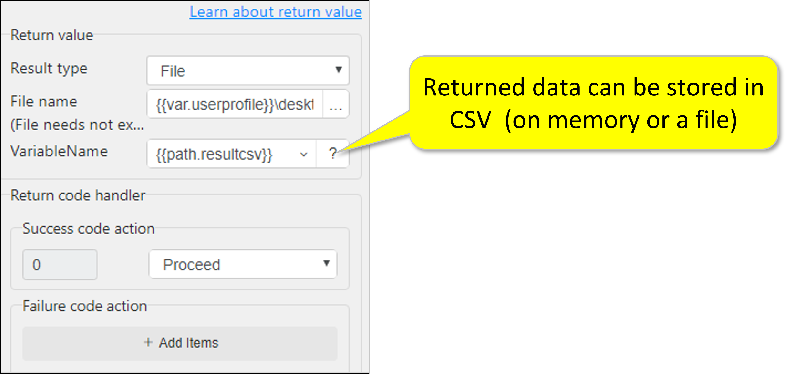
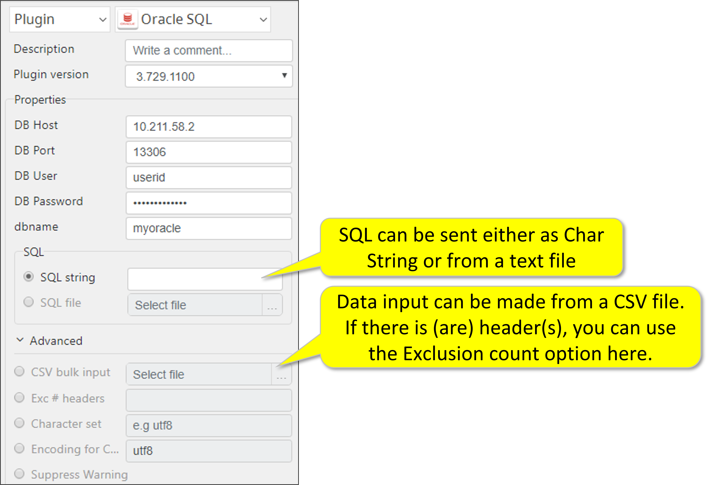

# Oracle SQL

***ARGOS LABS plugin module Oracle***

> This function is one of Plugins Operation.You can find the movie in [ARGOS RPA+ video tutorial](https://www.argos-labs.com/video-tutorial/).

## Name of the plugin
Item         | Value
-------------|:---:
Icon         |  
Display Name | **Oracle SQL**

## Name of the author (Contact info of the author)

Jerry Chae
* [email](mailto:mcchae@argos-labs.com)

[comment]: <> (* [github]&#40;https://github.com/Jerry-Chae&#41;)

## Notification

### Dependent modules
Module | Source Page                                           | License                                                                     | Version (If specified otherwise using recent version will be used)
---|-------------------------------------------------------|-----------------------------------------------------------------------------|---
[cx-Oracle](https://pypi.org/project/cx-Oracle/) | [cx-Oracle](https://github.com/oracle/python-cx_Oracle) | [BSD License](https://github.com/oracle/python-cx_Oracle/blob/main/LICENSE.txt) | `latest`

## Warning 
 **IMPORTANT NOTE** 
The ORACLE SQL plugin requires the ORACLE DLL to be downloaded in the ARGOS Virtual Environment. (V-Env) The DLL file size is nearly 30 MB. Depending on your network speed, it might take a few minutes to set up the V-Env.

## Primary Features
* The SQL plugin enables your bot to directly connect and manipulate the ORACLE database.

## Functions
None
## Prerequisite
None
## Limitations
The plugin today supports ORACLE on Windows. Other environments such as Linux and Mac are under testing now and will be released soon.
## Helpful links to 3rd party contents
None

## Version Control 
* [3.1126.3456](setup.yaml)
* Release Date: Nov 26, 2021

## Input (Required) 
Display Name | Input Method    | Default Value | Description
---|-----------------|---------------|---------
DB Host | IP Address      | - |Specify IP address of the host.
DB Port | Port No.        | - | Specify the port no of the database.
DB User | User ID(String) | - | Determine the specified user ID of the data base.
DB Password | Password | - | Determine the specified password of the data base.
DB Name | String | - | Specify the name of the data base.

## Input (Optional)
Display Name | Input Method       | Default Value | Description
---|--------------------|-----|---------
SQL string | String | - | SQL can be sent either as char String or from a text file
SQL file | fileread | - | SQL from file. (Note, either one of `SQL string` or `SQL file`)
CSV bulk input | fileread | -   | Data input can be made from a CSV file in case of `INSERT` sql.
Exc N Headers | int | - | If there is(are) header(s), you can use the Exclusion count option here.
Character Set | String | - | The database also uses this character set for metadata such as table names, column names, and SQL statements.
Encoding  | -                  | utf-8 | By checking this the target strings will be encoded.

## Return Value

### For `SELECT` SQL
Result will be the output records with CSV output

### for otherwise SQL
Reuslt will the `affected_row_count` and integer value

## Parameter setting examples

## Return Code
Code | Meaning
---|---
0 | Execution Successful
9 | Execution Failed
    
