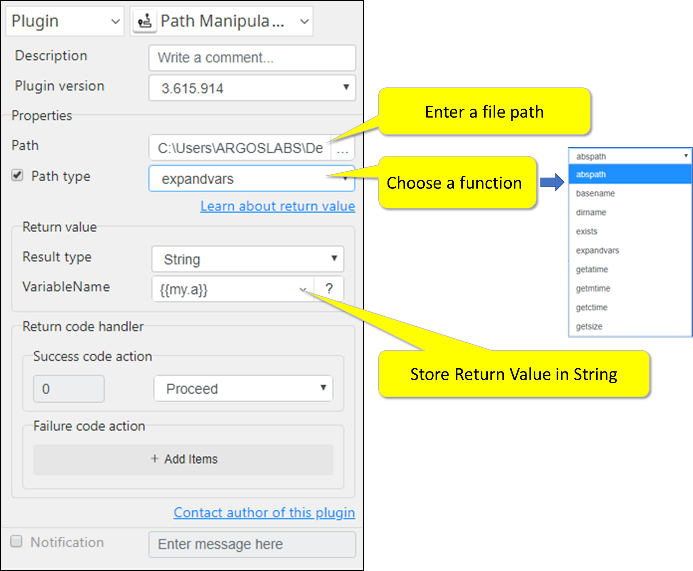

# PATH MANIPULATION

***ARGOS LABS plugin module for path***

> This function is one of Plugins Operation.You can find the movie in [ARGOS RPA+ video tutorial](https://www.argos-labs.com/video-tutorial/).

## Name of the plugin
Item         | Value
-------------|:---:
Icon         |  
Display Name | **PATH MANIPULATION**

## Name of the author (Contact info of the author)

Jerry Chae
* [email](mailto:mcchae`@argos-labs.com)

[comment]: <> (* [github]&#40;https://github.com/Jerry-Chae&#41;)

## Notification

### Dependent modules
Module | Source Page | License | Version (If specified otherwise using recent version will be used)
---|---|---|---
[openpyxl](https://pypi.org/project/openpyxl/) | [openpyxl](https://github.com/theorchard/openpyxl) | [MIT](https://github.com/theorchard/openpyxl/blob/master/LICENCE.rst) | newer than `2.6.1` (Latest is `3.0.10`, Dec 2020)

## Warning 
None

## Helpful links to 3rd party contents
None

## Version Control 
* [2.1130.3300](setup.yaml)
* Release Date: Nov 30, 2020

## Input (Required)
Display Name | Input Method  | Default Value | Description
-------------|---------------|---------------|---
Path         | File          | -             | Select Full file path of a file.

## Input (Optional)

> When input is C:\Users\ARGOSLABS\Desktop\Temp\data.csv

Operations | Full Name                    | Output(Example)
----|------------------------------|---
abspath | Absolut Path                 | C:\Users\ARGOSLABS\Desktop\Temp\data.csv
basename | 	Base name	                  | data.csv
dirname	| Directory name	              | C:\Users\ARGOSLABS\Desktop\Temp\
exists | 	Exists?                     |	True/False
expandvars	| Expand Environment Variable	 | see below
getatime	| Get access time	             | date-time mm-dd-yyyy hh:mm:ss
getmtime	| Get modified time	           | date-time mm-dd-yyyy hh:mm:ss 
getctime	| Get created time	            | date-time mm-dd-yyyy hh:mm:ss 
getsize	| Get filesize	                | file size in bytes

 **  Note: How to use “expandvars”**  
> This function returns path that are stored in the environment variables in fully expanded format. For example, %appdata% will return C:\Users\ARGOSLABS\AppData\Roaming

## Return Value
Select String - See chart above [Input Optional](#input--optional-)

### Normal Case
* ...

## Parameter setting examples

## Return Code
Code | Meaning
---|---
0 | Success
1 | Invalid Input(Open Error)
9 | Other Error
