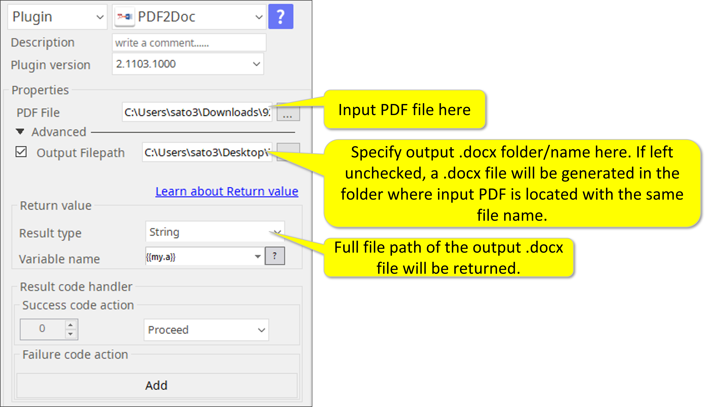

# PDF2Doc

***ARGOS LABS PDF to Word plugin***
> This plugin converts PDF files into MS Word files. (.docx)

## Name of the plugin
Item         | Value
-------------|:---:
Icon         |  
Display Name | **PDF2Doc**

## Name of the author (Contact info of the author)

Jerry Chae
* [email](mailto:mcchae`@argos-labs.com)

[comment]: <> (* [github]&#40;https://github.com/Jerry-Chae&#41;)

## Notification

### Dependent modules
Module | Source Page | License | Version (If specified otherwise using recent version will be used)
---|---|---|---
[pywin32](https://pypi.org/project/pywin32/) | [pywin32](https://github.com/mhammond/pywin32) | [PSF-2.0](https://github.com/mhammond/pywin32/blob/main/Pythonwin/License.txt) | `win32` for xlsx => xls

## Warning 
None

## Helpful links to 3rd party contents
None

## Version Control 
* [3.622.3456](setup.yaml)
* Release Date: Jun 22, 2021

## Input (Required)
Display Name | Input Method       | Default Value | Description
-------------|--------------------|---------------|---
PDF File         | Absolute File Path | -             | Select Full file path of a PDF file.

## Input (Optional)

Operations | Full Name                    | Output(Example)
----|------------------------------|---
Output File Path         | Absolute File Path | -             | Specify output .docx folder/name here. If left unchecked, a .docx file will be generated in the folder where input PDF is located with the same file name.

## Return Value
Full file path of the output .docx file will be returned.

## Parameter setting examples

## Return Code
Code | Meaning
---|---
0 | Execution Success
1 | Execution Failed
