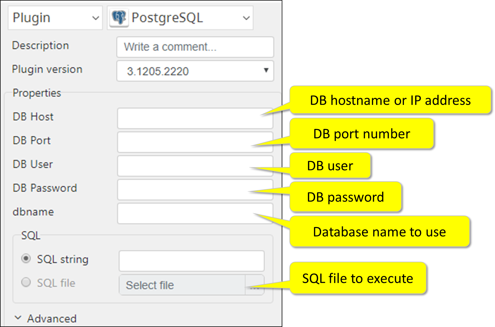
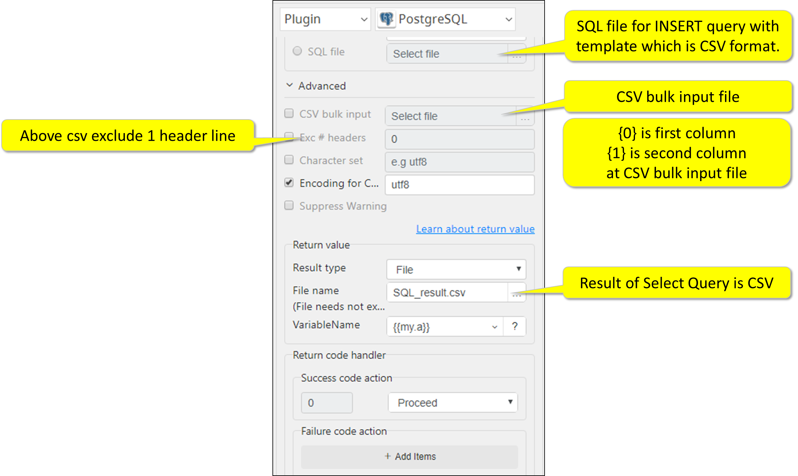

# PostgreSQL

***ARGOS LABS plugin module PostgreSQL***

> This function is one of Plugins Operation.You can find the movie in [ARGOS RPA+ video tutorial](https://www.argos-labs.com/video-tutorial/).

## Name of the plugin
Item         | Value
-------------|:---:
Icon         |  
Display Name | **PostgreSQL**

## Name of the author (Contact info of the author)

Jerry Chae
* [email](mailto:mcchae@argos-labs.com)

[comment]: <> (* [github]&#40;https://github.com/Jerry-Chae&#41;)

## Notification

### Dependent modules
Module | Source Page                                           | License                                                                 | Version (If specified otherwise using recent version will be used)
---|-------------------------------------------------------|-------------------------------------------------------------------------|---
[psycopg](https://pypi.org/project/psycopg/) | [psycopg](https://github.com/psycopg/psycopg) | [GNU Lesser General Public License v3.0](https://github.com/psycopg/psycopg/blob/master/LICENSE.txt) | `latest`

## Warning 
None
## Primary Features
* The PostgreSQL plugin enables your bot to directly connect and manipulate the Postgres database.

## Functions
None
## Prerequisite
None
## Helpful links to 3rd party contents
None

## Version Control 
* [4.211.3456](setup.yaml)
* Release Date: Feb 11, 2022

## Input (Required) 
Display Name | Input Method              | Default Value | Description
---|---------------------------|---------------|---------
DB Host | IP Address                | - |Specify IP address of the host.
DB Port | Port No.                  | - | Specify the port no of the database.
DB User | User ID(String)           | - | Determine the specified user ID of the data base.
DB Password | Password                  | - | Determine the specified password of the data base.
DB Name | String                    | - | Specify the name of the data base.
SQL String/File | String/Absolute File Path | - | SQL can be sent either as char String or from a text file

## Input (Optional)
Display Name | Input Method       | Default Value | Description
---|--------------------|-----|---------
CSV Bulk Input | Absolute file path | -   | CSV bulk input file {0} is first column {1} is second column at CSV bulk input file
Exc * Headers | String | - | If there is(are) header(s), you can use the Exclusion count option here.
Character Set | String | - | The database also uses this character set for metadata such as table names, column names, and SQL statements.
Encoding | -                  | utf-8 | By checking this the target strings will be encoded.

## Return Value
Result of Select Query is CSV. 
Check the Parameter Settings below for Example.

## Parameter setting examples

## Return Code
Code | Meaning
---|---
0 | Execution Successful
1 | SQL Errors
9 | Other Failures
    