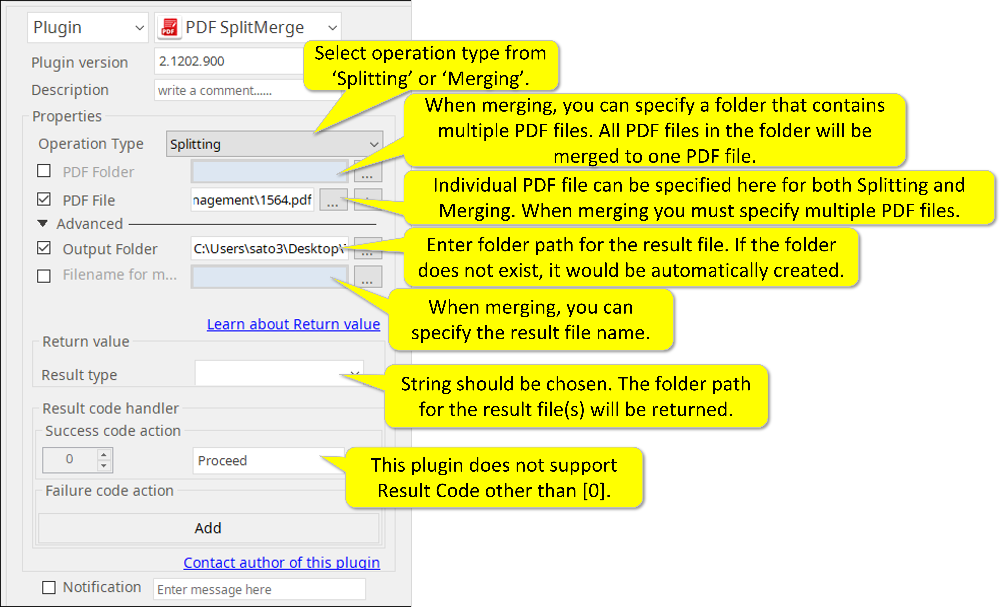

# PDF SplitMerge

***ARGOS LABS Splitting and Merging PDF plugin***

## Name of the plugin
Item         | Value
-------------|:---:
Icon         |  
Display Name | **PDF SplitMerge**

## Name of the author (Contact info of the author)

Jerry Chae
* [email](mailto:mcchae`@argos-labs.com)

[comment]: <> (* [github]&#40;https://github.com/Jerry-Chae&#41;)

## Notification

### Dependent modules
Module | Source Page                                    | License                                                              | Version (If specified otherwise using recent version will be used)
---|------------------------------------------------|----------------------------------------------------------------------|---
[PyPDF2](https://pypi.org/project/PyPDF2/) | [PyPDF2](https://github.com/colemana/PyPDF2) | [BSD License](https://github.com/colemana/PyPDF2/blob/master/LICENSE) | `latest`

## Warning 
None

## Helpful links to 3rd party contents
None

## Version Control 
* [3.409.3456](setup.yaml)
* Release Date: Apr 09, 2021

## Primary Feature
This plugin has two features on PDF files.  
* The first feature is to split PDF files that have multiple pages into multiple 1-page PDF files. 
* The second feature is to combine (merge) multiple PDF files into one PDF file.

## Input (Required)
Display Name | Input Method      | Default Value | Description
-------------|-------------------|---------------|---
Operation Type        | Splitting/Merging | -             | Select operation type from ‘Splitting’ or ‘Merging’.
PDF Folder | Folder Path       | - |  When merging, you can specify a folder that contains multiple PDF files. All PDF files in the folder will be merged to one PDF file.
PDF File | File Path | - |  Individual PDF file can be specified here for both Splitting and Merging. When merging you must specify multiple PDF files.

## Input (Optional)

Display Name | Input Method      | Default Value | Description
-------------|-------------------|---------------|---
Output Folder       |File Path | -             |  Enter folder path for the result file. If the folder does not exist, it would be automatically created.
Filenamed     for merging | String | - |When merging, you can specify the result file name.

### Note
**Page order when merging** 
* Pages will be sorted in the alphabetical order of the filename

## Return Value
String should be chosen. The folder path for the result file(s) will be returned.

## Parameter setting examples

## Return Code
Code | Meaning
---|---
0 | Execution Success
1 | Execution Failed
