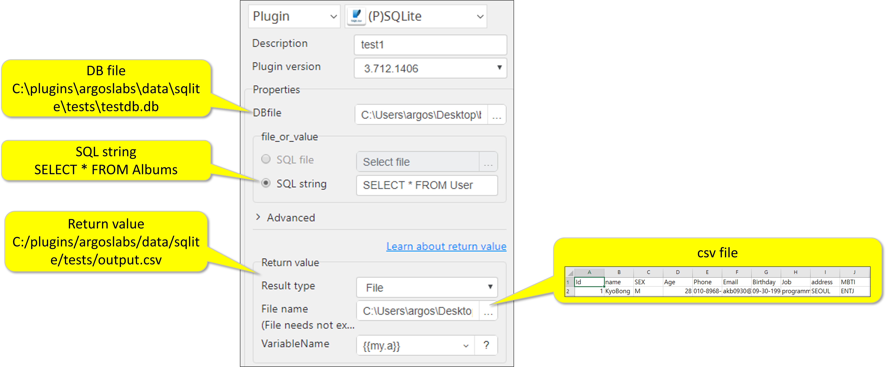
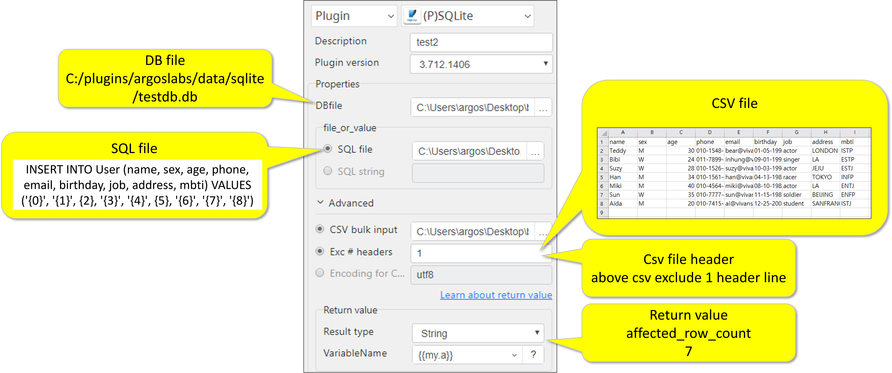
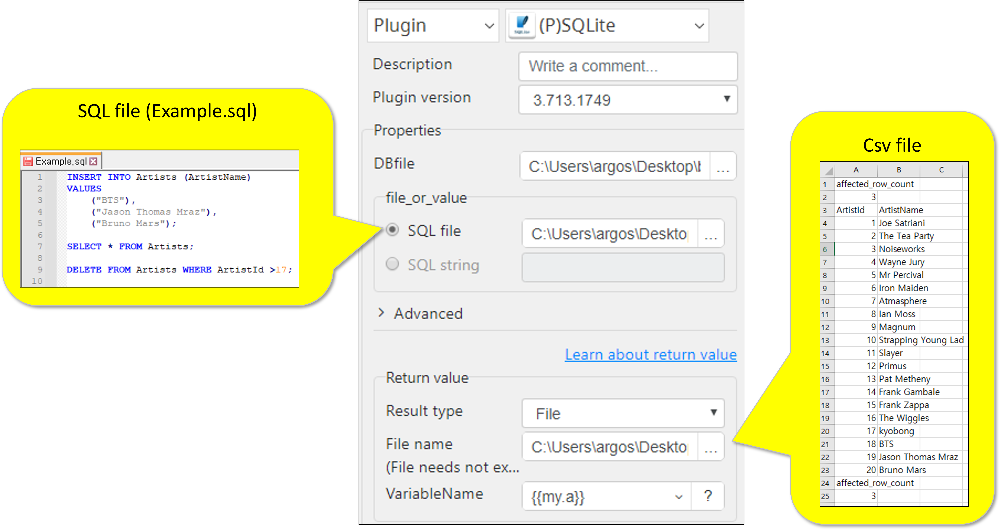
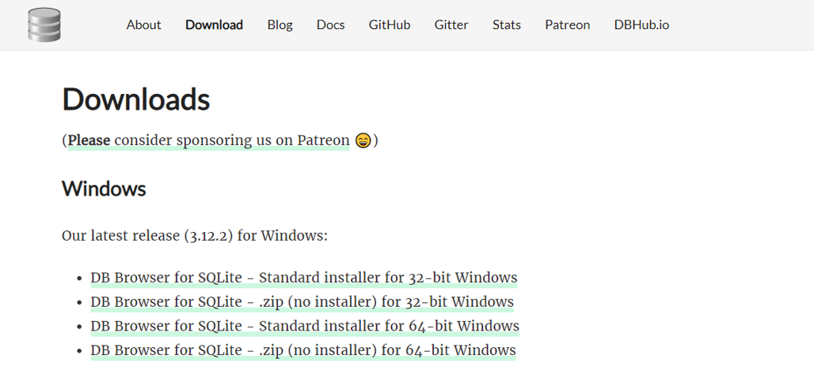
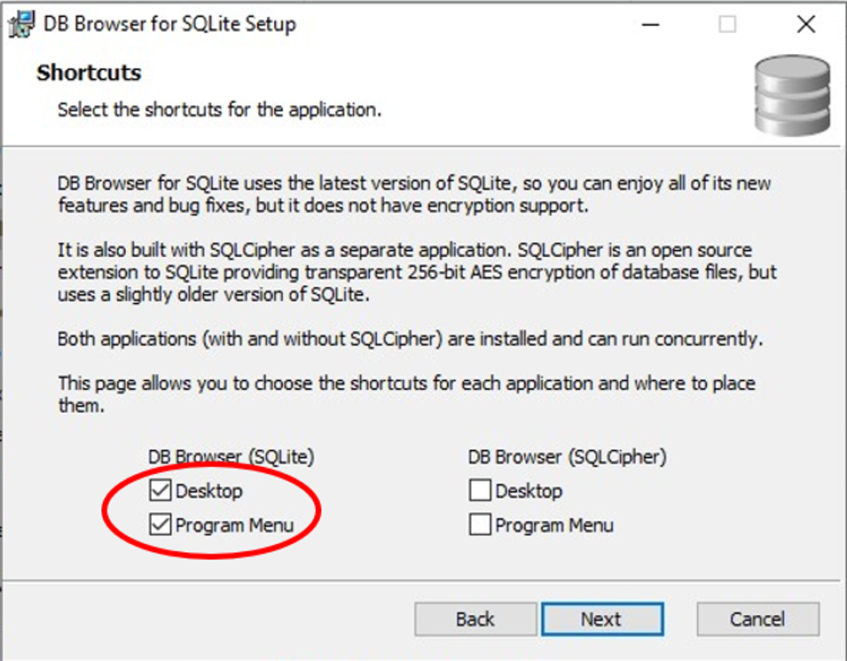
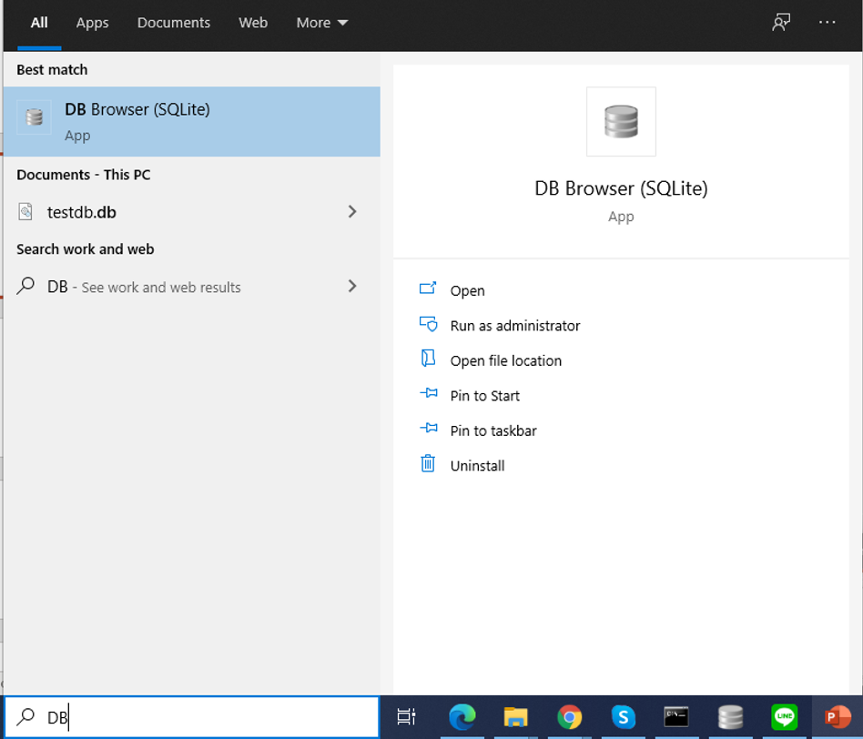
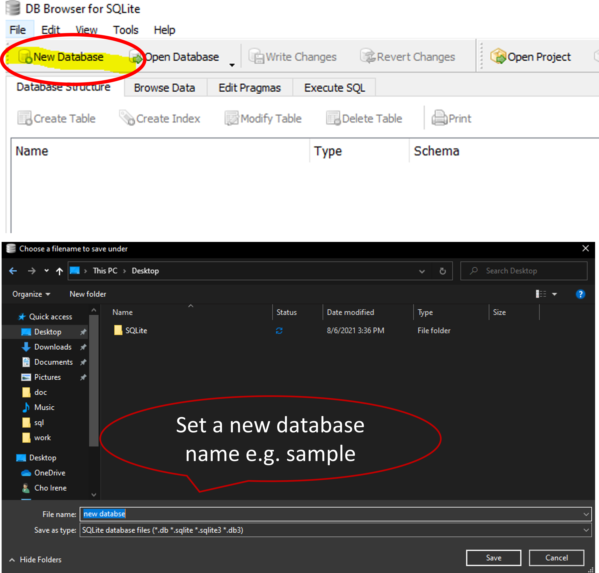
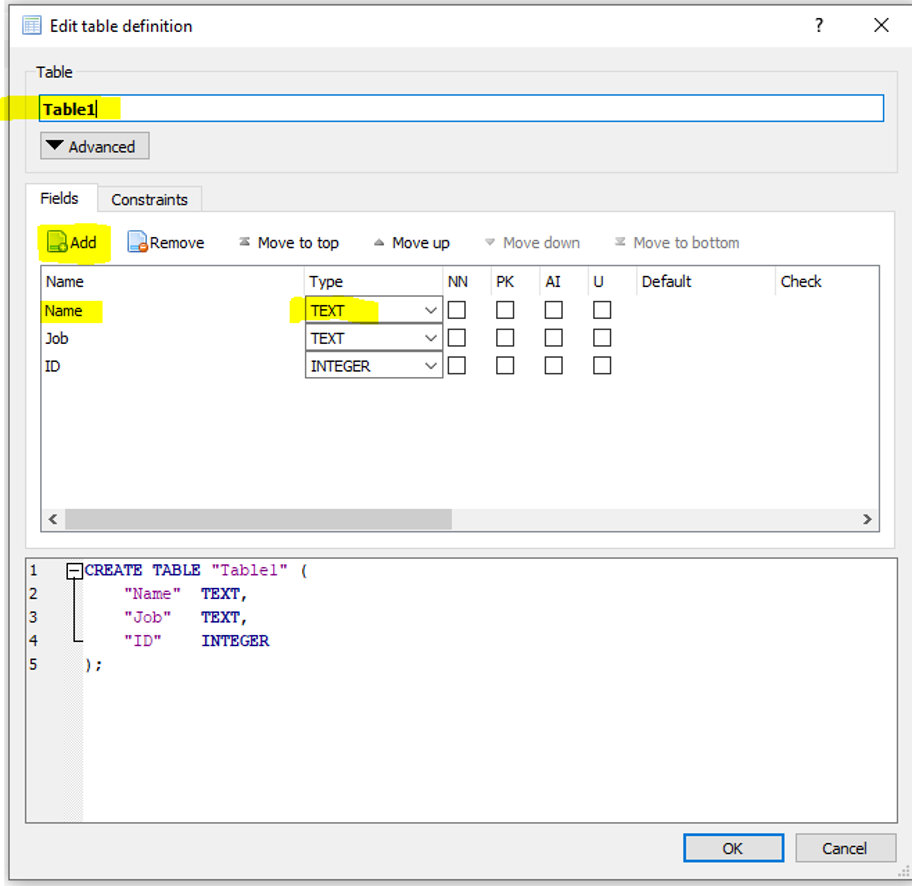
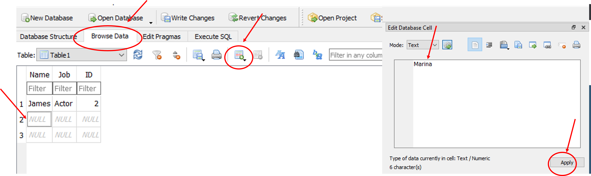
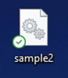

# _SQLite_

***ARGOS LABS plugin module SQLite***

> This function is one of Plugins Operation.You can find the movie in [ARGOS RPA+ video tutorial](https://www.argos-labs.com/video-tutorial/).

## Name of the plugin
Item         | Value
-------------|:---:
Icon         |  
Display Name | **SQLite**

## Name of the author (Contact info of the author)

Kyobong An
* [email](mailto:akb0930@argos-labs.com)

[comment]: <> (* [github]&#40;https://github.com/Jerry-Chae&#41;)

## Notification

### Dependent modules
None
## Warning 
None
## Primary Features
* The SQLite plugin has features to operate SQLite RDBMS. You can learn more about SQLite at https://www.sqlite.org/src/doc/trunk/README.md. The plugin can take SQL statement(s) either directly or via file.

## Special Notes
* When inputting a series of SQL statements from a file, it is recommended to separate ‘one way’ statements such as INSERT INTO from ‘two-way’ statements such as SELECT.
## Functions
None
## Prerequisite
**How to install SQLite**

See below for ['step by step'](#how-to-install-sqlite) instruction
## Helpful links to 3rd party contents
None

## Version Control 
* [3.713.1749](setup.yaml)
* Release Date: Jul 13, 2021

## Input (Required) 
Display Name | Input Method        | Default Value | Description
---|---------------------|---------------|---------
DB file | Absolute file path  | -             | Specify the file path of the data base(file extension is .db).
**SQL Statement** - SQL String | String              | -             | SQL query to execute data.
**SQL Statement** - SQL File | Absolute file path  | -             | SQL file to execute.

## Input (Optional)
Display Name | Input Method       | Default Value | Description
---|--------------------|-----|---------
CSV Bulk Input | Absolute file path | -   | CSV bulk input file {0} is first column {1} is second column at CSV bulk input file
Exc * Headers | String | - | If there is(are) header(s), you can use the Exclusion count option here.
Character Set | String | - | The database also uses this character set for metadata such as table names, column names, and SQL statements.
Encoding for CSV | -                  | utf-8 | Encoding format of the CSV file.

## Return Value
This plugin returns value depending on the SQL statement. 
Statements such as INSERT INTO and DELETE will return 2 lines like below. (it takes a format of one-column CSV file) 
>       affected_row_count 
>       3

SELECT statement will return regular CSV file depending on the SQL statement’s parameters 

The Return Value can be stored in

>   String 
> CSV (Internal memory to PAM) 
> File (either .txt or .csv)

## Parameter setting examples
                    

* Using string for SQL and returning csv with SELECT statement 
 

* Using file for SQL and csv for input 

* SQL file Examples 

-------
## How to Install _SQLite_
* **STEP 1** 

    Download and install DB [SQLite.](https://sqlitebrowser.org/dl/)

  
  
* **STEP 2** 
Execute DB and Create a New Database 
\* Check Desktop if DB cannot be found in Program Menu

  
  
* **STEP 3** 
Create a Table 
\* Set a table name, field names and types

* **STEP 4** 
Input Data and Save 
\* Click Browse Data and Input Data
  
* Save File  

## Return Code
Code | Meaning
---|---
0 | Execution Successful
9 | Execution Failed
    