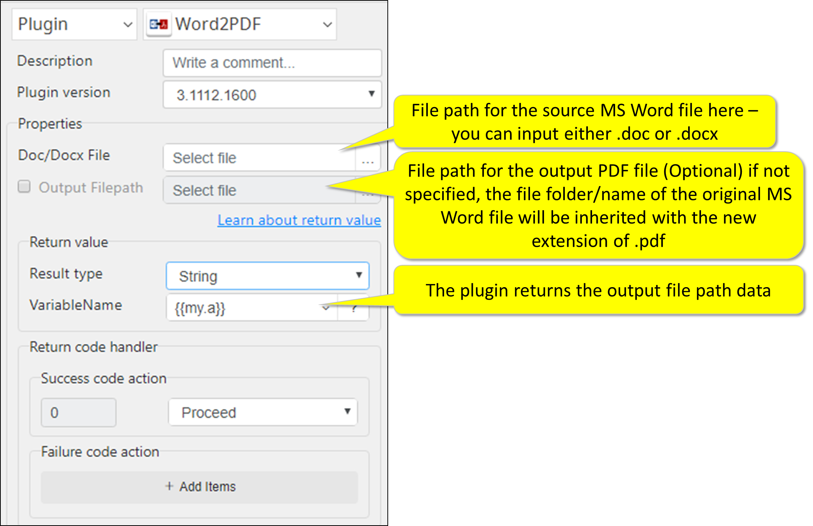

# Word2PDF
***ARGOS LABS Word to PDF plugin***
> This plugin simply converts Microsoft Word file (doc or docx) into PDF files

## Name of the plugin
Item         | Value
-------------|:---:
Icon         |  
Display Name | **Word2PDF**

## Name of the author (Contact info of the author)

Kyobong An
* [email](mailto:akb0930@argos-labs.com)

[comment]: <> (* [github]&#40;https://github.com/Jerry-Chae&#41;)

## Notification

### Dependent modules
Module | Source Page  | License                                                                            | Version (If specified otherwise using recent version will be used)
---|--------------|------------------------------------------------------------------------------------|---
[docx2pdf](https://pypi.org/project/docx2pdf/) | [docx2pdf](https://github.com/AlJohri/docx2pdf) | [MIT License](https://github.com/AlJohri/docx2pdf/blob/master/LICENSE) | `latest` 

## Warning 
None

## Helpful links to 3rd party contents
None

## Version Control 
* [3.1112.3456](setup.yaml)
* Release Date: Nov 12, 2021

## Input (Required)
Display Name | Input Method       | Default Value | Description
-------------|--------------------|---------------|---
Word File         | Absolute File Path | -             | MS Word file (file-path) can be either .doc or .docx

## Input (Optional)

Operations | Full Name                    | Output(Example)
----|------------------------------|---
Output File Path         | Absolute File Path | -             | Full-file path for the output PDF file.

## Return Value
Full file path of the output .pdf file will be returned.

## Parameter setting examples

## Return Code
Code | Meaning
---|---
0 | Execution Success
99 | Execution Failed
