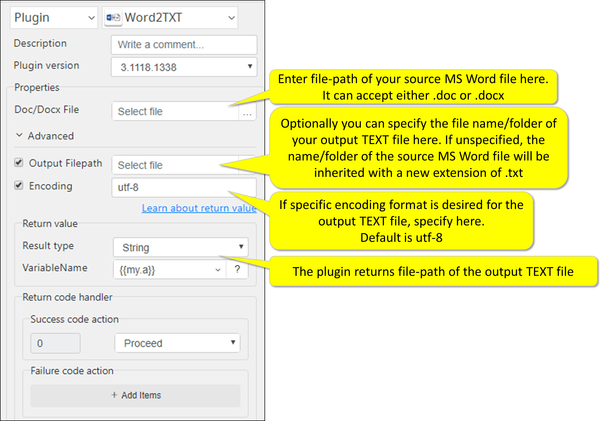

# Word2Txt

***ARGOS LABS Word Conversion(word -> txt) plugin***
> This plugin converts Word (.doc/.docx) files into .txt files. (.txt)

## Name of the plugin
Item         | Value
-------------|:---:
Icon         |  
Display Name | **Word2Txt**

## Name of the author (Contact info of the author)

Jerry Chae
* [email](mailto:mcchae`@argos-labs.com)

[comment]: <> (* [github]&#40;https://github.com/Jerry-Chae&#41;)

## Notification

### Dependent modules
Module | Source Page                                    | License                                                                            | Version (If specified otherwise using recent version will be used)
---|------------------------------------------------|------------------------------------------------------------------------------------|---
[pywin32](https://pypi.org/project/pywin32/) | [pywin32](https://github.com/mhammond/pywin32) | [PSF-2.0](https://github.com/mhammond/pywin32/blob/main/Pythonwin/License.txt) | `win32` for xlsx => xls
[docx2txt](https://pypi.org/project/docx2txt/) | [docx2txt](https://github.com/ankushshah89/python-docx2txt) | [MIT License](https://github.com/ankushshah89/python-docx2txt/blob/master/LICENSE.txt) | `latest`
 
## Warning 
None

## Helpful links to 3rd party contents
None

## Version Control 
* [3.727.3456](setup.yaml)
* Release Date: Jul 27, 2021

## Input (Required)
Display Name | Input Method       | Default Value | Description
-------------|--------------------|---------------|---
Word File(.doc/.docx)         | Absolute File Path | -             | Select Full file path of the word(.doc/.docx) file.

## Input (Optional)

Operations | Full Name                    | Output(Example)
----|------------------------------|---
Output File Path         | Absolute File Path | -             | Specify output Text(.txt) folder/name here. If left unchecked, the Text(.txt) file will be generated in the folder where input word is located with the same file name.
Encoding Format | - | utf-8 | The file format will be encoded.

## Return Value
Full file path of the output .txt file will be returned.

## Parameter setting examples

## Return Code
Code | Meaning
---|---
0 | Execution Success
99 | Execution Failed
