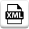

# XML Extract

***ARGOS LABS plugin module sample***
> This plugin is based on lmxl (Python) technology [lxml](https://lxml.de/). It extracts data from XML file and output in a CSV file.

## Name of the plugin
Item         | Value
-------------|:---:
Icon         |  
Display Name | **XML Extract**

## Name of the author (Contact info of the author)

Jerry Chae
* [email](mailto:mcchae`@argos-labs.com)

[comment]: <> (* [github]&#40;https://github.com/Jerry-Chae&#41;)

### Dependent modules
Module | Source Page                                                 | License                                                                                | Version (If specified otherwise using recent version will be used)
---|-------------------------------------------------------------|----------------------------------------------------------------------------------------|---
[lxml](https://pypi.org/project/lxml/) | [lxml](https://github.com/lxml/lxml)                 | [BSD License](https://github.com/lxml/lxml/blob/master/LICENSE.txt)     | `latest` 
 
## Warning 
 </s> **NOTE** 
Please note when your XML file contains inconsistent number of data under specific TAG(s), the output CSV may not be in the intended format.

For detailed explanations of the libraries of this plugin please visit this website, [click here](https://lxml.de/xpathxslt.html)

## Helpful links to 3rd party contents
None

## Version Control 
* [2.508.3456](setup.yaml)
* Release Date: May 08, 2020

## Input (Required)
Display Name | Input Method       | Default Value | Description
-------------|--------------------|---------------|---
XML File         | Absolute File Path | -             | Select Full file path of the xml file.
XPath | String | - | Specify single/multiple input XPath statement. 

## Input (Optional)

Display Name | Input Method       | Default Value | Description
-------------|--------------------|---------------|---
Show Header         | -         | -             | By checking this option it enables and the header will be included in the output.

## Return Value
Output will be CSV. String, CSV (internal), and File options can be used. Check the Example below.
## Example
> ## 1. Target XML File
>        <bookstore>
>        <book category="cooking">
>        <title lang="en">Everyday Italian</title>
>        <author>Giada De Laurentiis</author>
>        <year>2005</year>
>        <price>30.00</price>
>        </book>
>
>
>        <book category="children">
>        <title lang="en">Harry Potter</title>
>        <author>J K. Rowling</author>
>        <year>2005</year>
>        <price>29.99</price>
>        </book>
>
>
>        <book category="web">
>        <title lang="en">XQuery Kick Start</title>
>        <author>James McGovern</author>
>        <year>2003</year>
>        <price>49.99</price>
>        </book>
>
>
>        <book category="web">
>        <title lang="en">Learning XML</title>
>        <author>Erik T. Ray</author>
>        <year>2003</year>
>        <price>39.95</price>
>        </book>
>
>        </bookstore>

> ## 2. Input XPath
>       /bookstore/book/title
>       /bookstore/book/year
>       /bookstore/book/price
>       /bookstore/book/author
 

> ## 3. Output CSV
>       title,author,year,price
>       Everyday Italian,Giada De Laurentiis,2005,30.00
>       Harry Potter,J K. Rowling,2005,29.99
>       XQuery Kick Start,James McGovern,2003,49.99
>       Learning XML,Erik T. Ray,2003,39.95
----
## Parameter Setting Example

## Return Code
Code | Meaning
---|---
0 | Execution Success
1 | Execution Failed
