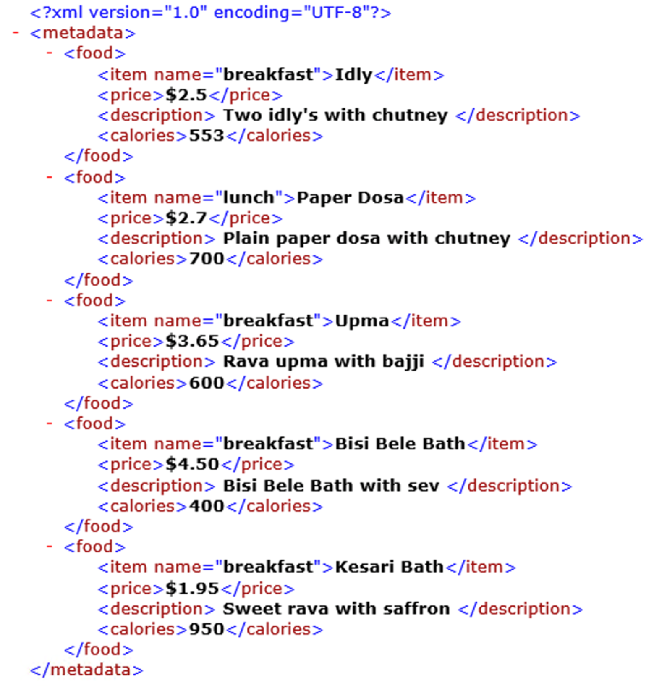

# XML Manipulation

***ARGOS LABS plugin module sample***
> This plugin is based on lmxl (Python) technology [lxml](https://lxml.de/). It extracts data from XML file and output in a CSV file.

## Name of the plugin
Item         | Value
-------------|:---:
Icon         |  
Display Name | **XML Manipulation**

## Name of the author (Contact info of the author)

Jerry Chae
* [email](mailto:mcchae`@argos-labs.com)

[comment]: <> (* [github]&#40;https://github.com/Jerry-Chae&#41;)

### Dependent modules
Module | Source Page                                                 | License                                                                                | Version (If specified otherwise using recent version will be used)
---|-------------------------------------------------------------|----------------------------------------------------------------------------------------|---
[lxml](https://pypi.org/project/lxml/) | [lxml](https://github.com/lxml/lxml)                 | [BSD License](https://github.com/lxml/lxml/blob/master/LICENSE.txt)     | `latest` 
 
## Warning 
 </s> **Note** 
Please note when your XML file contains inconsistent number of data under specific TAG(s), the output CSV may not be in the intended format.

For detailed explanations of the libraries of this plugin please visit this website, [click here](https://lxml.de/xpathxslt.html)

## Primary Feature
The XML Manipulation plugin edits XML files. It includes six useful operations that are set, get, delete, length, appendnext, and appendchild

## Helpful links to 3rd party contents
* [lxml](https://lxml.de/)
* [About XML and XPATH](https://lxml.de/xpathxslt.html#xpath)
## Version Control 
* [3.826.3456](setup.yaml)
* Release Date: Aug 26, 2021

## Input (Required)
Display Name | Input Method       | Default Value | Description
-------------|--------------------|---------------|---
Operation - GET | - | - | Retrieves data.
Operation - SET | - | - | Writes/modifies data.
Operation - Delete | - | - | Deletes data.
Operation - Length | - | - | Obtain number# of elements.
Operation - Appendnext | - | - | Appends data at the same level.
Operation - Appendchild | - | - | Appends data to a level below.
XML File         | Absolute File Path | -             |  File must have extension .xml.
XPath | String | - | Check above link for more explanations

## Input (Optional)

Display Name | Input Method       | Default Value | Description
-------------|--------------------|---------------|---
Output XML Path         | Absolute File path | -             |  Must specify output file path for delete, set, and append menus
String for Value | String | - | Used to specify value for set and append menus
Strip Blanks | - | - | By checking this option it will removes white spaces before and after the returned value (get).

## Return Value
* String for the get and length operations
* Output file path for set, delete, and append operations
 Check the Example below.

## Parameter Setting Example
Below examples are using this sample .xml file

 
### 1. Get value with Absolute Xpath

 
### 2. Get value with Relative Xpath

 
### 3. Get attribute with Relative Xpath

 
### 4. Length operation

 
### 5. Delete value operation

 
### 6. Delete attribute operation

 
### 7. Set value operation – modification of existing value

 
### 8. Set attribute – modifying existing attribute

 
### 9. Set attribute – adding non-existing attribute

 
### 10. Append_next operation

 
### 11. Append_child operation

## Return Code
Code | Meaning
---|---
0 | Execution Success
1 | Parameter error (invalid XML file)
2 | Reference error (invalid XPath)
99 | Other Errors
