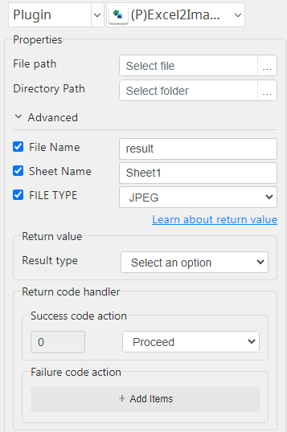

# Excel2Image

***Excel2Image with this plug-in can xlsx file to image formats(.jpg,.png,.gif,.bmp).***

## Excel2Image
| Item         |          Value           |
|--------------|:------------------------:|
| Icon         |  |
| Display Name |     **Excel2Image**      |

### Arun Kumar (arunk@argos-labs.com)

Arun Kumar
* [Email](mailto:arunk@argos-labs.com) 
 
## Version Control 
* [4.327.1826](setup.yaml)
* Release Date: `March 27, 2023`

## Input (Required)
| Parameters      | Output      |
|-----------------|-------------|
| File path       | image_path  |
| Directory Path  |             |
| File path       | image_path  |
| Directory Path  |             |
| File Name       |             |
| Sheet Name      |             |
| FILE TYPE       |             |

## Return Value

### Normal Case
Description of the output result

## Return Code
| Code | Meaning                      |
|------|------------------------------|
| 0    | Success                      |
| 1    | Exceptional case             |

## Output Format
You may choose one of 3 output formats below,

<ul>
  <li>String (default)</li>
  <li>CSV</li>
  <li>File</li>
</ul>  

## Parameter setting examples (diagrams)

## Operations

### Convert with default input:

### Convert with optional input:

