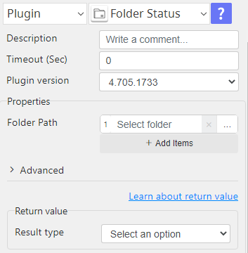
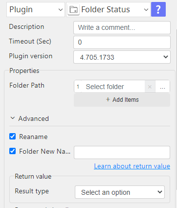

# Folder Status

***Folder Status plug-in This plugin obtains properties of a folder or folders.***

## Folder Status
| Item         |            Value            |
|--------------|:---------------------------:|
| Icon         |   |
| Display Name |      **Folder Status**      |

### Arun Kumar (arunk@argos-labs.com)

Arun Kumar
* [email](mailto:arunk@argos-labs.com) 
 
## Version Control 
* [4.622.1657](setup.yaml)
* Release Date: `June 22, 2023`

## Input (Required)
<ul>
    <li>Full folder-path of the target folder(s).</li>
</ul>

## Output/Return Value
<ul>
    <li>A CSV with the details of folder properties.</li>
</ul>

## Folder properties include
<ol>
    <li> Full folder path to the folder.</li>
    <li>Folder name with extension.</li>
    <li>Folder size in byte.</li>
    <li>Date/time of initial creation of the folder.</li>
    <li>Date/time of the last access to the folder.</li>
    <li>Date/time of the last modification (update) of the folder.</li>

</ol>

## CSV headers and variable example
| pathname                                 | basename                       | size                       | access_ts                       | modify_ts                      | create_ts                      |
|------------------------------------------|--------------------------------|----------------------------|---------------------------------|--------------------------------|--------------------------------|
| C:\Users\Administrator\Desktop\help_doc  | help_doc                       | 2907949                    | 2023-06-22 16:07:23             | 2023-06-15 11:16:54            | 2023-04-11 10:38:56            |
| {{groupname.pathname(index)}}            | {{groupname.basename(index)}}  | {{groupname.size(index)}}  | {{groupname.access_ts(index)}}  | {{groupname.modify_ts(index)}} | {{groupname.create_ts(index)}} |

## Operations

### folder status default:

### folder rename on checkbox:

