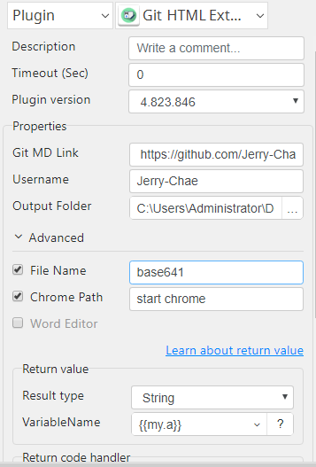
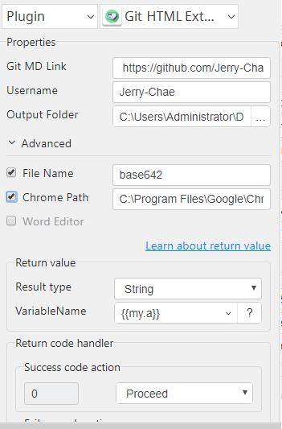
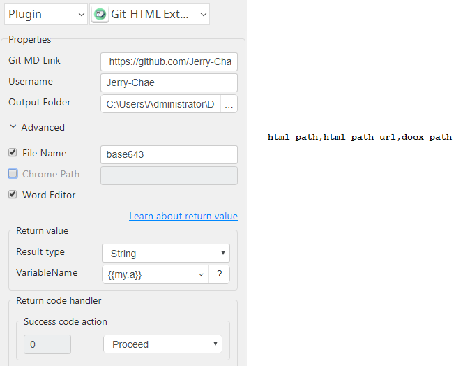

# Git HTML Extract

***Git HTML Extract with this plug-in can extract HTML from Git readme.md and HTML to pdf and docx by chrome option.***

## Git HTML Extract
| Item         |             Value             |
|--------------|:-----------------------------:|
| Icon         |  |
| Display Name |     **Git HTML Extract**      |

### Arun Kumar (arunk@argos-labs.com)

Arun Kumar
* [email](mailto:arunk@argos-labs.com) 
 
## Version Control 
* [4.823.846](setup.yaml)
* Release Date: `August 23, 2022`

## Input (Required)
| Parameters     | Output                                     |
|----------------|--------------------------------------------|
| Git MD Link    | html_path,html_path_url                    |
| Username       |                                            |
| Output Folder  |                                            |
| Git MD Link    | html_path,html_path_url                    |
| Username       |                                            |
| Output Folder  |                                            |
| File Name      |                                            |
| Git MD Link    | html_path,html_path_url,pdf_path,docx_path |
| Username       |                                            |
| Output Folder  |                                            |
| File Name      |                                            |
| Chrome Path    |                                            |
| Git MD Link    | html_path,html_path_url,docx_path          |
| Username       |                                            |
| Output Folder  |                                            |
| File Name      |                                            |
| Word Editor    |                                            |

### Notes:-
<ul>
    <li>Git MD Link (Git url to readme.md file.)</li>
    <li>Username (Git repo owner name.)</li>
    <li>Output Folder (An absolute filepath to save a file)</li>
    <li>File Name (File Name without extension and without space)</li>
    <li>Chrome Path (For convert to pdf)</li>
    <li>Chrome Path value "start chrome".</li>
    <ol>
        <li>Run at cmd if "start chrome" open chrome use it.</li>
    </ol>
    <li>Chrome Path value "C:\Program Files\Google\Chrome\Application\chrome.exe".</li>
    <ol>
        <li>Path pointed to chrome.exe.</li>
    </ol>
</ul>

## Return Value

### Normal Case
Description of the output result

## Return Code
| Code | Meaning                      |
|------|------------------------------|
| 0    | Success                      |
| 1    | Exceptional case             |

## Output Format
You may choose one of 3 output formats below,

<ul>
  <li>String (default)</li>
  <li>CSV</li>
  <li>File</li>
</ul>  

## Parameter setting examples (diagrams)

## Operations

### Chrome Path as cmd line start chrome:

### Chrome Path as chrome file path:

### Convert with Word Editor:

