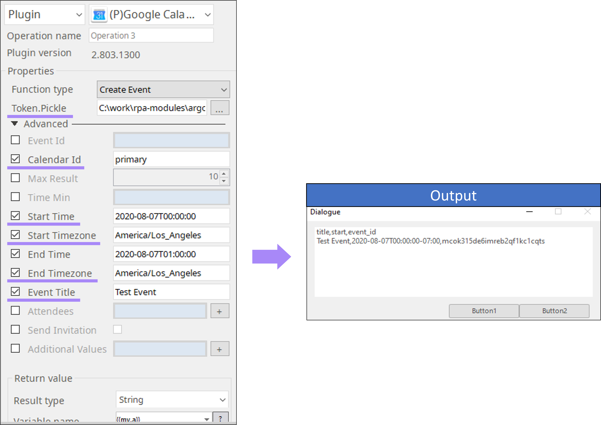

# Google Calendar

***ARGOS LABS managing google calendar***

## Name of the plugin
Item | Value
---|:---:
Icon |  
Display Name | **Google Calendar**

## Name of the author (Contact info of the author)

Jerry Chae
* [email](mailto:mcchae@argos-labs.com)

[comment]: <> (* [github]&#40;https://github.com/Jerry-Chae&#41;)

## Notification
### Primary Feature
* You can print event lists, create, delete, and update events in Google Calendar.

### Pre-requisite
* A file token.pickle which stores the credential information of Google API (Refer Google Token Plugin).

### Dependent modules
Module | Source Page              | License | Version (If specified otherwise using recent version will be used)
---|--------------------------|---|---
[google-auth-oauthlib](https://pypi.org/project/google-auth-oauthlib/) | [google-auth-oauthlib](https://github.com/googleapis/google-auth-library-python-oauthlib) | [Apache License 2.0](https://github.com/googleapis/google-auth-library-python-oauthlib/blob/main/LICENSE) | `latest`
[google-api-python-client](https://pypi.org/project/google-api-python-client/) | [google-api-python-client](https://github.com/googleapis/google-api-python-client) | [Apache License 2.0](https://github.com/googleapis/google-api-python-client/blob/main/LICENSE) | `latest`

## Warning 
None

## Helpful links to 3rd party contents
* [Google Calendar Id](https://docs.simplecalendar.io/find-google-calendar-id/)
* [List of Timezone](https://en.wikipedia.org/wiki/List_of_tz_database_time_zones)
* [Additional Values](https://developers.google.com/calendar/v3/reference/events/insert)

## Version Control 
* [2.803.3300](setup.yaml)
* Release Date: Aug 03, 2020

## Input (Required)
Display Name | Input Method       | Default Value | Description
---|--------------------|---------------|---
Function Type | Select an option   | - | Select options from `Event List`,`Create Event`,`Delete Event` & `Update Event`. Check Parameter Setting for example.
Token.Pickle | Absolute File Path | - | The token. pickle file should contain an access token.

## Input (Optional)

Display Name | Input Method        | Default Value | Description
---|---------------------|--------------|---
Event Id  | Event Identifier    | -            | It can be obtained from ‘Event List’ operation.
Calendar Id | Calendar Identifier | primary      | Default is ‘primary’ which is the primary calendar of the currently logged in user. Click [here](https://docs.simplecalendar.io/find-google-calendar-id/) for more
Max Result | String              | 10 |  Maximum number of events returned on one result page.
Start time | Date/time           | - | Event start time.
Start Time Zone | Timezone            | America/Los_Angeles |  The time zone in which the time is specified which is formatted as an IANA Time Zone Database name, e.g. "Europe/Zurich" click [here](https://en.wikipedia.org/wiki/List_of_tz_database_time_zones) for more reference.
End Time | Date/Time           | - | Equal start time.
End Timezone | Timezone            | America/Los_Angeles | Equal start timezone.
Event Title | String              | - | Title(or summary) of the event.
Attendee | E-Mail              | - | Attendee's email of the event.
Send Invitation | - | - | Default is False. this option will send invites for the attendees
Additional Value | String | - | Additional properties to put when you create or update an event.

>  Format? ‘Property:value’ e.g. location: San Jose, description: Event at Argos-Labs
    click [here]( https://developers.google.com/calendar/v3/reference/events/insert) for more reference.

## Return Value
Please see for the Parameter Settings below.

## Parameter setting examples
>  **Available time format**  
> 
>  **Datetime** 
> 
>* 'YYYYMMDD-HHMMSS', 'YYYY-MM-DD HH:MM:SS',
>* 'YYYY/MM/DD HH:MM:SS',  'MMDDYYYY-HHMMSS',
> * 'MM-DD-YYYY HH:MM:SS', 'MM/DD/YYYY HH:MM:SS',
> * 'M/D/YYYY HH:MM:SS', 'YYYYMMDD-HHMMSS.mmm',
>* 'YYYY-MM-DD HH:MM:SS.mmm', 'YYYY/MM/DD HH:MM:SS.mmm',
>* 'MMDDYYYY-HHMMSS.mmm', 'MM-DD-YYYY HH:MM:SS.mmm',
>* 'MM/DD/YYYY HH:MM:SS.mmm', 'M/D/YYYY HH:MM:SS.mmm'
>
> 
> **Date** 
>  * 'YYYYMMDD', 'YYYY-MM-DD', 'YYYY/MM/DD',
>  * 'MMDDYYYY', 'MM-DD-YYYY', 'MM/DD/YYYY',
>  * 'M/D/YYYY', 'B D YYYY', 'B D, YYYY',  'D B YYYY'
>
> Operations | Parameters | Return Value(CSV)
> -------|--------|------
> Event List | Calendar ID(Required) Max Result(Required) List from(Required) | Title, start, event_id
> Create Event | Calendar Id (required)   Start Time (required)   Start Timezone (required)   End Time (required)   End Timezone (required)  Even Title (optional)   Attendees (optional) Send Invitation (optional) Additional Values (optional) | Title, start, event_id
> Delete Event | Calendar Id (required) Event Id (required) : Obtain from Event List | “Delete the {{event_id}} successfully”
> Update Event | Calendar Id (required)  Event Id (required): Obtain from Event List Equals ‘Create Event’ parameters | Title, start, event_id

### Example of the plugin in STU
* **Event List**

 

## Return Code
Code | Meaning
---|---
0 | Success
1 | Exceptional case

