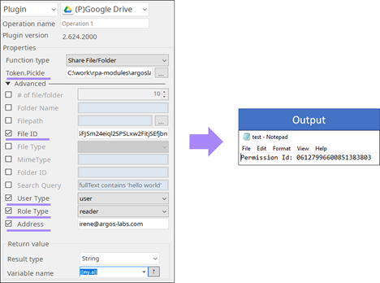
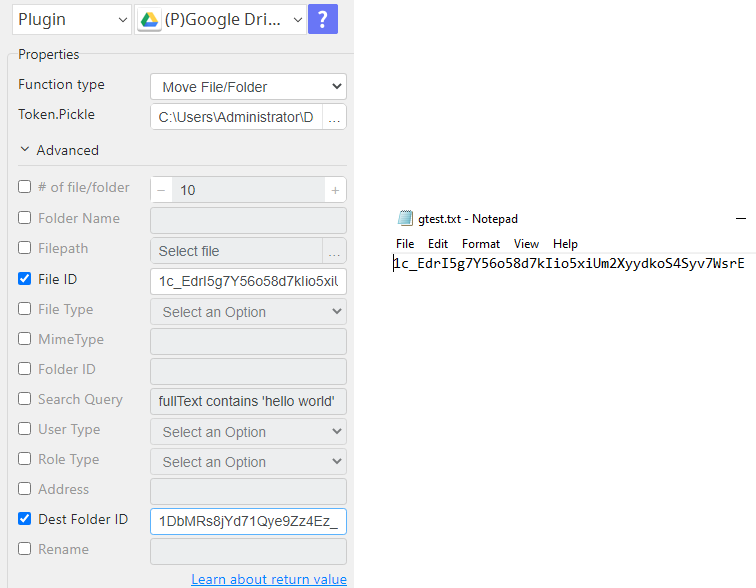
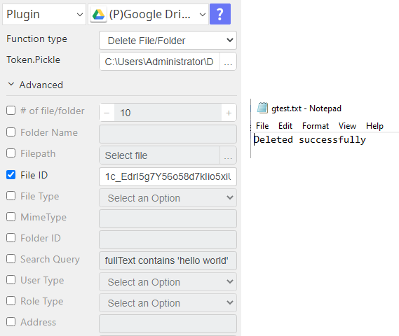
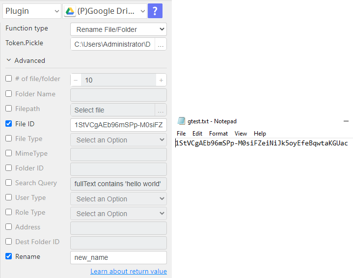
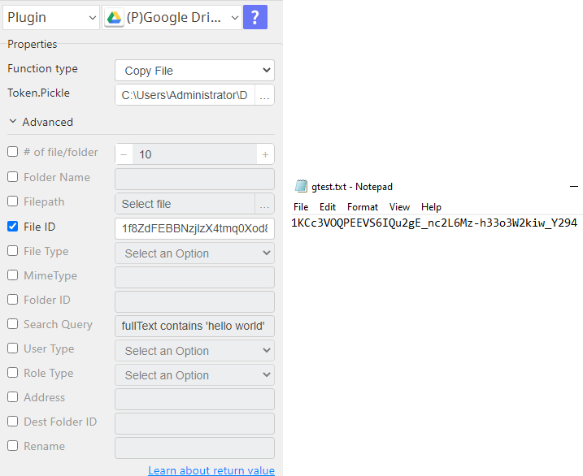
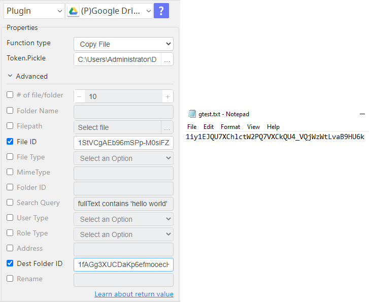

# Google Drive

***This plugin creates or manages the folders and files in Google Drive.***

## Google Drive
| Item         |          Value           |
|--------------|:------------------------:|
| Icon         |  |
| Display Name |     **Google Drive**     |

## Arun Kumar (ak080495@gmail.com)

* [email](mailto:ak080495@gmail.com) 
 
## Version Control 
* [4.914.1333](setup.yaml)
* Release Date: `September 14, 2022`

## Primary Features
You can create a new folder, upload, or download a file, search specific files, and share a file/folder with another user, group, or domain, move, delete, rename, copy files.

## Prerequisite
A file `token.pickle` which stores the credential information of Google API. (Refer to Google Token Plugin)

## Input (Required)
| Operations         | Parameters                                                                                                                     | Output          |
|--------------------|--------------------------------------------------------------------------------------------------------------------------------|-----------------|
| Create a Folder    | Folder Name: A new folder name. (e.g. Test)                                                                                    | Folder Id       |
| Upload a File      | File-path: Absolute path of an uploading file.                                                                                 | File Id         |
|                    | Folder Id(optional): -The folder id from Google Drive to upload a file. -The ID can be found from ‘File List’ operation. |                 |
| Download a File    | File ID: File id from Google Drive to download.                                                                                | File path       |
|                    | File Path: Absolute path to save a file.                                                                                       |                 |
|                    | File Type 1) File in Google Drive. 2) G Suite Files. (e.g. Google Sheet, Doc…)                                           |                 |
|                    | Mime Type (for G Suite Files)   (https://developers.google.com/drive/api/v3/ref-export-formats)                             |                 |
| Recently Modified  | # of file/folder: Default 10                                                                                                   | File List       |
|                    | Folder Id(optional): Specify a folder to get the files in it.                                                                  |                 |
| Search             | Search Query   (https://developers.google.com/drive/api/v3/search-files)                                                    | File List       |
|                    | Folder Id(optional): Specify a folder to get the files in it.                                                                  |                 |
| Share File/Folder  | User Type: User, Group, Domain                                                                                                 | Folder/ File Id |
|                    | Role Type: Reader, Writer, Commenter. (only for domain)                                                                        |                 |
|                    | Address (e.g. example@argos-labs.com, argos-labs.com)  *Only the email will be sent when the user type is ‘user’.           |                 |
|                    | Folder Id or File Id                                                                                                           |                 |
| Delete File/Folder | Folder Id or File Id                                                                                                           | Folder/ File Id |
| Move File/Folder   | Folder Id or File Id                                                                                                           | Folder/ File Id |
|                    | Dest Folder ID                                                                                                                 |                 |
| Rename File/Folder | Folder Id or File Id                                                                                                           | Folder/ File Id |
| Copy File          | File Id                                                                                                                        | File Id         |
| Copy File          | File Id                                                                                                                        | File Id         |
|                    | Dest Folder ID                                                                                                                 |                 |

## Return Value

### Normal Case
Description of an output result

## Return Code
| Code | Meaning     |
|------|-------------|
| 0    | Success     |
| 1    | Failed case |

## Output Format
You may choose one of 3 output formats below,

<ul>
  <li>String (default)</li>
  <li>CSV</li>
  <li>File</li>
</ul>  

## Parameter setting examples (diagrams)

## Operations

### Share File/Folder:

### Move Files/Folder:

### Delete Files/Folder:

### Rename Files/Folder:

### Copy Files within the same folder:

### Copy Files to another Folder:

