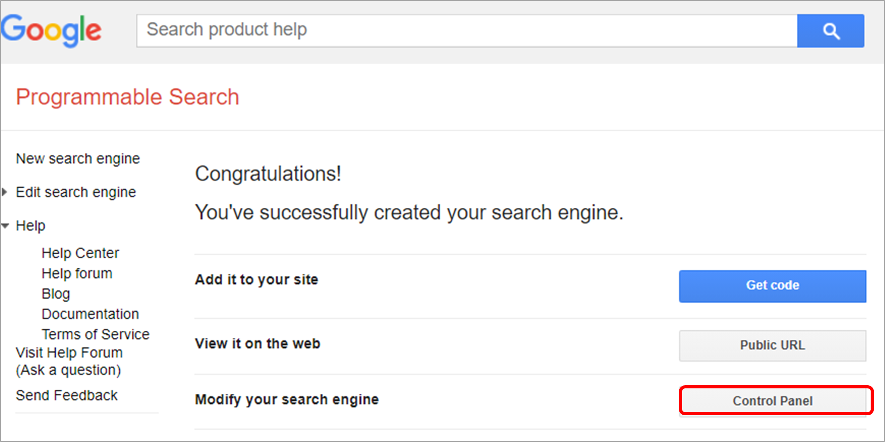

# Google Search API

***ARGOS LABS plugin module sample***

## Name of the plugin
Item | Value
---|:---:
Icon |  
Display Name | **Google Calendar**

## Name of the author (Contact info of the author)

Myeongkook Park
* [email](mailto:mcchae@argos-labs.com)

[comment]: <> (* [github]&#40;https://github.com/Jerry-Chae&#41;)

## Notification
### Primary Feature
* This plugin enables your Automation Scenario to perform searches on the Internet using Google’s search engine just like searching via a browser. 
### Pre-requisite
* see [below](#parameter-setting-examples)

### Dependent modules
Module | Source Page              | License | Version (If specified otherwise using recent version will be used)
---|--------------------------|---|---
[google-api-python-client](https://pypi.org/project/google-api-python-client/) | [google-api-python-client](https://github.com/googleapis/google-api-python-client) | [Apache License 2.0](https://github.com/googleapis/google-api-python-client/blob/main/LICENSE) | google-api-python-client==`1.12.8`

## Warning 
None

## Helpful links to 3rd party contents 
* [Google Cloud Console](https://console.cloud.google.co                                             ZZZZZZZZZZZZZZZZZZZZZZZZZZZZ
* m)
* [Programmable Search Engine](https://programmablesearchengine.google.com/about/)

## Version Control 
* [3.427.3456](setup.yaml)
* Release Date: Apr 27, 2021

## Input (Required)
Display Name | Input Method  | Default Value | Description
---|---------------|---------------|---
API Key | API Key       | -             |  You must acquire the API Key first from Google. Please see for the instruction.
Search Engine ID | ID            | -             | This is part of the API activation process. See below for details
Search Password | Password      | -             |   Enter word or words just like you enter them on your web-browser
Search Type | Choose option | Web           | Choose between general Web search and the Image search
Number of Result | Number | 10 |  You can specify the number of results to show up in output (up to 100)

## Input (Optional) - GET Process Only

Display Name | Input Method        | Default Value | Description
---|---------------------|--------------|---
Exact Terms | String | - |  Limit the results to those that include word(s) or phrase(s) specified here.
Date Restrict | Datetime | - | You can set the limitation to update dates – see below for formats
File Type | String | - | This is only for the Image search – see below.
Exclude Terms | String | - |   Limit the results to those that does not contain word(s) or phrase(s) specified here.
Site Search | String | - |   Limit the results to those that does not contain word(s) or phrase(s) specified here.

## Return Value

Return Value (CSV)         
Headers are shown below

title | link | snippet
------|------|--------
## How to obtain Google Search API key and the Search Engine ID
### 1. API Key
Step 1

* visit https://console.cloud.google.com
* Login to google account which first time to use this console
* Click “CREATE” button to create new project

Step 2

* New project
* Project name
* Click 'CREATE' button

Step 3

* Search with “custom search”
* Select “Custom Search API”

Step 4

* Click “TRY THIS API” button

Step 5

* Click “Get a Key”

Step 6

* Select a project. If there is no project, select Create a new project.
* Click “NEXT” button.

Step 7

* Copy API KEY

### 2.  Search Engine ID
Step 1

* Click “Programmable Search Engine” or Connect [URL](https://programmablesearchengine.google.com/about/)
* Login to google account which first time to use this console

Step 2

* Click “Get started”

Step 3

* Type “www.google.com/*”  for Sites to search 
* Select Your Language. The default setting is English.
* Click “CREATE” button

Step 4

* Click “Control Panel”

Step 5

* Click the button of Search the entire web to turn it on.

Step 6

* Click “Copy to clipboard”

## Parameter setting examples
**See example below.**

## Return Code
Code | Meaning
---|---
0 | Success
1 | Exceptional case

