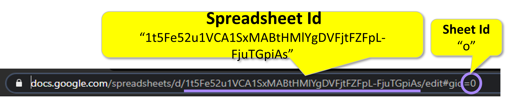
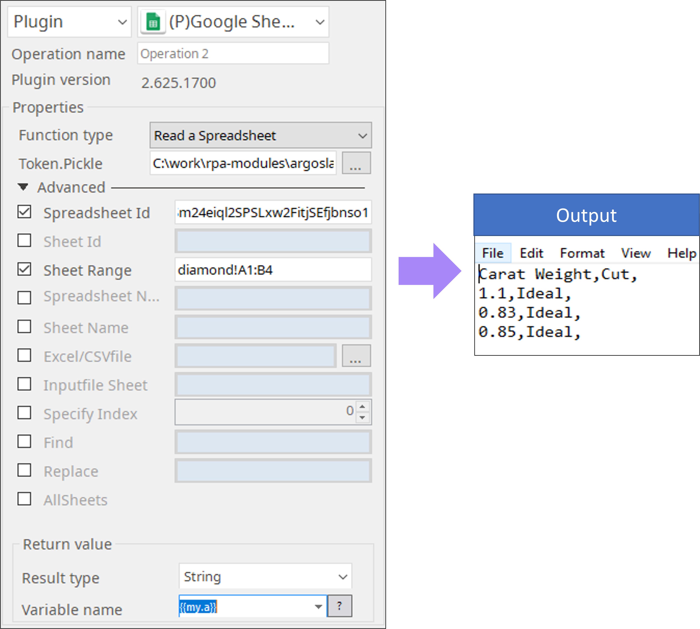

# Google Sheets

***ARGOS LABS plugin module Manage Google Sheets***
> * This plugin creates, reads from, writes to, and manages Google Sheets.

## Name of the plugin
Item | Value
---|:---:
Icon |  
Display Name | **Google Sheets**

## Name of the author (Contact info of the author)

Jerry Chae
* [email](mailto:mcchae@argos-labs.com)

[comment]: <> (* [github]&#40;https://github.com/Jerry-Chae&#41;)

## Notification

### Primary Feature
* You can create Google Sheet and read from/write to it. Management functions includes rename a spreadsheet or sheet, adding, deleting, and duplicating sheets.  There is also a feature to find and replace certain values in the spreadsheet. 

### Pre-requisite
* A file token.pickle which stores the credential information of Google API (Refer Google Token Plugin).

### Dependent modules
Module | Source Page              | License | Version (If specified otherwise using recent version will be used)
---|--------------------------|---|---
[google-api-python-client](https://pypi.org/project/google-api-python-client/) | [google-api-python-client](https://github.com/googleapis/google-api-python-client) | [Apache License 2.0](https://github.com/googleapis/google-api-python-client/blob/main/LICENSE) | google-api-python-client==`1.12.8`
[google-auth-oauthlib](https://pypi.org/project/google-auth-oauthlib/) | [google-auth-oauthlib](https://github.com/googleapis/google-auth-library-python-oauthlib) | [Apache License 2.0](https://github.com/googleapis/google-auth-library-python-oauthlib/blob/main/LICENSE) | `latest`
[openpyxl](https://pypi.org/project/openpyxl/) | [openpyxl](https://github.com/theorchard/openpyxl) | [MIT](https://github.com/theorchard/openpyxl/blob/master/LICENCE.rst) | newer than `2.6.1` (Latest is `3.0.10`, Dec 2020)
[google-auth-httplib2](https://pypi.org/project/google-auth-httplib2/) | [google-auth-httplib2](https://github.com/googleapis/google-auth-library-python-httplib2) | [Apache License 2.0](https://github.com/googleapis/google-auth-library-python-httplib2/blob/main/LICENSE) | `latest`

## Warning 
 **Note** 
**Google Spreadsheet ID and Sheet Id.** 
The spreadsheet id and sheet id both can be found from URL.

## Helpful links to 3rd party contents
None 

## Version Control 
* [4.307.1537](setup.yaml)
* Release Date: Mar 07, 2022

## Input (Required)
Display Name | Input Method  | Default Value | Description
---|---------------|---------------|---
Function Type | Choose from option | - | See below for instructions
Token.Pickle | Absolute File Path | - | The token. pickle file should contain an access token.

## Input (Plugin Operations & Required Parameters)
Operations | Parameters                                                               | Output
-----------|--------------------------------------------------------------------------|-------
Read a Spreadsheet | Spreadsheet Id    Sheet Range (e.g. Sheet1!A1:B3, sheetname!A1) | Values from the cell range of the sheet in form of CSV.
Create a Spreadsheet |Spreadsheet Name|Spreadsheet Id
Write a Spreadsheet | Spreadsheet Id   Sheet Range  Excel/CSV File   *Only accept .xslx or .csv format   Inputfile Sheet  *Sheetname of input excel file | Spreadheet ID
Rename a Spreadsheet |  Spreadsheet Id   Spreadsheet Name | Spreadsheet Id
Add a Sheet | Spreadsheet Id  Sheet Name  Sheet Id (optional): Integer e.g. 123 |  Sheet Id, Spreadsheet Id
Delete a Sheet |Spreadsheet Id   Sheet Id: The sheet id to delete |  Sheet Id,  Spreadsheet Id
Rename a Sheet |Spreadsheet Id   Sheet Id: The sheet id to rename  Sheet Name | Sheet Id,  Spreadsheet Id
Duplicate a Sheet | Spreadsheet Id   Sheet Id: The sheet id to be duplicated  Sheet Name | Newsheet Id,  oldsheet Id, Spreadsheet Id
Find and Replace | Spreadsheet Id | Sheet Id,  Spreadsheet Id

## Return Value

Below 4 operations return CSV as Return Value. 
  **Note** : The headers are used as “variable name” when you extract data from CSV and they are case sensitive.

Operations | Column A | Column B | Column C
------|----------|--------|-----
**Add a Sheet** | Sheet Id | Spreadsheet Id | 
**Delete a Sheet** | Sheet Id | Spreadsheet Id |
**Rename a Sheet** | Sheet Id | Spreadsheet Id |
**Duplicate a Sheet** | New Sheet Id | Old Sheet Id | Spreadsheet Id

## Parameter Setting Example 

## Return Code
Code | Meaning
---|---
0 | Success
1 | Exceptional case

