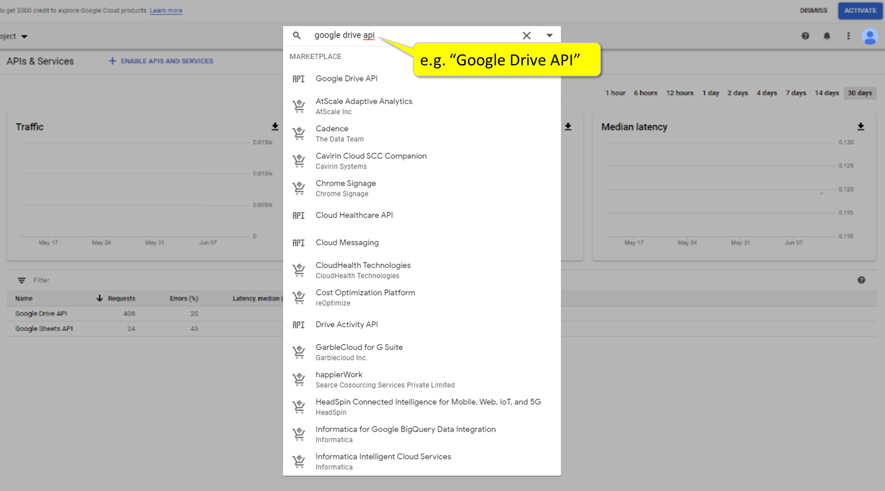
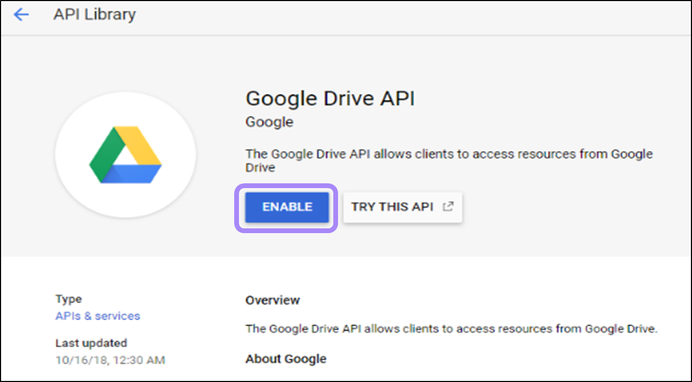
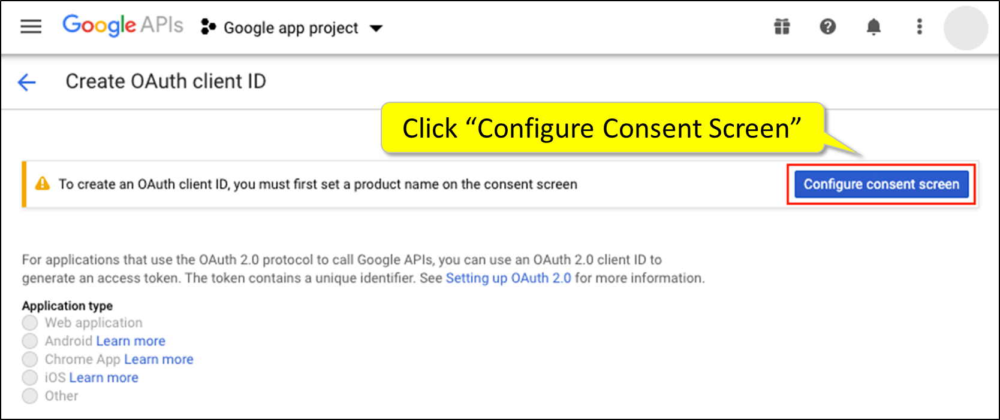
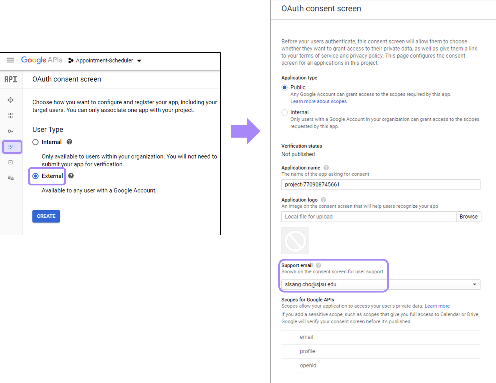
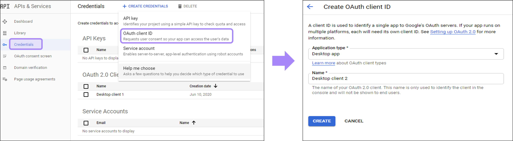
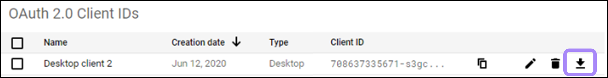
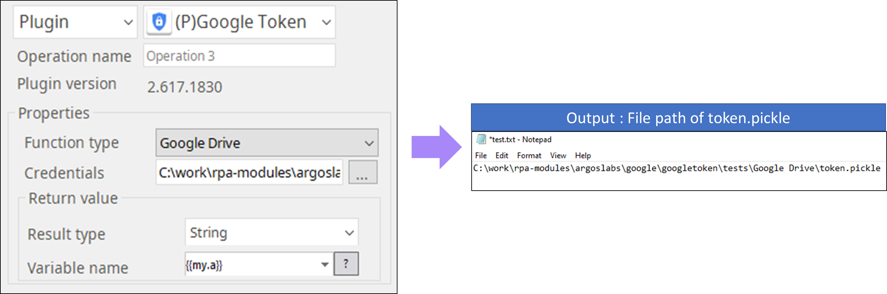

# Google Token

***ARGOS LABS create a google API token file***
> * This plugin creates a token.pickle file which stores the credential information of Google API.

## Name of the plugin
Item | Value
---|:---:
Icon |  
Display Name | **Google Token**

## Name of the author (Contact info of the author)

Jerry Chae
* [email](mailto:mcchae@argos-labs.com)

[comment]: <> (* [github]&#40;https://github.com/Jerry-Chae&#41;)

## Notification

### Primary Feature
* The file token.pickle stores the user’s access and refresh tokens, and is created automatically when the authorization flow completes for the first time.
* The file can be used for Google API such as Google Drive or Google Sheets. 

### Pre-requisite
* Google API credentials from google console are required to access private google services.

### Dependent modules
Module | Source Page              | License | Version (If specified otherwise using recent version will be used)
---|--------------------------|---|---
[google-api-python-client](https://pypi.org/project/google-api-python-client/) | [google-api-python-client](https://github.com/googleapis/google-api-python-client) | [Apache License 2.0](https://github.com/googleapis/google-api-python-client/blob/main/LICENSE) | google-api-python-client==`1.12.8`
[google-auth-oauthlib](https://pypi.org/project/google-auth-oauthlib/) | [google-auth-oauthlib](https://github.com/googleapis/google-auth-library-python-oauthlib) | [Apache License 2.0](https://github.com/googleapis/google-auth-library-python-oauthlib/blob/main/LICENSE) | `latest`

## Warning 
None

## Helpful links to 3rd party contents
None 

## Version Control 
* [3.407.3456](setup.yaml)
* Release Date: Apr 07, 2021

## Input (Required)
Display Name | Input Method  | Default Value | Description
---|---------------|---------------|---
Function Type | Choose from option | - | Select according to the requirement.

## Input (Plugin Operations & Required Parameters)
None

## Return Value
Return value will be file.

## Creating Google API credentials
 **Please read this guideline**: Click [here](https://developers.google.com/drive/api/v3/about-auth)
  
 1. Log in in to Google API Console https://console.developers.google.com/ and search the Google API you want to use (e.g. Google Drive)
  
2. Enable the API and set a product name on the consent screen.
 
  
3. In OAuth consent screen, choose external as a user type and put a proper email address in support email.
  
4. Get back to Credentials section, click ‘OAuth client ID’ in Create Credentials tab, select proper application type and create client ID.
*  Recommend ‘Desktop app’ as an application type.
  
5. Download the Client IDs file and rename the file as ‘credentials’.
 

## Parameter Setting Example 
If server takes more than 2 mins, close the browser, and rerun the operation. 

## Return Code
Code | Meaning
---|---
0 | Success
1 | Exceptional case

