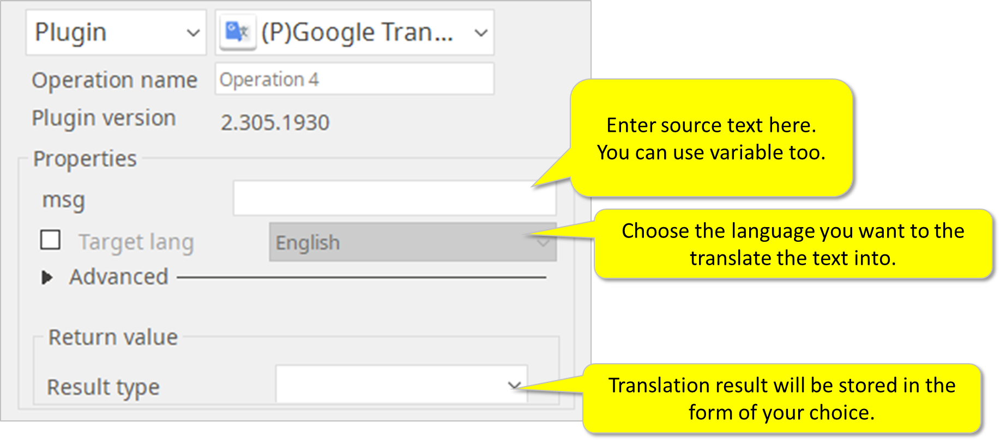

# Google Translate

***It translates text into another language using Google Translate technology.***

> This function is one of Plugins Operation.You can find the movie in [ARGOS RPA+ video tutorial](https://www.argos-labs.com/video-tutorial/).

## Name of the plugin
Item | Value
---|:---:
Icon |  
Display Name | **Google Translate**

## Name of the author (Contact info of the author)

Jerry Chae
* [email](mailto:mcchae@argos-labs.com)
* [github](https://github.com/Jerry-Chae)

## Notification

### Dependent modules
Module | Source Page | License | Version (If specified otherwise using recent version will be used)
---|---|---|---
[Googletans](https://pypi.org/project/googletrans/) | [py-googletrans](https://github.com/ssut/py-googletrans) | [MIT](https://github.com/ssut/py-googletrans/blob/master/LICENSE) | 4.0.0-rc1

> * At the release date of this plugin the dependent googletrans module's version 4.0.0-rc (pre-release) must be used
> * This module depends on google translate API
> * If google API upgraded so changed then error can happen 

## Warning 
No potential damage to customer files and data (overwrite risk)

## Helpful links to 3rd party contents
None

## Version Control 
* [3.705.2300](setup.yaml)
* Release Date: `Jul 5, 2021`

## Input (Required)
Display Name | Input Method | Default Value | Description
---|---|---|---
msg | | | message to translate

> * If message to translate is too big then use `Text file`

## Input (Optional)

Display Name | Show Default | Input Method | Default Value | Description
---|---|---|---|---
Text file | True | fileread | | Text file to read message
File Encoding | False | | utf8 | File encoding for text file
Target lang | True | choices | English | Destination language to use
Source lang | False | choices | auto | Destination language to use, if auto is set then try to detect source language automatically
Detect lang | False | Flag | Not selected | f set this flag just guessing the language of message and confidence. The result looks like `ko, 0.778`

> * If Show Default is True then this item is showed at the Properties otherwise hided at Advanced group
> * File Encoding for [Python Unicode HOWTO](https://docs.python.org/3.7/howto/unicode.html#encodings)
> * Candidates list for Target and Source language are: 
>   * Afrikaans
>   * Esperanto
>   * Italian
>   * Nepali
>   * Sundanese
>   * Arabic
>   * Spanish
>   * Japanese
>   * Dutch
>   * Swedish
>   * Bengali
>   * Estonian
>   * Javanese
>   * Norwegian
>   * Swahili
>   * Bosnian
>   * Finnish
>   * Khmer
>   * Polish
>   * Tamil
>   * Catalan
>   * French
>   * Korean
>   * Portuguese
>   * Telugu
>   * Czech
>   * Hindi
>   * Latin
>   * Romanian
>   * Thai
>   * Welsh
>   * Croatian
>   * Latvian
>   * Russian
>   * Filipino
>   * Danish
>   * Hungarian
>   * Macedonian
>   * Sinhala
>   * Turkish
>   * German
>   * Armenian
>   * Malayalam
>   * Slovak
>   * Ukrainian
>   * Greek
>   * Indonesian
>   * Marathi
>   * Albanian
>   * Vietnamese
>   * English
>   * Icelandic
>   * Myanmar(Burmese)
>   * Serbian
>   * Chinese(Mandarin/China)
>   * Chinese(Mandarin/Taiwan)

## Return Value

### Normal Case
Tranlated message

### When set `Detect lang` advanced property
[language 2-character code](https://www.loc.gov/standards/iso639-2/php/code_list.php), confidence (0 ~ 1)
Example result is 
```sh
ja,0.873
```

## Return Code
Code | Meaning
---|---
0 | Success
1 | Exceptional case

## Parameter setting examples (diagrams)

