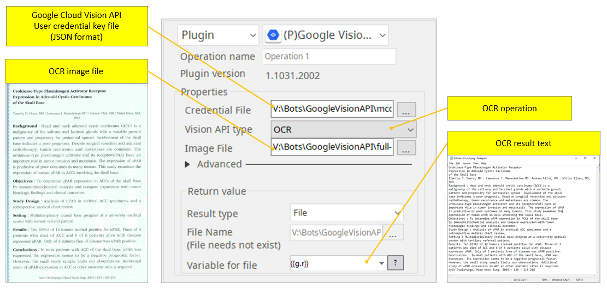
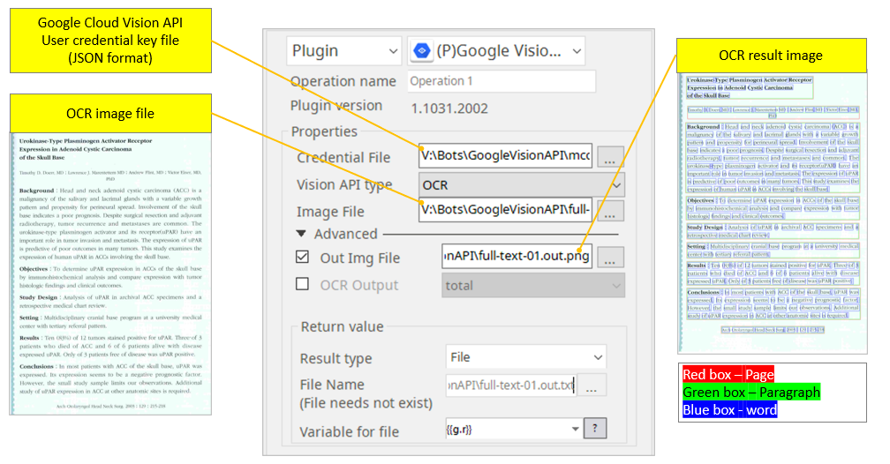
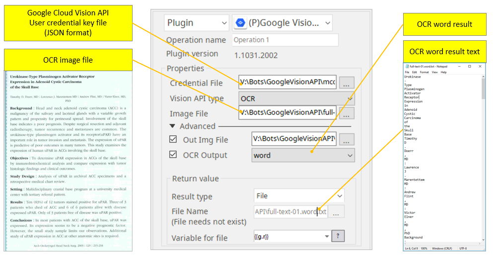
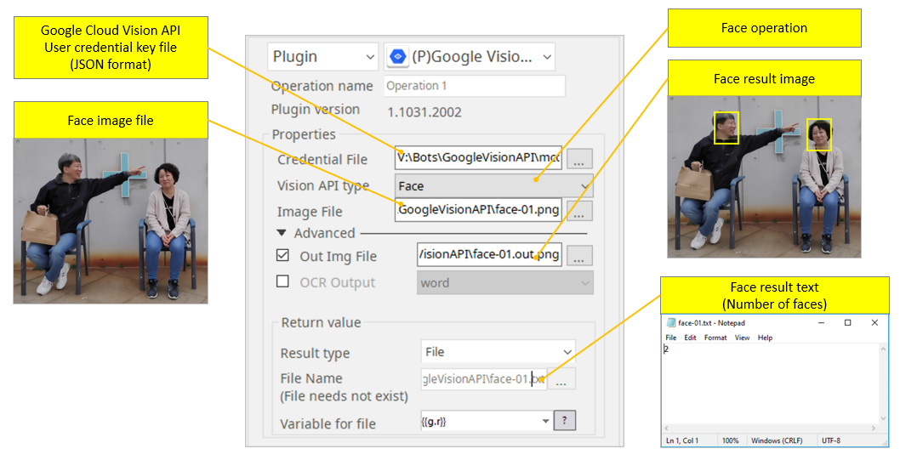
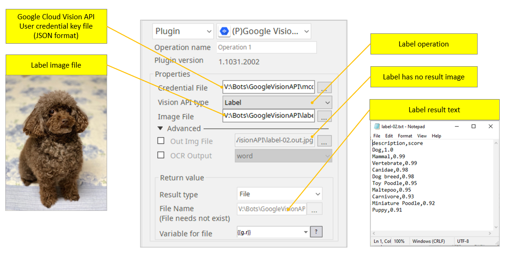
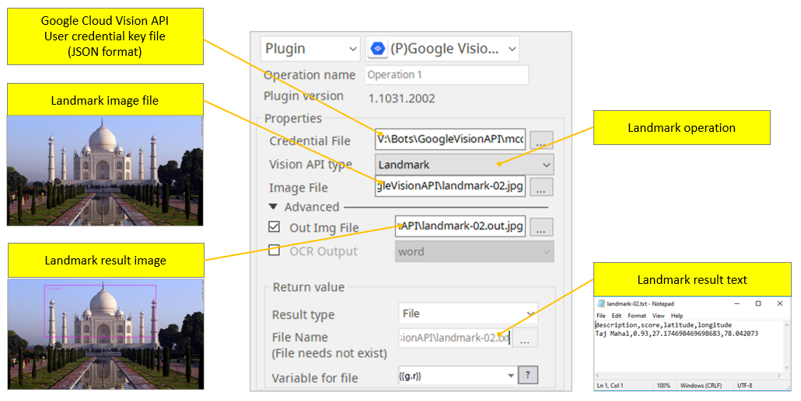
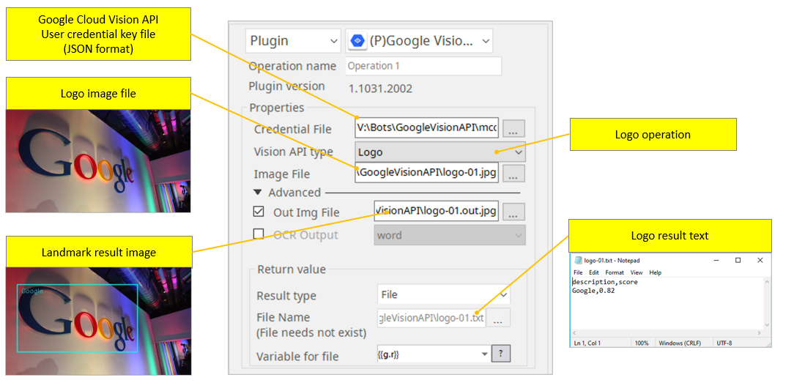
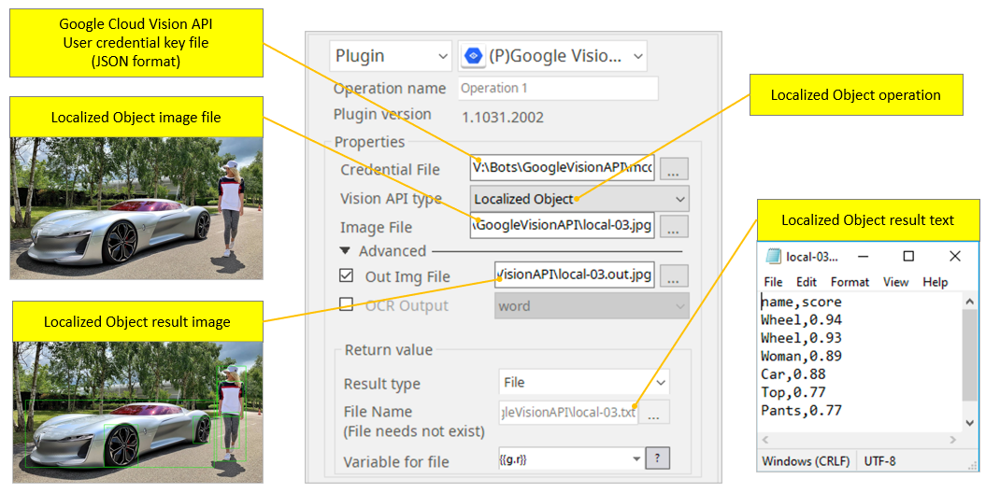
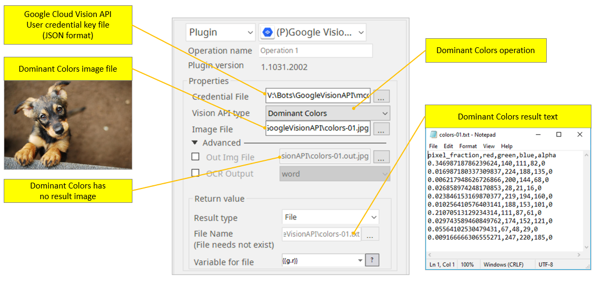

# Google Cloud Vision API

**ARGOS LABS plugin module for Google Vision API**   
> This function is one of Plugins Operation.You can find the movie in [ARGOS RPA+ video tutorial](https://www.argos-labs.com/video-tutorial/).

## Name of the plugin
Item | Value
---|:---:
Icon |  
Display Name | **Google Cloud Vision API**

## Name of the author (Contact info of the author)

Jerry Chae
* [email](mailto:mcchae@argos-labs.com)
* [github](https://github.com/Jerry-Chae)

## Notification
## Contents
* [List of file formats supported as input](#list-of-file-formats-supported-as-input)
* [OCR usage](#ocr-usage)
* [OCR usage with output result image](#ocr-usage-with-output-result-image)
* [OCR usage with word output](#ocr-usage-with-word-output)
* [Face usage](#face-usage)
* [Label usage](#label-usage)
* [Landmark usage](#landmark-usage)
* [Logo usage](#logo-usage) 
* [Localized Object usage](#localized-object-usage) 
* [Dominant Colors usage](#dominant-colors-usage)

## Prerequisite
 **Before you start**, **click** [How to obtain Google User Credentials](https://wiki.argos-labs.com/display/RPARELNOTE/How+to+obtain+Google+User+Credentials) 

 **Here is the link to** [Google Vision API pricing information](https://cloud.google.com/vision/pricing)

### Dependent modules
Module | Source Page | License                                                                   | Version (If specified otherwise using recent version will be used)
---|---|---------------------------------------------------------------------------|---
[google-cloud-vision](https://pypi.org/project/google-cloud-vision/) | [google-cloud-vision](https://github.com/GoogleCloudPlatform/cloud-vision) | [Apache License 2.0](https://github.com/GoogleCloudPlatform/cloud-vision/blob/master/LICENSE) | `latest`
[protobuf3-to-dict](https://pypi.org/project/protobuf3-to-dict/) | [protobuf3-to-dict](https://github.com/conda-forge/protobuf3-to-dict-feedstock) | [BSD 3-Clause "New" or "Revised" License](https://github.com/conda-forge/protobuf3-to-dict-feedstock/blob/main/LICENSE.txt) | protobuf3-to-dict>=`0.1.5`
[opencv-python](https://pypi.org/project/opencv-python/) | [opencv-python](https://github.com/opencv/opencv-python) | [MIT License](https://github.com/opencv/opencv-python/blob/4.x/LICENSE.txt) | opencv-python>=`4.1.1.26`

## Warning 
 **IMPORTANT NOTE**  
1) This is a commercial API and end user will be charged by the supplier of this API after a certain amount of free usage.
2) The user license contract has to be entered directly between the supplier of this API and the End User.
3) ARGOS LABS will not be responsible for any consequences either tangible or non-tangible that result from usage of this API.

 Unfortunately PDF and TIFF formats are not currently supported for Cloud Vision.

## Helpful links to 3rd party contents
* [How to obtain Google User Credentials](https://wiki.argos-labs.com/display/RPARELNOTE/How+to+obtain+Google+User+Credentials)
* [Google Vision API pricing information](https://cloud.google.com/vision/pricing)

## Version Control 
* [2.429.3456](setup.yaml)
* Release Date: `Apr 29, 2020

## Input (Required)
* See below for image reference

## Input (Optional)
* See below for image reference

## Return Value
* See below for image reference

## Parameter setting examples (diagrams)

### List of file formats supported as input.
 Unfortunately PDF and TIFF formats are not currently supported for Cloud Vision.

The accepted formats are :
* JPEG
* PNG8
* PNG24
* GIF
* Animated GIF (first frame only)
* BMP
* WEBP
* RAW
* ICO

### OCR usage

### OCR usage with output result image

### OCR usage with word output

### Face usage

### Label usage

### Landmark usage

### Logo usage

### Localized Object usage

### Dominant Colors usage

## Return Code
Code | Meaning
---|---
0 | Success
1 | Exceptional case
