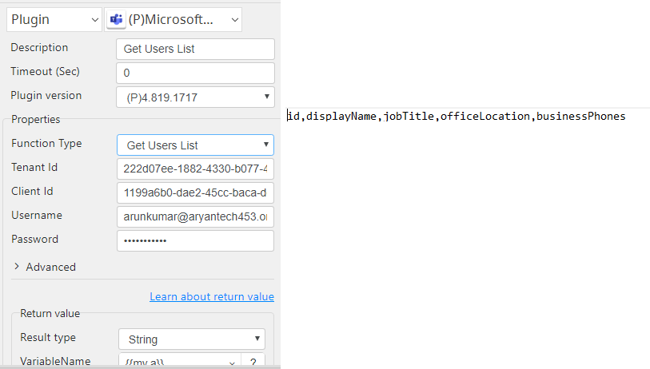

# Microsoft Teams

***Microsoft Teams plug-in use to Get Users List, Get Chat Members List, 
Chat Send Message, Get Channel Members List, and Channel Send Message.***

## Word Editor
| Item          |            Value             |
|---------------|:----------------------------:|
| Icon          |  |
| Display Name  |     **Microsoft Teams**      |

### Arun Kumar (arunk@argos-labs.com)

Arun Kumar
* [email](mailto:arunk@argos-labs.com) 
 
## Version Control 
* [4.823.932](setup.yaml)
* Release Date: `August 23, 2022`

## Create credentials from Azure Active Directory

1. Sign in in here: https://azure.microsoft.com/en-in/services/active-directory/

2. Select Manage Azure Active Directory

3. Select App registrations

4. Add New registration

5. Register app with skype and web rediret url

6. Select api permissions

7. Add api permissions

8. Select Microsoft Graph

9. Select  permissions

10. Search and check all requied permission names from table and Add permission

| permission name             |                   permission desc                   |
|-----------------------------|:---------------------------------------------------:|
| ChannelMember.Read.All      |            Read the members of channels             |
| ChannelMember.ReadWrite.All |        Add and remove members from channels         |
| ChannelMessage.Send         |               	Send channel messages                |
| Chat.ReadWrite              |          Read and write user chat messages          |
| ChatMessage.Send            |               Send user chat messages               |
| Group.ReadWrite.All         |              Read and write all groups              |
| offline_access              | Maintain access to data you have given it access to |
| openid                      |                    Sign users in                    |
| profile                     |              View users' basic profile              |
| User.Read                   |            Sign in and read user profile            |
| User.Read.All               |            Read all users' full profiles            |
| User.ReadBasic.All          |           Read all users' basic profiles            |

11. Select Grant admin consent

12. Generate secret token Select certificate & secrets

13. Add new secret

14. Value Column will be secret token

15. Update Manifest "signInAudience": "AzureADMultipleOrgs"

## Input (Required)

| OP Type                  | Parameters          | Output                                                |
|--------------------------|---------------------|-------------------------------------------------------|
| Get Users List           |                     | id,displayName,jobTitle,officeLocation,businessPhones |
| Get Chat Members List    | Chat Id             | id,displayName,email                                  |
| Chat Send Message        | Chat Id, Message    | message_id                                            |
| Get Channel Members List | Channel Link        | id,displayName,jobTitle,officeLocation,businessPhones |
| Get Channel Members List | Team Id, Channel Id | id,displayName,jobTitle,officeLocation,businessPhones |
| Channel Send Message     | Channel Link        | message_id                                            |
|                          | Message             |                                                       |
| Channel Send Message     | Channel Link        | message_id                                            |
|                          | Message             |                                                       |
|                          | File                |                                                       |
| Channel Send Message     | Team Id, Channel Id | Updated file path                                     |
|                          | Message             |                                                       |
| Channel Send Message     | Team Id, Channel Id | Updated file path                                     |
|                          | Message             |                                                       |
|                          | File                |                                                       |

## Return Value

### Normal Case

Description of the output result

## Return Code
| Code | Meaning                      |
|------|------------------------------|
| 0    | Success                      |
| 1    | Exceptional case             |

## Output Format
You may choose one of 3 output formats below,

<ul>
  <li>String (default)</li>
  <li>CSV</li>
  <li>File</li>
</ul>  

## Parameter setting examples (diagrams)

## Operations

### Get Users List:

### Get Chat Members List:

### Chat Send Message:

### Get Channel Members List:

### Channel Send Message:

