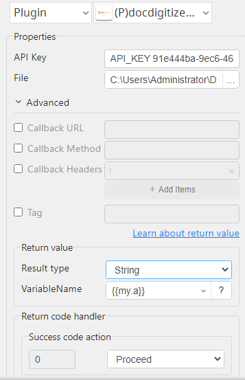
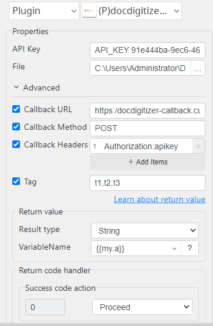

# Docdigitizer Upload

***Docdigitizer Upload with this plug-in Submit the file(s) to extract their data. A file size limit of 25Mb for the upload and support the following media types: application/pdf, image/jpeg, image/png, image/tiff***

## Docdigitizer Upload
| Item         |               Value               |
|--------------|:---------------------------------:|
| Icon         |   |
| Display Name |      **Docdigitizer Upload**      |

### Arun Kumar (arunk@argos-labs.com)

Arun Kumar
* [Email](mailto:arunk@argos-labs.com) 
 
## Version Control 
* [4.316.946](setup.yaml)
* Release Date: `March 16, 2023`

## Input (Required)
| Parameters       | Output              |
|------------------|---------------------|
| API Key          | document_id,status  |
| File             |                     |
| API Key          | document_id,status  |
| File             |                     |
| Callback URL     |                     |
| Callback Method  |                     |
| Callback Headers |                     |
| Tag              |                     |

### Notes:-
<ul>
    <li>API Key Docdigitizer Authorization key.</li>
    <li>File: file to submit to extract data</li>
    <li>Callback URL: optional parameter, should be the url of your API for you to be notified by Callback service (status notification)</li>
    <li>Callback Method: optional parameter, parameter related with callback service to specify which method shall we use to call the service, only GET or POST is accepted. If this parameter is omitted we call with GET.</li>
    <li>Callback Headers: optional parameter, parameter related with callback service to specify HTTP headers to pass when we call the callback service. This is a dictionary of key/value pairs of strings, like - </li>
    <li>Tag: this is an optional header that you can use to put your own tags. Tags are comma separated.</li>
</ul>

## Return Value

### Normal Case
Description of the output result

## Return Code
| Code | Meaning                      |
|------|------------------------------|
| 0    | Success                      |
| 1    | Exceptional case             |

## Output Format
You may choose one of 3 output formats below,

<ul>
  <li>String (default)</li>
  <li>CSV</li>
  <li>File</li>
</ul>  

## Parameter setting examples (diagrams)

## Operations

### Upload File:

### Upload File with optional parameter:

