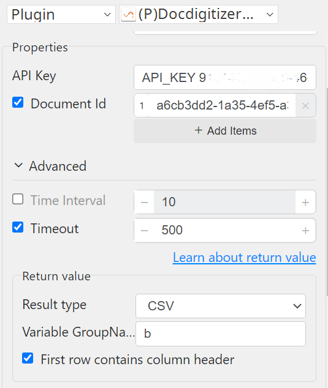

# Docdigitizer Tracking

***Docdigitizer Tracking with this plug-in track the status of submitted file.***

## Docdigitizer Tracking
| Item         |               Value                |
|--------------|:----------------------------------:|
| Icon         |  |
| Display Name |     **Docdigitizer Tracking**      |

### Arun Kumar (arunk@argos-labs.com)

Arun Kumar
* [Email](mailto:arunk@argos-labs.com) 
 
## Version Control 
* [4.316.0941](setup.yaml)
* Release Date: `March 16, 2023`

## Input (Required)
| Parameters    | Output              |
|---------------|---------------------|
| API Key       | document_id,status  |
| Document Id   |                     |
| Time Interval |                     |
| Timeout       |                     |

### Notes:-
<ul>
    <li>API Key Docdigitizer Authorization key.</li>
    <li>Document Id: The id of the document submitted (Please note that this is the 'document_id' and not the Task id)</li>
    
</ul>

## Return Value

### Normal Case
Description of the output result

## Return Code
| Code | Meaning                      |
|------|------------------------------|
| 0    | Success                      |
| 1    | Exceptional case             |

## Output Format
You may choose one of 3 output formats below,

<ul>
  <li>String (default)</li>
  <li>CSV</li>
  <li>File</li>
</ul>  

## Parameter setting examples (diagrams)

## Operations

### Track File:

