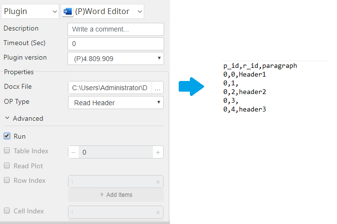

# Word Editor

***Word Editor with this plug-in can read and modify the docx file header, footer, table, and paragraph.***

## Word Editor
| Item         |          Value           |
|--------------|:------------------------:|
| Icon         |  |
| Display Name |     **Word Editor**      |

### Arun Kumar (arunk@argos-labs.com)

Arun Kumar
* [email](mailto:arunk@argos-labs.com) 
 
## Version Control 
* [4.811.2038](setup.yaml)
* Release Date: `August 12, 2022`

## Input (Required)
| OP Type            | Parameters      | Output                         |
|--------------------|-----------------|--------------------------------|
| Read Header        |                 | p_id,paragraph                 |
|                 |                 |                                |
| Read Header        | Run             | p_id,r_id,paragraph            |
|                 |                 |                                |
| Update Header      | Paragraph Index | Updated file path              |
|                    | Update Value    |                                |
| Update Header      | Paragraph Index | Updated file path              |
|                    | Update Value    |                                |
|                    | Output Path     |                                |
| Update Header      | Paragraph Index | Updated file path              |
|                    | Run Index       |                                |
|                    | Update Value    |                                |
| Update Header      | Paragraph Index | Updated file path              |
|                    | Run Index       |                                |
|                    | Update Value    |                                |
|                    | Output Path     |                                |
| Read Paragraphs    |                 | p_id,paragraph                 |
|                 |                 |                                |
| Read Paragraphs    | Run             | p_id,r_id,paragraph            |
|                 |                 |                                |
| Update Paragraphs  | Paragraph Index | Updated file path              |
|                    | Update Value    |                                |
| Update Paragraphs  | Paragraph Index | Updated file path              |
|                    | Update Value    |                                |
|                    | Output Path     |                                |
| Update Paragraphs  | Paragraph Index | Updated file path              |
|                    | Run Index       |                                |
|                    | Update Value    |                                |
| Update Paragraphs  | Paragraph Index | Updated file path              |
|                    | Run Index       |                                |
|                    | Update Value    |                                |
|                    | Output Path     |                                |
| Read Table         | Table Index     | row_id,cell_id,value           |
|                 |                 |                                |
| Read Table         | Table Index     | row_id,cell_id,value           |
|                    | Row Index       |                                |
| Read Table         | Table Index     | row_id,cell_id,value           |
|                    | Row Index       |                                |
|                    | Cell Index      |                                |
| Read Table         | Table Index     | row_id,cell_id,p_id,r_id,value |
|                    | Row Index       |                                |
|                    | Cell Index      |                                |
|                    | Run             |                                |
| Update Table Rows  | Table Index     | Updated file path              |
|                    | Row Index       |                                |
|                    | Cell Index      |                                |
|                    | Update Value    |                                |
| Update Table Rows  | Table Index     | Updated file path              |
|                    | Row Index       |                                |
|                    | Cell Index      |                                |
|                    | Update Value    |                                |
|                    | Output Path     |                                |
| Update Table Rows  | Table Index     | Updated file path              |
|                    | Row Index       |                                |
|                    | Cell Index      |                                |
|                    | Paragraph Index |                                |
|                    | Run Index       |                                |
|                    | Update Value    |                                |
| Update  Table Rows | Table Index     | Updated file path              |
|                    | Row Index       |                                |
|                    | Cell Index      |                                |
|                    | Paragraph Index |                                |
|                    | Run Index       |                                |
|                    | Update Value    |                                |
|                    | Output Path     |                                |
| Read Footer        |                 | p_id,paragraph                 |
|                 |                 |                                |
| Read Footer        | Run             | p_id,r_id,paragraph            |
|                 |                 |                                |
| Update Footer      | Paragraph Index | Updated file path              |
|                    | Update Value    |                                |
| Update Footer      | Paragraph Index | Updated file path              |
|                    | Update Value    |                                |
|                    | Output Path     |                                |
| Update Footer      | Paragraph Index | Updated file path              |
|                    | Run Index       |                                |
|                    | Update Value    |                                |
| Update Footer      | Paragraph Index | Updated file path              |
|                    | Run Index       |                                |
|                    | Update Value    |                                |
|                    | Output Path     |                                |

### Notes:-
<ul>
    <li>p_id has information about Paragraph Index.</li>
    <li>r_id has information about Run Index.</li>
    <li>Run Index treated as sub-paragraph.</li>
    <li>row_id has information about Row Index.</li>
    <li>cell_id has information about Cell Index.</li>
    <li>Cell Index treated as sub-row.</li>
    <li>Output Path is an optional parameter to store an updated file, 
        In case of not being selected default updated file will keep in the exact location as the docx file.</li>
    <li>In case of an empty Run Index, put it as None. </li>
    <li>When reading Paragraphs or Table with the plot select, a help docx file will generate with  
Row Index, Cell Index, Paragraph Index, and Run Index.</li>
        <ol>
            <li>(Paragraph Index)</li>
            <li>(Paragraph Index, Run Index),</li>
            <li>(Row Index, Cell Index),</li>
            <li>(Row Index, Cell Index, Paragraph Index, Run Index)</li>
        </ol>
</ul>

## Return Value

### Normal Case
Description of the output result

## Return Code
| Code | Meaning                      |
|------|------------------------------|
| 0    | Success                      |
| 1    | Exceptional case             |

## Output Format
You may choose one of 3 output formats below,

<ul>
  <li>String (default)</li>
  <li>CSV</li>
  <li>File</li>
</ul>  

## Parameter setting examples (diagrams)

## Operations

### Sample Docx File:

[Word Editor Input Data](README_sample.docx)

### Read Header:

### Read Header with Run:

### Read Paragraphs:

### Read Paragraphs with Run:

### Read Table:

### Update Paragraphs:

### Update Table:

### Update Table with Run:

