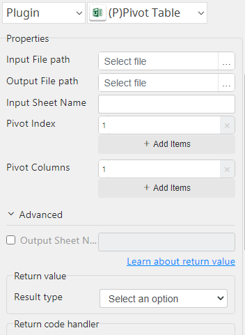

# Pivot Table

***Pivot Table with this plug-in generate pivot table.***

## Pivot Table
| Item           |          Value           |
|----------------|:------------------------:|
| Icon           |  |
| Display Name   |  **Pivot Table**         |

### Arun Kumar (arunk@argos-labs.com)

Arun Kumar
* [Email](mailto:arunk@argos-labs.com) 
 
## Version Control 
* [4.412.1739](setup.yaml)
* Release Date: `April 12, 2023`

## Input (Required)
| Parameters         | Output            |
|--------------------|-------------------|
| Input File path    | Output File path  |
| Output File path   |                   |
| Input Sheet Name   |                   |
| Pivot Index        |                   |
| Pivot Columns      |                   |
| Output Sheet Name  |                   |
| File path          | Output File path  |
| Output File path   |                   |
| Input Sheet Name   |                   |
| Pivot Index        |                   |
| Pivot Columns      |                   |
| Output Sheet Name  |                   |

## Return Value

### Normal Case
Description of the output result

## Return Code
| Code | Meaning                      |
|------|------------------------------|
| 0    | Success                      |
| 1    | Exceptional case             |

## Output Format
You may choose one of 3 output formats below,

<ul>
  <li>String (default)</li>
  <li>CSV</li>
  <li>File</li>
</ul>  

## Parameter setting examples (diagrams)

## Operations

### Convert with default input:

