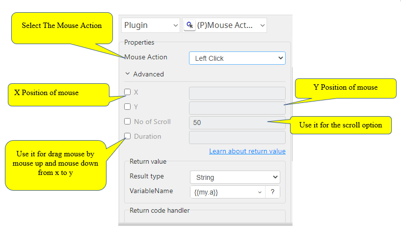

# Mouse Action

***Mouse Action with this plug-in can perform all mouse actions.***

## Mouse Action
| Item         |            Value            |
|--------------|:---------------------------:|
| Icon         |    |
| Display Name |      **Mouse Action**       |

### Arun Kumar (arunk@argos-labs.com)
* [Email](mailto:arunk@argos-labs.com) 
 
## Version Control 
* [4.905.900](setup.yaml)
* Release Date: `September 5, 2022`

## Input (Required)

Note:-

1. Use Select Window in case to avoid the use of x and y Positions.
