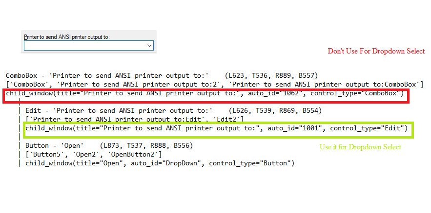
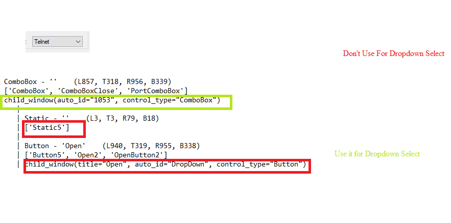
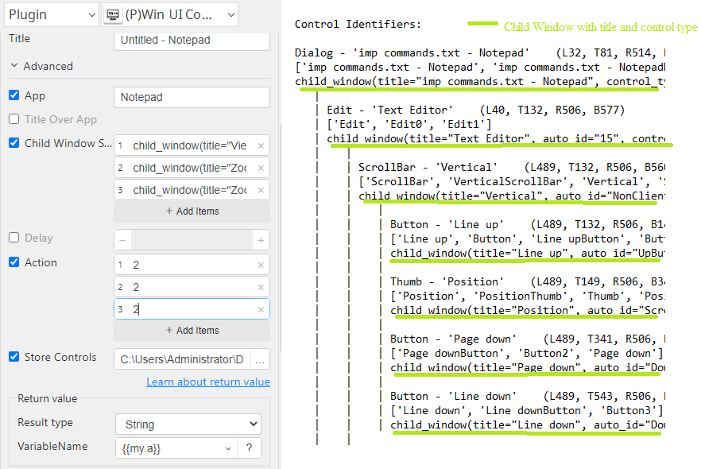
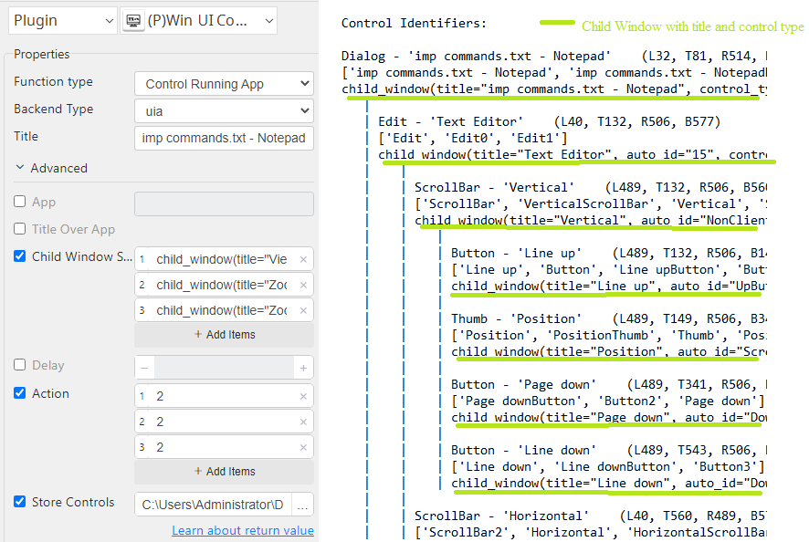

# Win UI Control

***Win UI Control with this plug-in can Control the windows interface.***

## Win UI Control
| Item         |            Value            |
|--------------|:---------------------------:|
| Icon         |  |
| Display Name |     **Win UI Control**      |

### Arun Kumar (arunk@argos-labs.com)

* [Email](mailto:arunk@argos-labs.com) 
 
## Version Control 
* [4.916.1639](setup.yaml)
* Release Date: `September 13, 2022`

## Input (Required)
| Function type       | Parameters                          | Output                       |
|---------------------|-------------------------------------|------------------------------|
| Control By App      | uia or win32                        | Success/Store Controls Path  |
|                     | Title                               |                              |
|                     | App                                 |                              |
|                     | Store Controls (print child window) |                              |
| Control By App      | uia or win32                        | Success/Store Controls Path  |
|                     | Title                               |                              |
|                     | App                                 |                              |
|                     | Child Window String                 |                              |
|                     | Action                              |                              |
|                     | Store Controls (print child window) |                              |
| Control Running App | uia or win32                        | Success/Store Controls Path  |
|                     | Title                               |                              |
|                     | Store Controls (print child window) |                              |
| Control Running App | uia or win32                        | Success/Store Controls Path  |
|                     | Title                               |                              |
|                     | Child Window String                 |                              |
|                     | Action                              |                              |
|                     | Store Controls (print child window) |                              |

Note:-
1. Delay use in case of the window does not load properly.
2. If the required app already running skip the App option.
3. win32 (Microsoft Windows API) & uia (Microsoft UI Automation) pick one according to Interface.
4. Child Window Name gets it from Store Controls.
7. Store Controls is an optional paramere used for store child window controls.

Action: -
1. '1 for Draw Outline',
2. '2 for Click',
3. '3 for Double Click Input',
4. '4 for Right Click Input'

**Select Dropdown directly**
#### Case 1 :- ComboBox have control_type='Edit'
**control_type='Edit'**

Dropdown Can be Selected directly by action field with dropdown value if value other than 1,2,3,4.

#### Case 1 :- ComboBox do not have control_type='Edit'

**control_type='ComboBox'** 

Dropdown Can be Selected directly by action field with dropdown value if value other than 1,2,3,4.

## Return Value

### Normal Case
Description of the output result

## Return Code
| Code | Meaning                      |
|------|------------------------------|
| 0    | Success                      |
| 1    | Exceptional case             |

## Output Format
You may choose one of 3 output formats below,

<ul>
  <li>String (default)</li>
  <li>CSV</li>
  <li>File</li>
</ul>  

## Parameter setting examples (diagrams)

## Operations

### Control By App:

### Control Running App:

