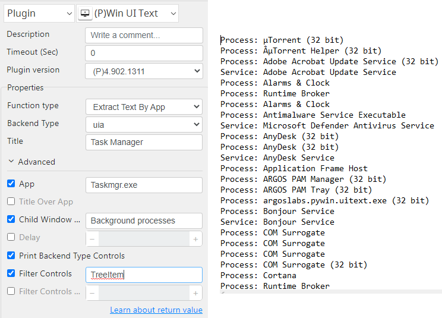
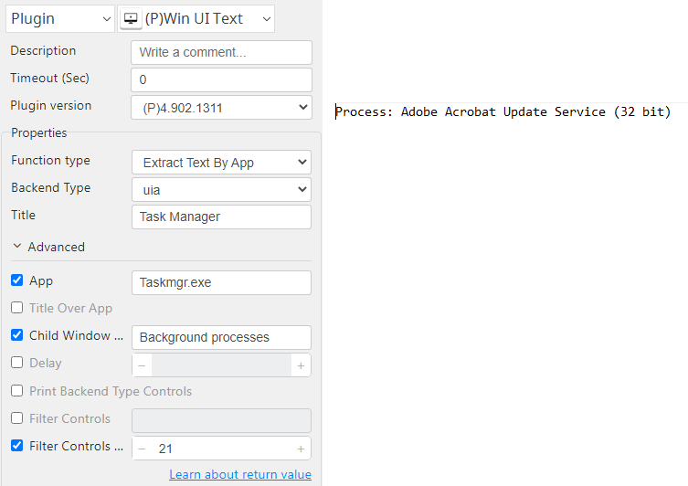

# Win UI Op

***Win UI Op with this plug-in can Extract text on the windows interface.***

## Win UI Op
| Item         |          Value           |
|--------------|:------------------------:|
| Icon         |    |
| Display Name |      **Win UI Op**       |

### Arun Kumar (arunk@argos-labs.com)

Arun Kumar
* [email](mailto:arunk@argos-labs.com) 
 
## Version Control 
* [4.903.1301](setup.yaml)
* Release Date: `September 3, 2022`

## Input (Required)
| Function type                  | Parameters                   | Output        |
|--------------------------------|------------------------------|---------------|
| Extract Text By App            | uia or win32                 | (Output Text) |
|                                | Title                        |               |
|                                | App                          |               |
| Extract Text By App            | uia or win32                 | (Output Text) |
|                                | Title                        |               |
|                                | App                          |               |
|                                | Child Window Name            |               |
| Extract Text By App            | uia or win32                 | (Output Text) |
|                                | Title                        |               |
|                                | App                          |               |
|                                | Child Window Name (Optional) |               |
|                                | Print Backend Type Controls  |               |
| Extract Text By App            | uia or win32                 | (Output Text) |
|                                | Title                        |               |
|                                | App                          |               |
|                                | Child Window Name            |               |
|                                | Filter Controls              |               |
| Extract Text By App            | uia or win32                 | (Output Text) |
|                                | Title                        |               |
|                                | App                          |               |
|                                | Child Window Name            |               |
|                                | Print Backend Type Controls  |               |
|                                | Filter                       |               |
|                                | Filter Controls With Index   |               |
| Extract Text From Running App  | uia or win32                 | (Output Text) |
|                                | Title                        |               |
| Extract Text From Running App  | uia or win32                 | (Output Text) |
|                                | Title                        |               |
|                                | Child Window Name            |               |
| Extract Text From Running App  | uia or win32                 | (Output Text) |
|                                | Title                        |               |
|                                | Print Backend Type Controls  |               |
| Extract Text From Running App  | uia or win32                 | (Output Text) |
|                                | Title                        |               |
|                                | Filter Controls              |               |
| Extract Text From Running App  | uia or win32                 | (Output Text) |
|                                | Title                        |               |
|                                | Filter Controls              |               |
|                                | Filter Controls With Index   |               |

Note:-

1. Delay use in case of the window does not load properly.
2. If the required app already running skip the App option.
3. win32 (Microsoft Windows API) & uia (Microsoft UI Automation) pick one according to Interface.
4. Child Window Name gets it from Print Backend Type Controls as Group Box.
5. Filter Controls Name get it from Print Backend Type Controls as Last Column Name.
6. Filter Controls Index also gets it from Print Backend Type Controls as First Column Name.
7. Child Window Name is an optional paramere used as filter.

## Return Value

### Normal Case
Description of the output result

## Return Code
| Code | Meaning                      |
|------|------------------------------|
| 0    | Success                      |
| 1    | Exceptional case             |

## Output Format
You may choose one of 3 output formats below,

<ul>
  <li>String (default)</li>
  <li>CSV</li>
  <li>File</li>
</ul>  

## Parameter setting examples (diagrams)

## Operations

### Extract Text By App:

### Extract Text By App with Print Backend Type Controles:

### Extract Text By App with Child Window(Group Box) and Print Backend Type Controles:

### Extract Text By App With Filter Controls:

### Extract Text By App With Filter Controls and Filter Index:

